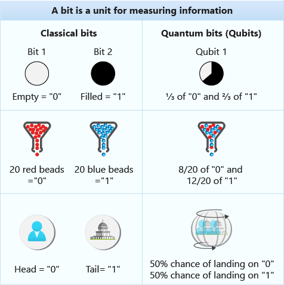
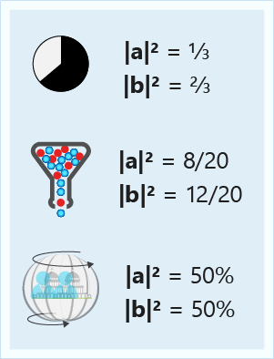
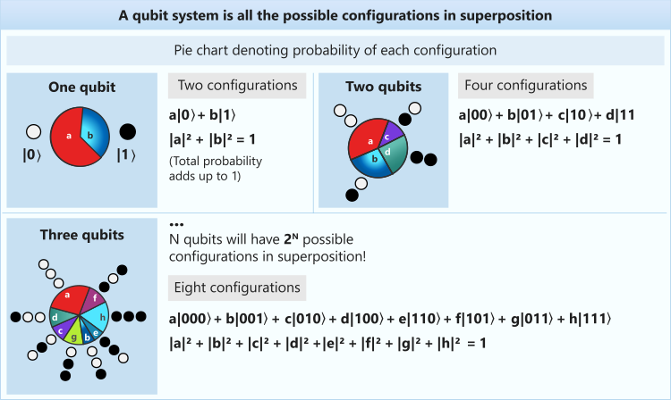
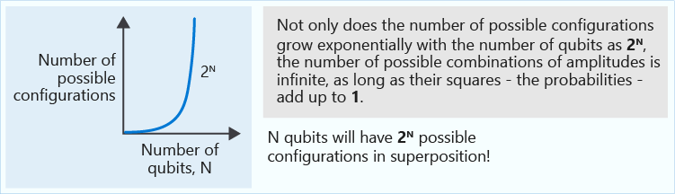

For some computational tasks, quantum computing provides exponential speedups. These speedups are possible thanks to three phenomena from
quantum mechanics: superposition, interference, and entanglement.

In the [Create your first Q# program by using the Quantum Development Kit](https://docs.microsoft.com/learn/modules/qsharp-create-first-quantum-development-kit?azure-portal=true) module, you used superposition to generate random numbers from qubits. In this part, you'll learn more about superposition.

## Quantum computers are quantum systems

Quantum computers are controllable quantum mechanical devices that exploit the properties of quantum physics to perform computations. You may have seen or heard about the Schrödinger equation that describes every quantum mechanical system:

$$i \hbar \frac{\partial}{\partial t}\psi(t)= \hat H \psi(t).$$

This equation captures the _wave function_, $\psi(t)$, which represents the state of the quantum system, and the Hamiltonian, $\hat H$, which represents the energy of the system. Here, $t$ is time and $\hbar$ is the Planck constant.

You may be thinking that you didn't choose the life of galactic adventures to learn about quantum mechanics and algebra in the first place. Fortunately, you don't need the Schrödinger equation to do quantum programming. In practice, nobody thinks in terms of the Schrödinger equation when they write quantum algorithms. But we can use the equation to help us understand some concepts of quantum computing.

The Schrödinger equation determines the evolution of the state of the system, represented by the wave function $\psi$. That is, given a time $t$, the equation helps us find the state of the system at that time. Each wave function $\psi$ is associated with an important concept in quantum computing: the *probability amplitude* of the wave function. The probability amplitude is a complex number that determines the probability of getting a certain outcome when we measure the system. 

The probability amplitude is an important difference from classical computing. In quantum computing, we don't describe bits as being in determined, factual states. Rather, we describe bits by the probabilities of finding their states when we observe them.

> [!NOTE]
> In this module and the documentation for Q#, we use $\LaTeX$
> fonts for mathematical *linear operators* that take qubit states to qubit
> states. Conversely, we use `code` font to represent *Q# operations*
> that take qubit registers as inputs to transform their state. For example, the
> linear operator $H$ maps the input state $|0\rangle$ to the state
> $H|0\rangle=\frac{1}{\sqrt2}(|0\rangle+|1\rangle),$ while the operation `H` acts on
> a qubit as `H(qubit)` to change the state of `qubit` from $|0\rangle$ to
> $\frac{1}{\sqrt2}(|0\rangle+|1\rangle)$.

### What's Dirac bra-ket notation?

How do we describe a quantum state?

A handy notation to write quantum states is the *Dirac bra-ket* notation. In this notation, we describe the possible states of quantum systems by using symbols called _kets_ $| \rangle$.

For example, $|0\rangle$ and $|1\rangle$ are 0 and 1 quantum states, respectively. They're two possible states of a qubit. A qubit in the state $|\psi\rangle = |0\rangle$ means that the probability of observing `Zero` when we measure the qubit is 100 percent. Similarly, a qubit in the state $|\psi\rangle =|1\rangle$ produces `One` when we measure it.

> [!NOTE]
> There are many interpretations of the concept of *measurement* in
> quantum mechanics, but the details are beyond the scope of this module. For
> quantum computing, you don't have to worry about it. Here we will understand 
> measurement to be the informal idea of "observing" a qubit, which immediately
> collapses the quantum superposition to one of the two basis states that correspond to classical values **0** and **1**. 
>
> To learn more about measurement in the
> context of quantum mechanics and its historical discussion, see the
> Wikipedia article about the [Measurement
> problem](https://wikipedia.org/wiki/Measurement_problem).

## What are linear operators?

We can perform measurements on quantum states, but we can also make changes to them. For example, we can transform a $|0\rangle$ state into a $|1\rangle$ state.

An *operator* is a function that acts on a state of a quantum system and transforms it to another state. 

$$A |\psi\rangle = |\psi'\rangle$$

We say that an operator $A$ is *linear* when it has the following properties for addition and multiplication by a complex number $a$:

$$A( |\psi_1\rangle + |\psi_2\rangle) =  A |\psi_1\rangle + A|\psi_2\rangle$$

$$A(a|\psi\rangle)=a  A(|\psi\rangle)$$

### How do linear operators relate to quantum superposition?

The Schrödinger equation is a linear equation. It implies that if two states
$ |\psi_1\rangle$ and $|\psi_2\rangle$ are solutions of the Schrödinger equation
(in other words, valid quantum states), then any linear combination of the states is also a valid
quantum state:

$$|\psi\rangle=a |\psi_1\rangle+b|\psi_2\rangle.$$

This linear combination of $ |\psi_1\rangle$ and $|\psi_2\rangle$ is called a
superposition of $ |\psi_1\rangle$ and $|\psi_2\rangle$. Here, $a$ and $b$ are the
probability amplitudes of $ |\psi_1\rangle$ and $|\psi_2\rangle$, respectively.
Remember that in the module [Create your first Q# program by using the Quantum
Development
Kit](https://docs.microsoft.com/learn/modules/qsharp-create-first-quantum-development-kit?azure-portal=true)
you used superposition to create a quantum random number generator. You used the operation `H` to put a qubit that's in the state $|0\rangle$ into superposition.
Mathematically, this equation is $$  H |0\rangle = \frac1{\sqrt2} |0\rangle + \frac1{\sqrt2} |1\rangle.$$

Linearity is a fundamental property of quantum mechanics and therefore of quantum computing.

> [!NOTE]
> The symbol $H$ (without the hat) refers to the quantum operator,
> also known as the *Hadamard gate*. You used this operator to create quantum
> superpositions. By contrast, the symbol $\hat H$ (with the hat) refers to the Hamiltonian
> operator that's part of the Schrödinger equation. 

> [!NOTE]  
> Sometimes people talk about *quantum gates* instead of *operations*. The term *quantum gate* is an 
> analogy to classical logic gates. It's rooted in the early 
> days of quantum computing when algorithms were merely a theoretical 
> construct. They were visualized as diagrams similar to circuit diagrams in classical computing.

## Quantum computers are probabilistic

A fundamental difference between classical computers and quantum computers is
that programs in quantum computers are intrinsically probabilistic, whereas classical
computers are usually deterministic. Quantum algorithms consist of linear operations that are
applied to a register of qubits to modify the states to a particular
superposition of all possibilities. Each possible state has an associated
probability amplitude. When we make a measurement, we obtain one of the possible
states with a certain probability. This fact contrasts with classical computing,
where a bit can only be deterministically **0** or **1**.

> [!NOTE]
> Whereas some programs for classical computers are also probabilistic,
> probabilistic classical programs can't provide the same speedup that you can
> obtain with quantum computers. The performance difference is fundamentally due to superposition,
> interference, and entanglement.

These characteristics mean that sometimes you have to run the algorithm several
times to ensure the highest probability result in the output. This repetition
might seem inefficient. But in many cases, running quantum algorithms several
times is much more efficient than solving the task classically.

In the next figure, you can see a simplified comparison between qubits and bits:

The following figure shows the probability associated with each simplified qubit. 
 

These examples don't represent actual qubits. After all, coins and marble
vending machines can't exist in superposition states. But the examples help us visualize
the probabilities. Only quantum systems like ions or superconducting circuits
can exist in the superposition states that enable the power of quantum
computing.

How do we know the probabilities associated with a given superposition? Suppose we have a register of two qubits that can be in a superposition of four possible states: $$|\psi\rangle = a |00\rangle + b |01\rangle + c |10\rangle + d |11\rangle.$$

Remember that $a,b,c$ and $d$ are complex numbers, and they're probability amplitudes for each state. Their
absolute values, for example $|a|$, squared, give the corresponding probabilities. For
instance, the probability for observing $|00\rangle$ is $P(00)=|a|^2$. For
$|01\rangle$, it's $P(01)=|b|^2$, and so on.

There are no restrictions on the types of numbers the probability amplitudes can
be. They can be positive, negative, or even complex numbers. However, in a valid quantum superposition, all probabilities must sum to one: $|a|^2+|b|^2+|c|^2+|d|^2=1$. This constraint is often known as the _normalization condition_. You can think of the normalization condition as the fact that you always obtain an outcome when you measure, so the probabilities of measuring every possible outcome must sum to one.

In the next figure, you see how the number of parameters needed to simulate a
quantum superposition grows exponentially with the number of qubits. That growth doesn't mean that the information that we can store in a superposition grows
exponentially with the number of qubits. After all, we can't obtain the complete
information about the superposition. We obtain only the results after a measurement.

In the example state we produced for the quantum random bit generator,
$|\psi\rangle=\frac1{\sqrt2} |0\rangle + \frac1{\sqrt2} |1\rangle$, the probability
for each state is

$$P(0)=\left|\frac1{\sqrt{2}}\right|^2=\frac12;$$
$$P(1)=\left|\frac1{\sqrt{2}}\right|^2=\frac12.$$

Each state has a 50-percent probability of being measured, so we have a balanced
bit generator. We also can check that $\frac12 + \frac12 = 1$.

In the next part, you'll use Q# to see how to prepare different superpositions of qubits and inspect their probabilities.
