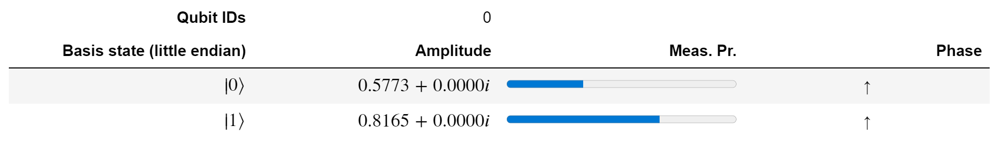

Now you'll explore how to create, manage, and inspect superpositions in Q#. We introduce a function from the Quantum Development Kit called `DumpMachine`. This function enables you to observe the probability amplitudes of the simulated qubit registers.

## Create the project

Start by creating a Q# project like you did for the quantum random number generator in the [Create your first Q# program by using the Quantum Development Kit](https://docs.microsoft.com/learn/modules/qsharp-create-first-quantum-development-kit?azure-portal=true) module. 

1. On the **View** menu, select **Command Palette**.
1. Enter *Q#: Create New Project*.
1. Select **Standalone console application**.
1. Select a directory to hold your project. For example, select your home directory. Enter *ExploringSuperposition* as the project name. Then select **Create Project**.
1. From the window that appears below, select **Open new project**.

Like before, you see two files: the project file and *Program.qs*, which contains starter code.

## Include the Diagnostics namespace

You'll find the Diagnostics namespace [Microsoft.Quantum.Diagnostics](https://docs.microsoft.com/qsharp/api/qsharp/microsoft.quantum.diagnostics?azure-portal=true) in the [Standard
library](https://docs.microsoft.com/quantum/user-guide/libraries/standard?azure-portal=true)
of the Quantum Development Kit. This namespace contains functions and operations that are useful for
diagnostic purposes.

For the moment, we're interested in the [`DumpMachine`](https://docs.microsoft.com/qsharp/api/qsharp/microsoft.quantum.diagnostics.dumpmachine?azure-portal=true) function. This function dumps information about the current status of the target machine
into a file or some other location. If you omit `location`, this function prints the output in the console. We'll use this dumped information to track the state of the qubit register.

> [!NOTE]
> The `DumpMachine` function is useful only for simulations. On quantum
> hardware, `DumpMachine` does nothing because we can't access the
> state of the qubit register during execution. Remember that measuring the
> state of a qubit can change its state. On simulated virtual quantum computers,
> we can use tools like `DumpMachine` to explore the state of the system.

To add the library, you use the `open` directive. Modify *Program.qs* like this example:

:::code language="qsharp" source="code/3-program-0.qs" highlight="4":::

## Dump the state of the program

In the module [Create your first Q# program by using the Quantum Development
Kit](https://docs.microsoft.com/learn/modules/qsharp-create-first-quantum-development-kit?azure-portal=true),
you defined the `GenerateRandomBit` operation. You can use this operation to see how `DumpMachine` works.

To do so, you simply call `DumpMachine` at every step where you want to see the state of the register.

1. Modify *Program.qs* like the following example, and then save the file.

    :::code language="qsharp" source="code/3-program-1.qs":::

    Here, you call `DumpMachine` four times:

    1. After the qubit is allocated
    1. After you place the qubit in superposition
    1. After you measure the qubit's state
    1. After you reset the qubit

    You split the operation `MResetZ` into two operations: `M` and `Reset`. You do so because 
you want to inspect the state after the measurement.

1. Open the integrated terminal. From the **Terminal** menu, select **New Terminal**.
1. From the terminal, run `dotnet run`:

    ```dotnetcli
    dotnet run
    ```

    At the end of the program, you get a result of `Zero` or `One`.

    If you get the result `One`, you see this output:

    ```output
    Initialized qubit:
    # wave function for qubits with ids (least to most significant): 0
    |0⟩:     1.000000 +  0.000000 i  ==     ******************** [ 1.000000 ]     --- [  0.00000 rad ]
    |1⟩:     0.000000 +  0.000000 i  ==                          [ 0.000000 ]

    Qubit after applying H:
    # wave function for qubits with ids (least to most significant): 0
    |0⟩:     0.707107 +  0.000000 i  ==     ***********          [ 0.500000 ]     --- [  0.00000 rad ]
    |1⟩:     0.707107 +  0.000000 i  ==     ***********          [ 0.500000 ]     --- [  0.00000 rad ]

    Qubit after the measurement:
    # wave function for qubits with ids (least to most significant): 0
    |0⟩:     0.000000 +  0.000000 i  ==                          [ 0.000000 ]
    |1⟩:     1.000000 +  0.000000 i  ==     ******************** [ 1.000000 ]     --- [  0.00000 rad ]

    Qubit after resetting:
    # wave function for qubits with ids (least to most significant): 0
    |0⟩:     1.000000 +  0.000000 i  ==     ******************** [ 1.000000 ]     --- [  0.00000 rad ]
    |1⟩:     0.000000 +  0.000000 i  ==                          [ 0.000000 ]

    One
    ```

The `DumpMachine` function creates a table of information that describes the state of the qubit register. Specifically, it gives the probability amplitude, the probability, and the phase in radians for each basis state. Let's look at each step.

1. ```output
       Initialized qubit:
       # wave function for qubits with ids (least to most significant): 0
       |0⟩:     1.000000 +  0.000000 i  ==     ******************** [ 1.000000 ]     --- [  0.00000 rad ]
       |1⟩:     0.000000 +  0.000000 i  ==                          [ 0.000000 ]
   ```

   Every qubit that's allocated with the `use` statement starts in the state $|0\rangle$. So `DumpMachine` produces the information that corresponds to a single-qubit register in the state $|0\rangle$.

1. ```output
       Qubit after applying H:
       # wave function for qubits with ids (least to most significant): 0
       |0⟩:     0.707107 +  0.000000 i  ==     ***********          [ 0.500000 ]     --- [  0.00000 rad ]
       |1⟩:     0.707107 +  0.000000 i  ==     ***********          [ 0.500000 ]     --- [  0.00000 rad ]

   ```

   After applying `H`, we prepare the qubit in the superposition state $|\psi\rangle=\frac1{\sqrt2} |0\rangle + \frac1{\sqrt2} |1\rangle$.

1. ```output
       Qubit after the measurement:
       # wave function for qubits with ids (least to most significant): 0
       |0⟩:     0.000000 +  0.000000 i  ==                          [ 0.000000 ]
       |1⟩:     1.000000 +  0.000000 i  ==     ******************** [ 1.000000 ]     --- [  0.00000 rad ]
   ```

   After we measure and store the outcome `One`, the state of the registers collapses to $|1\rangle$ and is no longer in superposition.

1. ```output
       Qubit after resetting:
       # wave function for qubits with ids (least to most significant): 0
       |0⟩:     1.000000 +  0.000000 i  ==     ******************** [ 1.000000 ]     --- [  0.00000 rad ]
       |1⟩:     0.000000 +  0.000000 i  ==                          [ 0.000000 ]
   ```

   The operation `Reset` resets the qubit to the state $|0\rangle$. Remember that for any Q# operation, you
   always need to leave the qubits you use in the state $|0\rangle$ so that other operations can use it.

> [!TIP]
> You can also run Q# in Jupyter Notebook. Notebooks provide a better
> visualization of the `DumpMachine` outputs. You can install the application and try it
> out by following the Quantum Development Kit (QDK) documentation about [Q# Jupyter
> notebooks](https://docs.microsoft.com/quantum/quickstarts/install-jupyter). 
>
> 

## Explore some superpositions

Now that you know how to inspect the state of a register, you can see operations
that modify the state of your qubits and place them into a superposition.

The current random number generator produces either `Zero` or `One` with a 50 percent probability. Let's look at a second example that generates random numbers with a different probability.

### Skewed random bit generator

Suppose you want to create a random bit generator that's skewed. For example, you want the outcome `Zero` with probability $\alpha$ and the outcome `One` with probability $1-\alpha$. Here's valid qubit state that will produce such a random bit generator:

$$|\psi\rangle=\sqrt\alpha|0\rangle+\sqrt{1-\alpha}|1\rangle$$

This state can be obtained by sequentially applying the operator $R_y(2\arccos
\sqrt{\alpha})$ to a qubit in the state $|0\rangle.$ You can achieve this result in Q# by
using the operation
[Ry](https://docs.microsoft.com/qsharp/api/qsharp/microsoft.quantum.intrinsic.Ry?azure-portal=true)
in the Standard library.

> [!TIP]
> To learn more about the math behind single-qubit operations, check out the
> [Single-qubit gates Quantum Kata](https://github.com/microsoft/QuantumKatas/tree/main/tutorials/SingleQubitGates?azure-portal=true) tutorial.

1. Modify *Program.qs* like the following example, and then save the file.

    :::code language="qsharp" source="code/3-program-2.qs":::

1. From the terminal, run `dotnet run`. The following example chooses $\alpha$ to be about $\frac13$.

    ```dotnetcli
    dotnet run --alpha 0.333333
    ```

    Here's an example that produces `One`.

    ```output
    The qubit is in the desired state.

    # wave function for qubits with ids (least to most significant): 0
    |0⟩:     0.577350 +  0.000000 i  ==     *******              [ 0.333333 ]     --- [  0.00000 rad ]
    |1⟩:     0.816497 +  0.000000 i  ==     **************       [ 0.666667 ]     --- [  0.00000 rad ]

    Your skewed random bit is:
    One
    ```

    You can see how `DumpMachine` displays the expected state after it applies the operations and displays the associated probabilities.

### Multiple-qubit superposition

Now let's explore superpositions of a register that includes many qubits. For example, if your register consists of three qubits, then you have eight basis states:

$$|000\rangle,|001\rangle,|010\rangle,|011\rangle,|100\rangle,|101\rangle, |110\rangle,|111\rangle $$

So you can express an arbitrary three-qubit state as:

$$|\psi\rangle=a_0|000\rangle+a_1|001\rangle+a_2|010\rangle+a_3|011\rangle+a_4|100\rangle+a_5|101\rangle+a_6 |110\rangle+a_7|111\rangle$$

Here, $a_i$ are complex numbers that satisfy $\sum|a_i|^2=1$.

For instance, you can place qubits in a uniform superposition by applying `H` to each qubit. You can use this uniform superposition to create a different version of the quantum random number generator that generates three-bit numbers by measuring three qubits in superposition
instead of measuring one qubit three times.

1. Modify *Program.qs* like the following example, and then save the file.

    :::code language="qsharp" source="code/3-program-3.qs":::

    Here, we introduce three concepts:

    * The `qubits` variable now represents a `Qubit` array that has a length of three. For more information about arrays in Q#, see the [QDK documentation](/quantum/user-guide/language/).
    * The operations [ApplyToEach](https://docs.microsoft.com/qsharp/api/qsharp/microsoft.quantum.canon.applytoeach?azure-portal=true) and
      [ForEach](https://docs.microsoft.com/qsharp/api/qsharp/microsoft.quantum.arrays.foreach?azure-portal=true)
      are useful to measure and act on multiple qubits, and they use
      less code. Q# libraries offer many kinds of operations and functions that make writing
      quantum programs more efficient.
    * The [BoolArrayAsInt](https://docs.microsoft.com/qsharp/api/qsharp/microsoft.quantum.convert.boolarrayasint?azure-portal=true) and [ResultArrayAsBoolArray](https://docs.microsoft.com/qsharp/api/qsharp/microsoft.quantum.convert.resultarrayasboolarray?azure-portal=true) functions from the `Microsoft.Quantum.Convert` library transform the binary `Result` array that's returned by `ForEach(M, qubits)` into an integer.

1. From the terminal, run `dotnet run`.

    ```dotnetcli
    dotnet run
    ```

    This example output produces the number four:

    ```output
    The qubit register in a uniform superposition:
    # wave function for qubits with ids (least to most significant): 0;1;2
    ∣0❭:     0.353553 +  0.000000 i  ==     ***                  [ 0.125000 ]     --- [  0.00000 rad ]
    ∣1❭:     0.353553 +  0.000000 i  ==     ***                  [ 0.125000 ]     --- [  0.00000 rad ]
    ∣2❭:     0.353553 +  0.000000 i  ==     ***                  [ 0.125000 ]     --- [  0.00000 rad ]
    ∣3❭:     0.353553 +  0.000000 i  ==     ***                  [ 0.125000 ]     --- [  0.00000 rad ]
    ∣4❭:     0.353553 +  0.000000 i  ==     ***                  [ 0.125000 ]     --- [  0.00000 rad ]
    ∣5❭:     0.353553 +  0.000000 i  ==     ***                  [ 0.125000 ]     --- [  0.00000 rad ]
    ∣6❭:     0.353553 +  0.000000 i  ==     ***                  [ 0.125000 ]     --- [  0.00000 rad ]
    ∣7❭:     0.353553 +  0.000000 i  ==     ***                  [ 0.125000 ]     --- [  0.00000 rad ]
    Measuring the qubits collapses the superposition to a basis state.
    # wave function for qubits with ids (least to most significant): 0;1;2
    ∣0❭:     0.000000 +  0.000000 i  ==                          [ 0.000000 ]                   
    ∣1❭:     0.000000 +  0.000000 i  ==                          [ 0.000000 ]                   
    ∣2❭:     0.000000 +  0.000000 i  ==                          [ 0.000000 ]                   
    ∣3❭:     0.000000 +  0.000000 i  ==                          [ 0.000000 ]                   
    ∣4❭:     0.000000 +  0.000000 i  ==                          [ 0.000000 ]                   
    ∣5❭:     1.000000 +  0.000000 i  ==     ******************** [ 1.000000 ]     --- [  0.00000 rad ]
    ∣6❭:     0.000000 +  0.000000 i  ==                          [ 0.000000 ]                   
    ∣7❭:     0.000000 +  0.000000 i  ==                          [ 0.000000 ]                   
    5
    ```

    By using `DumpMachine`, you see how the act of measuring the three qubits collapses the state of the register to one of the eight possible basis states.

    The `ForEach(M, qubit)` operation measures each qubit in turn, gradually collapsing the state. Can you find the intermediary states after each measurement? To do so, you just need to modify the code slightly.

1. Modify *Program.qs* like the following example, and then save the file:

    :::code language="qsharp" source="code/3-program-4.qs":::

    Here, you use a `for` loop to act on each qubit sequentially. Q# has classical flow control capabilities. For more information about Q# flow control statements, see the [QDK documentation](https://docs.microsoft.com/quantum/user-guide/using-qsharp/control-flow?azure-portal=true).

    Your output resembles this example:

    ```output
    The qubit register in a uniform superposition: 
    # wave function for qubits with ids (least to most significant): 0;1;2
    |0⟩:     0.353553 +  0.000000 i  ==     ***                  [ 0.125000 ]     --- [  0.00000 rad ]
    |1⟩:     0.353553 +  0.000000 i  ==     ***                  [ 0.125000 ]     --- [  0.00000 rad ]
    |2⟩:     0.353553 +  0.000000 i  ==     ***                  [ 0.125000 ]     --- [  0.00000 rad ]
    |3⟩:     0.353553 +  0.000000 i  ==     ***                  [ 0.125000 ]     --- [  0.00000 rad ]
    |4⟩:     0.353553 +  0.000000 i  ==     ***                  [ 0.125000 ]     --- [  0.00000 rad ]
    |5⟩:     0.353553 +  0.000000 i  ==     ***                  [ 0.125000 ]     --- [  0.00000 rad ]
    |6⟩:     0.353553 +  0.000000 i  ==     ***                  [ 0.125000 ]     --- [  0.00000 rad ]
    |7⟩:     0.353553 +  0.000000 i  ==     ***                  [ 0.125000 ]     --- [  0.00000 rad ]
    
    # wave function for qubits with ids (least to most significant): 0;1;2
    |0⟩:     0.000000 +  0.000000 i  ==                          [ 0.000000 ]
    |1⟩:     0.500000 +  0.000000 i  ==     *****                [ 0.250000 ]     --- [  0.00000 rad ]
    |2⟩:     0.000000 +  0.000000 i  ==                          [ 0.000000 ]
    |3⟩:     0.500000 +  0.000000 i  ==     *****                [ 0.250000 ]     --- [  0.00000 rad ]
    |4⟩:     0.000000 +  0.000000 i  ==                          [ 0.000000 ]
    |5⟩:     0.500000 +  0.000000 i  ==     *****                [ 0.250000 ]     --- [  0.00000 rad ]
    |6⟩:     0.000000 +  0.000000 i  ==                          [ 0.000000 ]
    |7⟩:     0.500000 +  0.000000 i  ==     *****                [ 0.250000 ]     --- [  0.00000 rad ]
    
    # wave function for qubits with ids (least to most significant): 0;1;2
    |0⟩:     0.000000 +  0.000000 i  ==                          [ 0.000000 ]
    |1⟩:     0.707107 +  0.000000 i  ==     **********           [ 0.500000 ]     --- [  0.00000 rad ]
    |2⟩:     0.000000 +  0.000000 i  ==                          [ 0.000000 ]
    |3⟩:     0.000000 +  0.000000 i  ==                          [ 0.000000 ]
    |4⟩:     0.000000 +  0.000000 i  ==                          [ 0.000000 ]
    |5⟩:     0.707107 +  0.000000 i  ==     **********           [ 0.500000 ]     --- [  0.00000 rad ]
    |6⟩:     0.000000 +  0.000000 i  ==                          [ 0.000000 ]
    |7⟩:     0.000000 +  0.000000 i  ==                          [ 0.000000 ]
    
    # wave function for qubits with ids (least to most significant): 0;1;2
    |0⟩:     0.000000 +  0.000000 i  ==                          [ 0.000000 ]
    |1⟩:     0.000000 +  0.000000 i  ==                          [ 0.000000 ]
    |2⟩:     0.000000 +  0.000000 i  ==                          [ 0.000000 ]
    |3⟩:     0.000000 +  0.000000 i  ==                          [ 0.000000 ]
    |4⟩:     0.000000 +  0.000000 i  ==                          [ 0.000000 ]
    |5⟩:     1.000000 +  0.000000 i  ==     ******************** [ 1.000000 ]     --- [  0.00000 rad ]
    |6⟩:     0.000000 +  0.000000 i  ==                          [ 0.000000 ]
    |7⟩:     0.000000 +  0.000000 i  ==                          [ 0.000000 ]
    
    Your random number is:
    5
    ```

You can see how each consecutive measurement changes the quantum state and therefore the probabilities of obtaining each outcome.

Let's look briefly at each step:

1. **State preparation**: After applying `H` to each qubit of the register, we obtain a uniform superposition.

    ```output
    The qubit register in a uniform superposition: 
    # wave function for qubits with ids (least to most significant): 0;1;2
    |0⟩:     0.353553 +  0.000000 i  ==     ***                  [ 0.125000 ]     --- [  0.00000 rad ]
    |1⟩:     0.353553 +  0.000000 i  ==     ***                  [ 0.125000 ]     --- [  0.00000 rad ]
    |2⟩:     0.353553 +  0.000000 i  ==     ***                  [ 0.125000 ]     --- [  0.00000 rad ]
    |3⟩:     0.353553 +  0.000000 i  ==     ***                  [ 0.125000 ]     --- [  0.00000 rad ]
    |4⟩:     0.353553 +  0.000000 i  ==     ***                  [ 0.125000 ]     --- [  0.00000 rad ]
    |5⟩:     0.353553 +  0.000000 i  ==     ***                  [ 0.125000 ]     --- [  0.00000 rad ]
    |6⟩:     0.353553 +  0.000000 i  ==     ***                  [ 0.125000 ]     --- [  0.00000 rad ]
    |7⟩:     0.353553 +  0.000000 i  ==     ***                  [ 0.125000 ]     --- [  0.00000 rad ]
    ```

1. **First measurement**: In the first measurement, the result was `One`. Therefore, all of the amplitudes of the states whose rightmost qubit is `Zero` are no longer present. The amplitudes are $|0\rangle=|000\rangle, |2\rangle=|010\rangle, |4\rangle=|100\rangle$, and $|6\rangle= |110\rangle$. The rest of the amplitudes increase to fulfill the normalization condition.

    ```output
    # wave function for qubits with ids (least to most significant): 0;1;2
    |0⟩:     0.000000 +  0.000000 i  ==                          [ 0.000000 ]
    |1⟩:     0.500000 +  0.000000 i  ==     *****                [ 0.250000 ]     --- [  0.00000 rad ]
    |2⟩:     0.000000 +  0.000000 i  ==                          [ 0.000000 ]
    |3⟩:     0.500000 +  0.000000 i  ==     *****                [ 0.250000 ]     --- [  0.00000 rad ]
    |4⟩:     0.000000 +  0.000000 i  ==                          [ 0.000000 ]
    |5⟩:     0.500000 +  0.000000 i  ==     *****                [ 0.250000 ]     --- [  0.00000 rad ]
    |6⟩:     0.000000 +  0.000000 i  ==                          [ 0.000000 ]
    |7⟩:     0.500000 +  0.000000 i  ==     *****                [ 0.250000 ]     --- [  0.00000 rad ]
    ```

1. **Second measurement**: In the second measurement, the result was `Zero`. Therefore,
   all of the amplitudes of the states whose second rightmost (middle) qubit is `One` vanish.
The amplitudes are $|3\rangle=|011\rangle$ and $|7\rangle=|111\rangle$. The rest of the
   amplitudes increase to fulfill the normalization condition.

    ```output
    # wave function for qubits with ids (least to most significant): 0;1;2
    |0⟩:     0.000000 +  0.000000 i  ==                          [ 0.000000 ]
    |1⟩:     0.707107 +  0.000000 i  ==     **********           [ 0.500000 ]     --- [  0.00000 rad ]
    |2⟩:     0.000000 +  0.000000 i  ==                          [ 0.000000 ]
    |3⟩:     0.000000 +  0.000000 i  ==                          [ 0.000000 ]
    |4⟩:     0.000000 +  0.000000 i  ==                          [ 0.000000 ]
    |5⟩:     0.707107 +  0.000000 i  ==     **********           [ 0.500000 ]     --- [  0.00000 rad ]
    |6⟩:     0.000000 +  0.000000 i  ==                          [ 0.000000 ]
    |7⟩:     0.000000 +  0.000000 i  ==                          [ 0.000000 ]
    ```

1. **Third measurement**: In the third measurement, the result was `One`. Therefore, all of
   the amplitudes of the states whose leftmost qubit is `Zero` clear out. The only
   compatible state is $|5\rangle=|101\rangle$. This state gets an amplitude probability
   of $1$.

    ```output
    # wave function for qubits with ids (least to most significant): 0;1;2
    |0⟩:     0.000000 +  0.000000 i  ==                          [ 0.000000 ]
    |1⟩:     0.000000 +  0.000000 i  ==                          [ 0.000000 ]
    |2⟩:     0.000000 +  0.000000 i  ==                          [ 0.000000 ]
    |3⟩:     0.000000 +  0.000000 i  ==                          [ 0.000000 ]
    |4⟩:     0.000000 +  0.000000 i  ==                          [ 0.000000 ]
    |5⟩:     1.000000 +  0.000000 i  ==     ******************** [ 1.000000 ]     --- [  0.00000 rad ]
    |6⟩:     0.000000 +  0.000000 i  ==                          [ 0.000000 ]
    |7⟩:     0.000000 +  0.000000 i  ==                          [ 0.000000 ]
    
    Your random number is:
    5
    ```

In the next part, you'll explore two important concepts of quantum computing: interference and entanglement.
