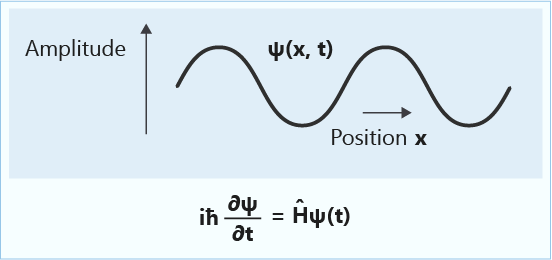
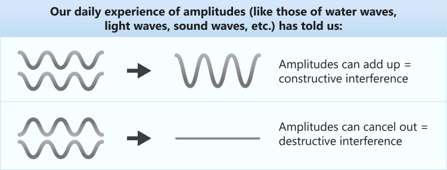
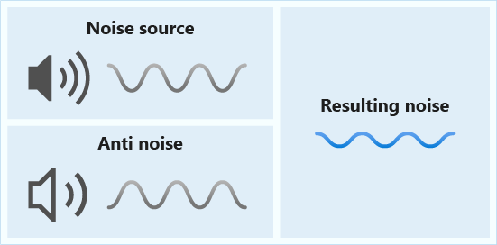
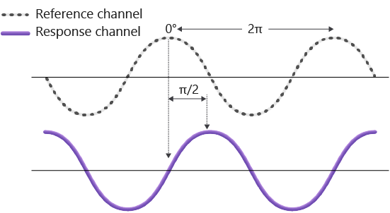
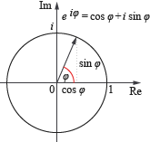

Until now, you've been using superpositions only with real positive amplitudes.
You might be wondering, why not directly use the probabilities to represent the
superposition? Well, the ability to have negative and complex amplitudes is one
of the main physical phenomena that makes quantum computing work. Let's examine this ability
further.

## Waves of probabilities

The term *wave function* might be familiar to you. You might have noticed that the `DumpMachine` function that you just used refers to the quantum state as a "wave function."

Physicists often use "wave function" as a synonym for the quantum state of a
system. They use the term because the Schrödinger equation that we introduced at the beginning of
this
module. The Schrödinger equation has the same mathematical structure as classical wave equations.

You might have also heard the term *probability wave*. In fact, the idea of the *amplitude* of a
wave inspired the term
*probability amplitude*.

Because probability amplitudes of qubits can be described by wavelike equations, you'll observe many of the well-known properties of waves. Quantum
algorithms exploit these properties to perform calculations. In particular,
quantum computers exploit the phenomenon of *wave interference*.

## Complex numbers can describe waves

As we mentioned earlier, probability amplitudes can be complex numbers.

Complex numbers are a handy mathematical tool to describe waves. In fact, they were used to describe waves long before the discovery of quantum mechanics. They help us understand interference.

But what is wave interference? Waves are governed by a linear equation. This characteristic
implies that waves can be superposed, just like we discussed for quantum states earlier. (Remember, waves and quantum states are mathematically identical.) Superposition of different waves enables their amplitudes
to interfere, resulting in different effects on the overall state. 

There are two types of interference:

- **Constructive interference**: Two waves add up to increase the amplitude of the resulting wave. For example, in our daily experience, when two water waves meet in a pool, we may see a bigger wave when their peaks add up.
- **Destructive interference**: Two waves subtract to decrease the amplitude of the resulting wave. Again,
    in our daily experience, noise-canceling headphones use an external
    microphone to catch the noise in the environment. The device then reproduces sound
    waves that have the same magnitude but opposite phase. The headphones play
    the reproduced sound in the inner speakers to cancel the noise for the listener. This
    technique uses destructive interference for noise cancellation.

Constructive and destructive interferences are caused by *relative phases* between
the waves. In the next figure, you can see how the relative phase determines the
distance between the peaks of the waves and therefore how they interfere.

In general, an amplitude is a complex number. It describes both the magnitude
and the phase of the wave. The following image shows the standard representation
of complex numbers in a complex plane that uses polar coordinates.

## Interference in quantum computing

Qubit states follow the same mathematics as waves.

You used the following superposition to create the quantum random number generator.

$$|\psi_1\rangle= \frac1{\sqrt2}|0\rangle+\frac1{\sqrt2}|1\rangle.$$

In this case, the probabilities of measuring **0** and **1** are both $\frac12$.
Remember, each amplitude squared gives the probability of obtaining each state.

However, the following state also gives the same probabilities for each outcome.

$$|\psi_2\rangle= \frac1{\sqrt2}|0\rangle-\frac1{\sqrt2}|1\rangle.$$

Notice the minus sign, which makes the relative phase differ between the $|0\rangle$ state and the
$|1\rangle$ state.

Now consider an equal superposition of the states $|\psi_1\rangle$ and
$|\psi_2\rangle$:

$$|\psi\rangle=\frac1{\sqrt2}|\psi_1\rangle+\frac1{\sqrt2}|\psi_2\rangle=
\frac1{\sqrt2}\left(\frac1{\sqrt2}|0\rangle+\frac1{\sqrt2}|1\rangle\right)+\frac1{\sqrt2}\left(\frac1{\sqrt2}|0\rangle-\frac1{\sqrt2}|1\rangle\right)$$
$$= \frac12 \left(|0\rangle+|0\rangle\right)+ \frac12\left(|1\rangle-|1\rangle\right)=
|0\rangle.$$

Here, the amplitudes of $|0\rangle$ had the same phase. They constructively
interfered like waves, doubling the probability of obtaining **0**. Conversely, the
amplitudes of $|1\rangle$ had the opposite phase and destructively interfered,
eliminating the probability of obtaining **1**.

> [!NOTE]
> Qubits don't necessarily interfere with each other, but their
> probability amplitudes do. Because probability
> amplitudes are associated with wavelike equations, they show
> wavelike properties, such as interference.

Interference is one of the basic principles behind the power of quantum
computing. Quantum interference can be harnessed to cancel the amplitudes of
states that don't help you solve the problem, while increasing the amplitudes
of states that lead you to the solution.

In the next part, you'll see how you can use Q# to explore quantum interference.
