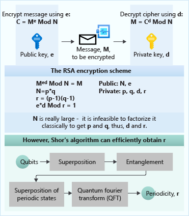
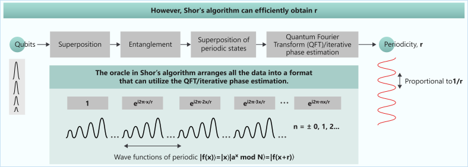

In this part, you explore some famous quantum computing algorithms.

You'll learn the basics of how they use superposition, interference, and entanglement to achieve a quantum advantage over classical algorithms. In later modules, you'll explore these algorithms in more detail.

## Quantum oracle

Before we explore algorithms, we need to introduce the concept of a *quantum oracle*.
In many problems, you're
interested in solving a problem while making the fewest number of evaluations of
a function: $f:\\{ 0,1 \\}^n \rightarrow \\{0,1\\}^m$. For example, to
check whether a number $x$ fulfills a property, you can encode the problem in a
binary function: $f: \\{0,1\\}^n \rightarrow \\{0,1\\}$. You can consider the function $f(x)$ 
as a black box that produces $1$ if the number $x$ fulfills the
property. Otherwise, the result is $0$. This strategy can be used, for example, to brute-force
search solutions for mathematical problems.

A quantum oracle is a quantum operation that implements a black-box function: $f:
\\{0,1\\}^n \rightarrow \\{0,1\\}^m$. This
operation is implemented in a way that enables you to evaluate the black-box function
not only on individual inputs but also on the superposition of basis states.

> [!NOTE]
> Using a quantum oracle is different from calculating the function on all
> inputs at once. You can extract only the evaluation of the qubit you
> decide to measure.

The oracle has to act on quantum states instead of classical bits. To enable
this capacity, you can encode the input $x$ that has the binary representation $x=(x_0,x_1,...,x_{n-1})$
into an $n$-qubit register: $|x\rangle=|x_0x_1...x_{n-1}\rangle$.

For more information about quantum oracles, see the [conceptual documentation for the
Quantum Development Kit (QDK)](https://docs.microsoft.com/quantum/concepts/oracles?azure-portal=true).

## Deutsch–Jozsa algorithm

The Deutsch–Jozsa quantum algorithm is famous because it's one of the earliest examples of using quantum computing to solve a problem exponentially faster than its classical counterpart.

The algorithm has limited real-life application. But its relative simplicity makes it a fantastic example to show how quantum computers can improve classical results by using superposition, interference, and entanglement.

### Problem: Find out if a function is constant

Let's introduce a problem to help us understand the Deutsch–Jozsa algorithm. 

Suppose you're given this function: $f(x):\\{0,1\\}^n\rightarrow\\{0,1\\}$. This binary function takes a string of bits and produces a single bit. The function fits one of the following descriptions:

- *Constant*: It produces the same output value for all input values.
- *Balanced*: It produces $1$ for exactly half of the input values and $0$ for all remaining input values.

For example, the function $f(x)=1$ for all $x$ is a constant function. Conversely, the function $f(x)= x_{n-1}$, where $x_{n-1}$ is the last bit of $x$, is balanced.

The task is to use the least amount of calls possible to find out whether a given black-box function $f(x)$ is constant
or balanced.

### Classical solution

If you solve this problem classically, how many calls to the given function do
you need?

The first call gives you no information. Regardless of whether it returns $0$
or $1$, the function could still be constant or balanced.

In the best-case scenario, the second call returns a different value. So in just two calls, you can
conclude that the function is balanced. But if you get the same value for the first two calls, you must keep querying the function until either you get a different value or you do $\frac{2^{n}}{2}+1$ queries that return the same value. In this case, you know for certain that the function is constant.

In other words, if the function is constant, you need to call the function for one half plus one of the possible inputs to be sure that the function isn't balanced.

### Quantum solution: The Deutsch-Jozsa algorithm

Suppose you're given an oracle operation $U_f$ that acts as a black box that implements the function $f(x)$. Both $f(x)$ and $U_f$ are unknown to you. 
Your only information is that $f(x)$ takes a bit string of length $n$ as an input and that the function is either constant or balanced.

### Outline of the Deutsch-Jozsa algorithm 

The Deutsch-Jozsa algorithm follows this pattern:

1. Start with a register of $n$ qubits that are initiated in the state $|0...0\rangle$.
1. Apply $H$ to every qubit to create a superposition of all possible states.
1. Apply the oracle $U_f$ to the superposition to cause quantum interference.
1. Apply $H$ to every qubit again to get out of superposition.
1. Measure every qubit. If all measurement results are $0$, the function is
   constant. Otherwise, the function is balanced.

By using this algorithm, you solve the problem by querying the oracle only once. The process is
exponentially faster than the classical solution.

If you're interested in the details of this algorithm and want to implement it
in Q#, see the [Quantum Katas tutorial for the Deutsch-Jozsa algorithm](https://github.com/microsoft/QuantumKatas/tree/main/tutorials/ExploringDeutschJozsaAlgorithm?azure-portal=true) and
the [sample for the Deutsch-Jozsa algorithm](https://github.com/microsoft/Quantum/blob/main/samples/getting-started/simple-algorithms/DeutschJozsa.qs?azure-portal=true).

## Shor's algorithm

Shor's algorithm is a quantum factoring algorithm that offers an exponential speedup over any known classical factoring algorithm. It's important because it implies that sufficiently large quantum computers can break public-key cryptography.

### Problem: Integer factorization

The factoring problem finds the prime factors of any
integer $N$.

### Classical solution 

Many classical approaches can find the prime factors of an integer.
The approaches range from trying division for every prime number smaller than $N/2$
to sophisticated algorithms that involve advanced number-theory tools. The
best-known classical algorithm is the *general number field sieve* algorithm.

### Quantum solution: Shor's algorithm

Shor's algorithm takes advantage of the fact that the factoring problem can be
transformed to a problem of finding the period of a periodic
function. The latter problem is known as the order-finding problem. 

Shor's algorithm uses
superposition and interference to apply the *quantum Fourier transform*. This transform is
a quantum-computer version of the discrete Fourier transform. Shor's algorithm uses this transform to find the
function's period faster than any known classical algorithm. 

Some versions
of Shor's algorithm instead use *iterative phase estimation*. This estimation is a kind of algorithm
that finds a complex phase of an operation. By using the complex phase, you can find the period
of the function.

The RSA (Rivest-Shamir-Adleman) encryption scheme is one of the most widely used cryptosystems for secure data transmission. Its principle relies on the fact that a set of private parameters (p, q, d, and r) is difficult to obtain by using classical algorithms. They're difficult because they need to be derived by factoring a large number, N. However, Shor's algorithm can efficiently obtain one of the parameters, r. The algorithm can then use this parameter to infer the other parameters, as indicated in the mathematical relations in the preceding figure. Therefore, the encryption of the message can be broken.

### Outline of Shor's algorithm

Shor's algorithm consists of three parts:

- A classical part that transforms the factoring problem into a problem of
   finding the period $r$ of a periodic function $f(x)=a^x \mod N$. Here, $a$ is
   a random number whose greater common divisor with $N$ is $1$.

- A quantum part that finds the period $r$ by using the quantum Fourier transform
   or iterative phase estimation.

- A classical part that infers the factors of $N$ from the period $r$ by using number-theory techniques.

Shor's algorithm finds a prime factor with high probability, but
the algorithm can fail. However, you can repeat the algorithm several times until it finds the
prime factors. And Shor's algorithm is exponentially faster than the best-known classical algorithm.

For more information about how to implement this algorithm by using Q# high-level
functionality, see the [Q# sample for integer
factorization](https://github.com/microsoft/Quantum/tree/main/samples/algorithms/integer-factorization#integer-factorization-sample?azure-portal=true).
