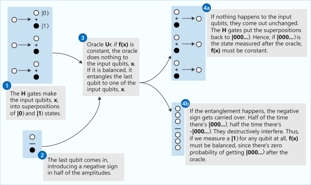

Here, you explore some of the most famous quantum computing algorithms.

We outline how they use superposition, interference, and entanglement to achieve a quantum advantage over classical algorithms. In later modules, you'll explore these algorithms in more detail.

## Quantum oracle

First, let's introduce the concept of *quantum oracle*. In many problems, you're
interested in solving a problem while making the fewest number of evaluations of
a function $f:\\{ 0,1 \\}^n \rightarrow \\{0,1\\}^m$. For example, if you're
checking whether a number $x$ fulfills a property, you can encode the problem in a
binary function $f: \\{0,1\\}^n \rightarrow \\{0,1\\}$. The function $f(x)$ can
be considered as a black-box that outputs $1$ if the number $x$ fulfills the
property, and $0$ otherwise. This can be used, for example, to brute-force
search solutions for mathematical problems.

A quantum oracle is a quantum operation that implements some black-box function $f:
\\{0,1\\}^n \rightarrow \\{0,1\\}^m$. This
operation is implemented in a way that enables you to evaluate the black-box function
not only on individual inputs, but also on superposition of basis states.

> [!NOTE]
> This is not the same as being able to calculate the function on all
> inputs at once, since you'll be able to extract only the evaluation of the qubit you
> decide to measure!

The oracle has to act on quantum states instead of classical bits. To enable
this, the input $x$ with binary representation $x=(x_0,x_1,...,x_{n-1})$
can be encoded into an $n$-qubit register: $\ket{x}=\ket{x_0x_1...x_{n-1}}$.

You can learn more about quantum oracles in the [conceptual documentation of the
Quantum Development Kit](https://docs.microsoft.com/quantum/concepts/oracles?azure-portal=true).

## Deutsch–Jozsa algorithm

This quantum algorithm is famous for being one of the earliest examples of using quantum computing to solve a problem exponentially faster than its classical counterpart.

Although it has limited real-life application, its relative simplicity makes it a fantastic example to show how quantum computers can improve classical results using superposition, interference and entanglement.

### Problem: finding out if a function is constant

First let's introduce the problem to solve. Suppose you're given a function $f(x):\\{0,1\\}^n\rightarrow\\{0,1\\}$.

This is a binary function that takes a string of bits and outputs a single bit. You're guaranteed that the function is either:

- *constant*: It produces the same output value for all input values.
- *balanced*: It produces $1$ for exactly half of the input values and $0$ for all remaining input values.

For example, the function $f(x)=1$ for all $x$ is a constant function. On the other hand, the function $f(x)= x_{n-1}$, where $x_{n-1}$ is the last bit of $x$, is balanced.

The task is to find out whether or not a given black-box function $f(x)$ is constant
or balanced with the least amount of calls possible.

### Classical solution

If you solve this problem classically, how many calls to the given function will
we need?

The first call will give you no information - regardless of whether it returns $0$
or $1$, the function could still be constant or balanced.

In the best case scenario, the second call will return a different value and you'll be able to
conclude that the function is balanced in just two calls. However, if you get the same value for the first two calls, you'll have to keep querying the function until either you get a different value or until you do $\frac{2^{n}}{2}+1$ queries that will return the same value. In this case, you'll know for certain that the function will be constant.

In other words, if the function is constant you need to call the function for one half plus one of the possible inputs to be completely sure that the function isn't balanced.

### Quantum solution: the Deutsch-Jozsa algorithm

Suppose you are given an oracle operation $U_f$ that acts as a black-box that implements the function $f(x)$. Both, $f(x)$ and $U_f$ are unknown to you and
the only information you have is that $f(x)$ takes a bit string of length $n$ as input and you're guaranteed that the function is either constant or balanced.

#### Outline of the algorithm

The algorithm is as follows:

1. Start with a register of $n$ qubits initiated in the state $\ket{0...0}$.
1. Apply $H$ to every qubit to create a superposition of all possible states.
1. Apply the oracle $U_f$ to the superposition to cause quantum interference.
1. Apply $H$ to every qubit again to get out of superposition.
1. Measure every qubit: if all measurements results are $0$, the function is
   constant, otherwise, it is balanced.

Using this algorithm you solve the problem with just one query to the oracle,
exponentially faster than the classical solution.

If you're interested in the details of this algorithm and want to implement it
in Q#, check our [quantum katas tutorial on Deutsch-Jozsa algorithm](https://github.com/microsoft/QuantumKatas/tree/main/tutorials/ExploringDeutschJozsaAlgorithm?azure-portal=true) and
the [sample on Deutsch-Jozsa algorithm](https://github.com/microsoft/Quantum/blob/main/samples/getting-started/simple-algorithms/DeutschJozsa.qs?azure-portal=true).

## Shor's algorithm

Shor's algorithm is a quantum factoring algorithm that offers an exponential speed-up over any known classical factoring algorithm. It's important because it implies that public key cryptography can be broken with sufficiently large quantum computers.

### Problem: integer factorization

The factoring problem finds the prime factors of any
integer $N$.

### Classical solution of the factoring problem

There are many classical approaches to find the prime factors of an integer.
They go from just trying the division for every prime number smaller than $N/2$
to very sophisticated algorithms involving advanced number theory tools. The
best known classical algorithm is the *general number field sieve* algorithm.

### Quantum solution: Shor's algorithm

Shor's algorithm takes advantage of the fact that the factoring problem can be
transformed to a problem that consists on finding the period of a periodic
function. This is known as the order finding problem. Shor's algorithm uses
superposition and interference to apply the quantum Fourier transform -
a version of the discrete Fourier transform for quantum computers - to find the
period of the function faster than any known classical algorithm. Some versions
of the algorithm use instead *iterative phase estimation*, a kind of algorithm
that finds a complex phase of an operation that enables you to find the period
of the function.

#### Outline of Shor's algorithm

The algorithm consists of three parts:

- A classical part that transforms the factoring problem into a problem of
   finding the period $r$ of a periodic function $f(x)=a^x \mod N$, where $a$ is
   a random number whose greater common divisor with $N$ is $1$.

- A quantum part that finds the period $r$ using the quantum Fourier transform
   or iterative phase estimation.

- A classical part that infers the factors of $N$ from the period $r$ using number theory techniques.

Shor's algorithm succeeds in finding a prime factor with high probability but
it can fail. However, repeating the algorithm several times until it finds the
prime factors is exponentially faster than the best known classical algorithm.

If you want to know how to implement this algorithm with the Q# high-level
functionality, you can also check the [Q# sample for integer
factorization](https://github.com/microsoft/Quantum/tree/main/samples/algorithms/integer-factorization#integer-factorization-sample?azure-portal=true).
