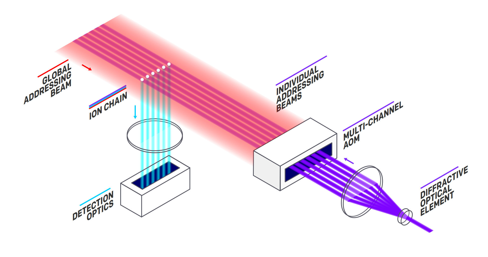

Modern classical computers are based on transistors made from semiconductors to implement classical logic operations. Quantum computers take
radically different approaches to exploit the properties of quantum systems to implement qubits and quantum operations.

In this unit, you will learn about the challenges of building a quantum computer. You will also learn the different types of physical qubit systems and how quantum devices are designed.

## Harnessing quantum systems to perform computations

To build quantum computers, we need full access to the controllable quantum
systems that will represent the qubits we'll use to store and process the
quantum information. A qubit can be represented by any physical system with
**two** *states* or *levels* that can be prepared in a quantum superposition. In
general, a functional quantum computer should fulfill the following criteria:

- **Scalability:** since quantum computers are based on the manipulation of
  quantum information by using qubits, we need a system that allows scalability
  to a large number of qubits.
- **Ability to initialize the qubits in a specific state:** having many qubits
  isn't useful if we can't trust their initial state. A fundamental
  characteristic of a quantum computer is its ability to initialize the qubits
  reliably to a specific state (usually, the state $|0\rangle$).
- **Resilient qubits:** quantum states are very delicate. The smallest
  interaction with the environment can "contaminate" the state of the qubits and
  ruin our computations. Qubit registers needs to be able to remain in a
  consistent quantum state long enough for us to perform the computations. The
  amount of time a qubit can remain in a specific quantum state is often called
  *coherence time*.
- **Ability to perform a universal set of operations:** like in classical
  computing, any quantum algorithm can be decomposed as the application of
  a sequence of operations from a universal set of basic operations. This set is
  not unique, but a quantum computer should be able to reliably perform all the
  operations of the chosen universal set.
- **Reliable measurements:** to obtain the results of quantum
  computations we need to measure each qubit with high precision. Note that
  the measurement affects the state of the register. It's often performed only
  at the end of the computation.

These five criteria are often known as the *DiVincenzo* criteria for quantum
computation.

Building devices that meet these five criteria is one of the most demanding
engineering challenges ever faced by humankind. However, in the recent years
astounding advances in condensed matter physics and quantum optics are allowing
companies and universities to build the first working versions of quantum
computers. Microsoft is partnering with some of the best-in-class quantum computer
manufacturers around the world to give you access to the latest quantum
computing solutions through Azure Quantum. 

Here is an overview of the
different technologies used to create quantum computers, accessible via Azure Quantum.

### Trapped ion quantum computers

Trapped ion quantum computers use *ions* (electrically charged atoms) suspended
in an electromagnetic field in vacuum as the basic building block.

In particular, these computers use chains of trapped ions and each ion represents a
qubit. They use lasers to induce controlled vibrations on the chain to
accomplish operations in the qubit states. The qubit states are stored in the
internal states of each ion. In particular, the qubit states are often stored in
two hyperfine levels of the ion.

> [!NOTE]
> The hyperfine levels of an atom arise from the different possible
> configurations of the spin orientations of the electron and the nucleus.
> Generally, the state with the lower energy, is associated
> with the state $|0\rangle$, and the state with higher energy is associated with the
> qubit state $|1\rangle$.

These computers use lasers and electromagnetic pulses to cause
transitions in the internal states of the ions and to modify the vibrational
motion of the ion chain. By combining very carefully transformations of the
vibrational motion of the ion chain and individual ion transitions, it's
possible to get qubits entangled and apply an universal set of quantum
operations.

Azure Quantum provides access to trapped ion quantum devices through our
partners, IonQ and Honeywell. In this module, you'll submit quantum operations to
this kind of devices.

### Superconducting quantum computers

Superconducting quantum computers are based on superconducting electronic
circuits. While classical computers use circuits of transistors to represent
bits and perform classical computations, superconducting quantum computers use *transmons*
to represent qubits and perform quantum operations.

If certain materials are cooled below a critical temperature, their electric
resistance drops to zero. These materials are called **superconductors**. By
linking two superconductors with a thin insulating barrier, you can build
*transmons*, an electronic device that possesses quantum states in superposition, with two of the
states used as |0> and |1>.". Transmons can be considered analogous to transistors. While in
transistors you use junctions of semiconductors to represent controllable bits,
in transmons you use junctions of superconductors to represent controllable
qubits.

There are other variants of superconducting circuits that don't use transmons
but similar components. However, transmons are the key component in most
cloud-available superconducting quantum computers.

Since superconducting properties appear at very low temperatures and higher
temperatures imply more noise, these quantum computers work at very low
temperatures. This is why, with the aid of a cryostat, the superconducting chip
is cooled to near absolute zero.

### Other types of quantum computers

Trapped ion and superconducting quantum computers aren't the only options for
quantum computing, although they are implemented the most in industry so far. Here are several
other approaches that are currently subjected to active research:

- **Quantum dot computers:** quantum dots are small clusters of semiconductor
  atoms that behave like macroscopic atoms and can be prepared into superposed
  states.
- **Photonic quantum computers:** polarized photons used to represent qubits
  and photon waveguides to implement quantum operations.
- **Topological quantum computers:** a new type of particles called *anyons*, first proposed theoretically, now in active research and development, to create qubits very resilient to noise.  

There many other proposals for quantum computers since the field is still under
development. With Azure Quantum you have access to an ever-growing collection
of quantum computers to run your own quantum algorithms. 

You can learn about Microsoft latest efforts on advancing quantum computing
technologies in [our research page](https://www.microsoft.com/research/research-area/quantum-computing/?facet%5Btax%5D%5Bmsr-research-area%5D%5B%5D=243138&sort_by=most-recent&facet%5Btax%5D%5Bmsr-content-type%5D%5B%5D=3).

### Azure Quantum for cloud quantum computing

Azure Quantum is a cloud computing hub where you can connect to different
industry leading providers of quantum hardware to use their most advanced quantum computers.

You just need an Azure subscription to start submitting quantum computing jobs
to Azure Quantum. These jobs will be queued by the provider to run on the
target device you select. Through Azure Quantum you can manage your jobs and
monitor their status, as well as getting the results once they are completed.

In the next unit, you'll use Azure Quantum to submit your first job to a quantum
computer.
