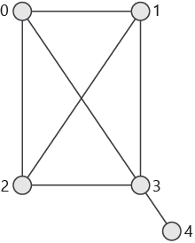
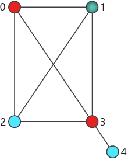

Let's take a step back and see how Grover's algorithm works and why we can use it to solve our best-delivery-route problem. 

In this section, we define the problem solved by Grover's search algorithm — the so-called "search problem"  — and take a closer look at how various real-life problems can be represented in terms of this problem.

## The search problem

The search problem is formulated as follows: you are given a function $f$ that takes an $N$-bit input and returns a 1-bit output, 0 or 1. Your goal is to find any input $x_0$ for which $f(x_0) = 1$.

> [!NOTE] 
> Notice that you are not given any information about the structure of the function! You only have 
> access to an "opaque box" that implements this function, this is, takes the input and returns the corresponding output.

## What problems can be framed as search problems?

The search problem is by design generic. Indeed, any problem that allows you to check whether a given value $x$ is a valid solution (a "yes or no problem") can be formulated in terms of the search problem, if we define $f(x)$ as "1 if, and only if, $x$ is a valid solution for our problem".

Here are some examples:

* [Boolean satisfiability problem](https://en.wikipedia.org/wiki/Boolean_satisfiability_problem): Is the set of Boolean values $x$ an interpretation (an assignment of values to variables) that satisfies the given Boolean formula?
* [Traveling salesman problem](https://en.wikipedia.org/wiki/Travelling_salesman_problem): Does $x$ describe the shortest possible loop that connects all cities?
* Database search problem: Does the database table contain a record $x$?
* Integer factorization problem: Is the fixed number $N$ divisible by the number $x$?

Some of these problems are better suited to benefit from using Grover's algorithm than the others. 

The problem you have been tasked with is the following. We supply our space stations with different materials, food, water, fuel, etc. We need to elaborate a list of the minimum number of supplies we need to carry in the spaceship, depending on the number of stations and how close they are between them. If two space stations are close enough we know they are connected and they can share supplies, so there is no need to delivery same type of supply twice.

This problem is an instance of the graph coloring problem.

We'll use the graph coloring problem as an example throughout this module. In the last unit, we will return to the question of the quantum speedup and the types of problems that can be solved faster by using Grover's algorithm rather than a classical algorithm.

## Graph coloring problem

The graph coloring problem, more precisely known as the [proper vertex coloring problem](https://en.wikipedia.org/wiki/Graph_coloring#Vertex_coloring), is formulated as follows: given a graph and a set of $k$ labels ("colors"), assign a label to each of the graph's vertices such that no two vertices that are connected have the same label. Using colors as labels is a good visual aid in the graphic representation. In practice these labels can be anything: a list of jobs to be assigned, a list of the radio frequencies we use to communicate between space stations, or a list of different supplies we deliver to space stations. 

Here is an example graph with five vertices and seven edges:

Here is an attempt to label the vertices of this graph using three colors. 

We see that this labeling attempt is not valid using our definition - vertices 0 and 3 are assigned the same label, even though they share an edge.

In fact, you cannot label the vertices of this graph using just three colors; you'll need at least four colors to do that.

In this module, we'll consider the problem of finding a 4-coloring of the graph - that is, a solution that uses, at most, four colors. (Without any constraint on the number of colors used, finding a valid graph coloring is trivial - you just assign a new label to each vertex you see!)

In general, graph coloring is an [NP-complete problem](https://en.wikipedia.org/wiki/NP-completeness), and the best currently known solutions to the problem take exponential time to run.

In the next units of this module, you'll see how quantum computing can help speed up the solution to this problem.
