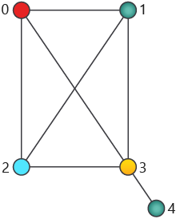

For the moment, forget about spacecraft traveling between stations and consider only colors and vertices. You have a picture of dots connected by edges and you wonder about the ways to color the dots. 

In this part, you will implement a quantum oracle for the graph coloring problem.

> [!NOTE]
> In this module we'll focus on high-level behavior of quantum oracles and (in the following units) Grover's search algorithm. 
> We encourage you to dig deeper into the code on your own, in particular, to look up any unfamiliar operations and language constructs in the [Q# documentation](https://docs.microsoft.com/quantum).

## Create the project

Start by creating a Q# project as described in the module [Create your first Q# program by using the Quantum Development Kit](https://docs.microsoft.com/learn/modules/qsharp-create-first-quantum-development-kit?azure-portal=true). To do so:

1. On the **View** menu, select **Command Palette**.
1. Enter **Q#: Create New Project**.
1. Select **Standalone console application**.
1. Select a directory to hold your project, such as your home directory. Enter *ExploringGroversSearch* as the project name, then select **Create Project**.
1. From the window that appears at the bottom, select **Open new project**.

You will see two files: the project file and *Program.qs*, which contains starter code. 

For each of the code snippets in this module, you should copy the whole snippet to replace the contents of the file *Program.qs*. 
After that, open the integrated terminal (from the **Terminal** menu, select **New Terminal**) and run `dotnet run`:

```dotnetcli
dotnet run
```


## Representing the graph

We need two parameters to represent a graph: the number of vertices and the list of edges. 

In Q#, we will store the number of vertices `nVertices` as an integer, and the list of edges `edges` as an array of tuples. Each tuple describes one edge of the graph as a pair of indices of vertices connected by this edge; we will use zero-based indices so that the index value can be between 0 and `nVertices` - 1.



The structure of our example graph can be represented as follows:

:::code language="qsharp" source="code/4-program-1.qs":::

## Representing the vertex coloring

We will describe our graph coloring by an array of `nVertices` colors. 
For our example, we will look for a four-coloring of the graph - a coloring that uses at most four colors, encoded with integers 0 through 3. 

We need to represent our coloring in a bit string, so we'll use a bit string of length 2 * `nVertices`, with the first pair of bits encoding the color of vertex 0, the second pair - the color of vertex 1, and so on. We'll store our bits as Boolean values, with 0 and 1 bits encoded as `false` and `true`, respectively. The pair of bits will encode an integer color index using little-endian notation, this is, an integer 1 is encoded as 10, with the least significant bit stored first.

Here is how the coloring of our example graph will be encoded and interpreted:

:::code language="qsharp" source="code/4-program-2.qs":::

This code will produce the following output:

```output
Vertex 0 - color #0 (red)
Vertex 1 - color #1 (green)
Vertex 2 - color #2 (blue)
Vertex 3 - color #3 (yellow)
Vertex 4 - color #1 (green)
```

When we work with graph coloring in a quantum program, we use the same encoding, but with the basis states $|0\rangle$ and $|1\rangle$ instead of the classical bits `false` and `true`. 
The same coloring would be represented as a 10-qubit state $|0010011110\rangle$.

## Implementing the oracle

A typical approach to implementing a quantum oracle for a given function is as follows:

1. Break down the classical function into small building blocks that are easy to implement.  
  You can use primitive logic gates to implement any Boolean function. You can either use primitive logic gates directly to get a low-level representation of the function or take advantage of higher-level building blocks implemented by Q# library operations.

2. Replace each classical block with a sequence of quantum gates that implement it as a marking oracle.  
  You can implement each of the primitive logic gates using one or several quantum gates. Sometimes we'll need to allocate an extra qubit to hold the computation result of the gate. For example,  
   * The classical NOT gate is equivalent to the X gate.
   * The classical XOR gate can be implemented using the CNOT gate (controlled X gate).
   * The classical AND gate can be realized using the Toffoli gate (a double-controlled X gate) and an extra qubit.

3. If the algorithm calls for a phase oracle, transform the marking oracle into a phase oracle.  
  This step uses a standard trick called *phase kickback*: that is, applying a marking oracle to an input array of qubits and a target qubit in a particular state will have the same effect on the input array as applying a phase oracle to it.

Let's see how this approach works for our vertex coloring problem!

### Step 1. Check whether the colors of two vertices are the same

The smallest building block for checking whether the given graph coloring is valid is taking a pair of vertices connected by an edge and checking whether their assigned colors are the same or different.

The operation that implements this check (`MarkColorEquality`) has to take two 2-qubit arrays as inputs, representing the colors of the vertices, and a qubit that we'll use to mark the result of the comparison by flipping its state if the colors are the same.
To compare the qubit arrays, we compare their corresponding bits to each other; if all pairs of bits are the same, then the arrays are the same, and the colors of the vertices stored in those arrays are the same.
To compare a pair of bits, we can compute their XOR: if the result is 0, the bits are the same; otherwise they are different.

Here is the Q# code that implements this check and uses it to compare two qubit arrays: the first one in the $|00\rangle$ state and the second one in an equal superposition of all basis states.

:::code language="qsharp" source="code/4-program-3.qs":::

The `within ... apply` statement implements a common pattern in quantum computing: apply the statements of `within` and `apply` blocks, and then "undo" the `within` block. We use it to make sure that applying our check doesn't have unexpected effect on the input qubits.

> [!NOTE]
> The `DumpRegister` function is similar to the `DumpMachine` function that has been used in previous modules. However, it prints the information about the state of a *subset* of qubits, rather than all the qubits used by the program. 
> In the current implementation of the full-state simulator, `DumpRegister` can only be used if that register is not entangled with the rest of the qubits.

Here is the output of this code:

```output
The starting state of qubits c1 and target:
# wave function for qubits with ids (least to most significant): 2;3;4
∣0❭:     0.500000 +  0.000000 i  ==     *****                [ 0.250000 ]     --- [  0.00000 rad ]
∣1❭:     0.500000 +  0.000000 i  ==     *****                [ 0.250000 ]     --- [  0.00000 rad ]
∣2❭:     0.500000 +  0.000000 i  ==     *****                [ 0.250000 ]     --- [  0.00000 rad ]
∣3❭:     0.500000 +  0.000000 i  ==     *****                [ 0.250000 ]     --- [  0.00000 rad ]
∣4❭:     0.000000 +  0.000000 i  ==                          [ 0.000000 ]
∣5❭:     0.000000 +  0.000000 i  ==                          [ 0.000000 ]
∣6❭:     0.000000 +  0.000000 i  ==                          [ 0.000000 ]
∣7❭:     0.000000 +  0.000000 i  ==                          [ 0.000000 ]

The state of qubits c1 and target after the equality check:
# wave function for qubits with ids (least to most significant): 2;3;4
∣0❭:     0.000000 +  0.000000 i  ==                          [ 0.000000 ]
∣1❭:     0.500000 +  0.000000 i  ==     *****                [ 0.250000 ]     --- [  0.00000 rad ]
∣2❭:     0.500000 +  0.000000 i  ==     *****                [ 0.250000 ]     --- [  0.00000 rad ]
∣3❭:     0.500000 +  0.000000 i  ==     *****                [ 0.250000 ]     --- [  0.00000 rad ]
∣4❭:     0.500000 +  0.000000 i  ==     *****                [ 0.250000 ]     --- [  0.00000 rad ]
∣5❭:     0.000000 +  0.000000 i  ==                          [ 0.000000 ]
∣6❭:     0.000000 +  0.000000 i  ==                          [ 0.000000 ]
∣7❭:     0.000000 +  0.000000 i  ==                          [ 0.000000 ]
```

> [!NOTE]
> As a reminder, the indices in the `DumpMachine`/`DumpRegister` output are encoded in little-endian. Hence, the index `|1❭` corresponds to bit string `100`, with the least significant bit stored first.

We see that in the beginning the state of the system is 

$$|00\rangle\_\textrm{c0} \otimes \frac12\big(|00\rangle + |10\rangle + |01\rangle + |11\rangle\big)\_\textrm{c1} \otimes |0\rangle\_\textrm{target}.$$

After we apply the equality check, the state of the register `c0` doesn't change (you can verify this by adding another `DumpRegister` call), but the amplitudes of the combined state of the register `c1` and the `target` qubit change.
The amplitude of the $|00\rangle\_\textrm{c1} \otimes |0\rangle\_\textrm{target}$ state becomes 0, and the amplitude of the $|00\rangle\_\textrm{c1} \otimes |1\rangle\_\textrm{target}$ state becomes $0.25$. 
Note that the two amplitude values not only change but are swapped as the result of applying this check.

Indeed, since the colors encoded in the state $|00\rangle\_\textrm{c0} \otimes |00\rangle\_\textrm{c1} \otimes |0\rangle\_\textrm{target}$ are equal, the state of the `target` qubit for this basis state gets flipped, giving us the resulting state

$$|00\rangle_\textrm{c0} \otimes \frac12\big(|00\rangle_\textrm{c1} \otimes |1\rangle_\textrm{target} + |10\rangle_\textrm{c1} \otimes |0\rangle_\textrm{target} + |01\rangle_\textrm{c1} \otimes |0\rangle_\textrm{target} + |11\rangle_\textrm{c1} \otimes |0\rangle_\textrm{target} \big).$$

> [!NOTE]
> Note that the `target` qubit becomes entangled with the register `c1`: you can no longer separate their states!
> If the value of the function we're evaluating is the same for all inputs, the target qubit will remain unentangled from the input register, storing this value instead. 
> In our case, some inputs yield $f(x) = 0$ and some yield $f(x) = 1$, so you cannot separate the information about the inputs from the information about the output any longer.

### Step 2. Check whether the vertex coloring is valid

Now that we know how to check that the colors of any two vertices are different, we can represent the vertex coloring validation as follows:

1. Iterate over all pairs of vertices connected by edges.
2. For each pair, check that the colors of these vertices are different.
3. If all pairs of vertices satisfy this condition, the coloring is valid.

To implement these steps as a quantum operation, we'll need to allocate extra qubits to store the results of pairwise color comparisons, one qubit per edge. 
We start with those qubits in $|0\rangle$ state and compare colors of vertices in each pair using the `MarkColorEquality` operation we've seen above; it flips the state of the qubit to $|1\rangle$ if the colors of the corresponding pair of vertices are the same.

Lastly, we compute the final result. If all the extra qubits allocated are in the $|0\rangle$ state, we flip the state of our target qubit to indicate that the vertex coloring is valid.

Here is the Q# code that validates that the vertex coloring is valid.

:::code language="qsharp" source="code/4-program-4.qs":::

Here is the output of this code:

```output
The coloring is valid
```

#### Bonus exercises

* Experiment with the colorings and the graph structures to see which ones are deemed valid and invalid. An example of invalid coloring for this graph would be `[false, false, true, false, false, true, true, true, true, true]`, which describes a graph with vertices 3 and 4 assigned the same color. 
* Modify the code to run on superpositions of inputs and see what happens. 


### Step 3. Convert the marking oracle into the phase oracle

Now, we have a marking oracle, that is, an operation that marks the qubit states that represent valid colorings in the state of an extra qubit. How can we use it to implement a phase oracle, that is, another operation that would mark such states using their phases?

We can do it using the so-called "phase kickback trick": 

1. Allocate an extra qubit in the $\frac{1}{\sqrt2}(|0\rangle - |1\rangle)$ state.
2. Apply the marking oracle $U_\textrm{mark}$ with this extra qubit as the target.  
What happens to the register that encodes the coloring at this step? 
   * If the basis state $|x\rangle$ encodes an *invalid coloring*, the state does not change.
   * If the basis state $|x\rangle$ encodes a *valid* coloring, the operation $U_\textrm{mark}$ flips the state of the extra qubit, converting it to $\frac{1}{\sqrt2}(|1\rangle - |0\rangle)$, which is equivalent to multiplying the whole state by $-1$.

If you apply these steps to a basis state, you won't be able to tell the difference - the global phase won't be observable. 
But if you apply these steps to a superposition state, you'll see that the basis states that encode valid colorings acquire the $-1$ relative phase - exactly the effect we need the phase operation to have!

Here is what the phase kickback trick looks like in Q#. We'll use the operation that implements color check, which makes the effects easier to see in the output, but you can use the same trick on any operation that implements a marking oracle.

:::code language="qsharp" source="code/4-program-5.qs":::

```output
The starting state of qubits c1:
# wave function for qubits with ids (least to most significant): 2;3
∣0❭:     0.500000 +  0.000000 i  ==     *****                [ 0.250000 ]     --- [  0.00000 rad ]
∣1❭:     0.500000 +  0.000000 i  ==     *****                [ 0.250000 ]     --- [  0.00000 rad ]
∣2❭:     0.500000 +  0.000000 i  ==     *****                [ 0.250000 ]     --- [  0.00000 rad ]
∣3❭:     0.500000 +  0.000000 i  ==     *****                [ 0.250000 ]     --- [  0.00000 rad ]

The state of qubits c1 after the equality check:
# wave function for qubits with ids (least to most significant): 2;3
∣0❭:    -0.500000 +  0.000000 i  ==     *****                [ 0.250000 ] ---     [  3.14159 rad ]
∣1❭:     0.500000 +  0.000000 i  ==     *****                [ 0.250000 ]     --- [  0.00000 rad ]
∣2❭:     0.500000 +  0.000000 i  ==     *****                [ 0.250000 ]     --- [  0.00000 rad ]
∣3❭:     0.500000 +  0.000000 i  ==     *****                [ 0.250000 ]     --- [  0.00000 rad ]
```

You can see that indeed, the amplitude of the $|00\rangle$ state changed to $-0.5$, so its relative phase compared to the other basis states is now $-1$.

Congrats space explorer! Now you know how to build a complete quantum oracle for a graph coloring problem! In the next unit, you finally put into practice your skills to implement Grover’s search algorithm to determine the inventory of supplies we need to carry in the spaceship. 
