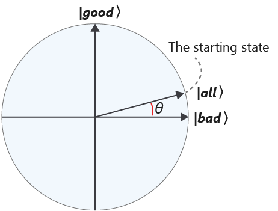
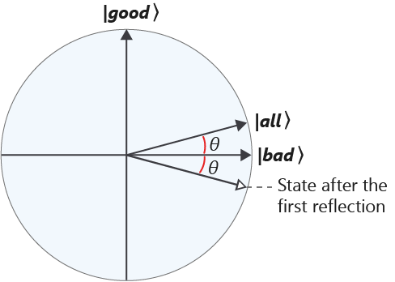
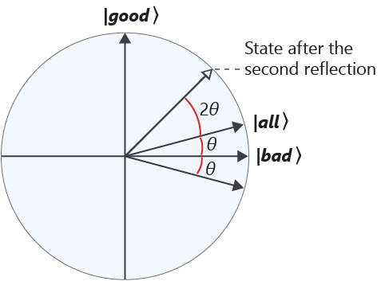
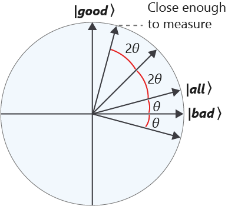
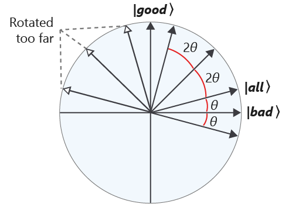

In the previous units, you learned about the search problem and to implement its instances as quantum oracles. 

Preliminaries are over! Prepare yourself for your first real mission! In this unit, you will implement Grover's search algorithm. It is not necessary to dive deep into the gate-level implementation details but you will focus the discussion on the high-level logic instead.

For a strategic delivery, you have to make sure that two connected stations don't receive the same type of supply. You have to prepare a route to deliver to different space stations according to this requirement. 

## Algorithm outline

Let's start with an outline of the algorithm and then discuss each step in detail.

1. We start by preparing an equal superposition of all basis states.  
  This is a common first step for quantum algorithms in general.

2. The main part of the algorithm repeats a sequence of steps. This sequence is called *Grover's iteration* and consists of two steps:

   * Apply the quantum oracle - This operation multiplies the phases of all states that are solutions to our problem by $-1$, as we've seen earlier in this module. Notice that this is the only step that uses the information about our problem.

   * Apply the so-called "diffusion operator" - This operator changes the amplitudes of the basis states as follows: the amplitudes that are greater than the average of the amplitudes will get smaller, and the amplitudes that are less than the average will get larger.  This step does not depend on our problem.

   Overall, one iteration *decreases* the amplitudes of the basis states that are not solutions to our problem and *increases* the amplitudes of the basis states that are solutions, while keeping both types of amplitudes positive.

3. Finally, we measure the state of the system. Repeating the iteration several times introduces significant differences between the two types of amplitudes so the measurement yields the answer with a high probability.

## Algorithm visualization

Now, let's take a look at Grover's algorithm from a slightly different angle, visualizing the system state at each step.

Assume that our search space (meaning all possible values that our variables can take) has $N$ elements, and $M$ of them are solutions to our problem.

We'll define two state vectors: 

* An equal superposition of $M$ "good" basis states (states that are solutions to our problem)  

  $$|\textrm{good}\rangle = \frac{1}{\sqrt{M}} \sum_{x : f(x) = 1} |x\rangle$$
* An equal superposition of $N - M$ "bad" basis states (states that are *not* solutions to our problem)

  $$|\textrm{bad}\rangle = \frac{1}{\sqrt{N-M}} \sum_{x : f(x) = 0} |x\rangle$$

The algorithm never distinguishes different "good" or different "bad" states until the final measurement, so all amplitudes of "good" states remain equal to each other, and all amplitudes of "bad" states remain equal to each other.
This means that we can always represent the overall system state as a superposition of the states $|\textrm{good}\rangle$ and $|\textrm{bad}\rangle$.

1. We start with an equal superposition of all basis states, both "good" and "bad". This state is represented as follows:

   $$|\textrm{all}\rangle = \sqrt{\frac{M}{N}} |\textrm{good}\rangle + \sqrt{\frac{N-M}{N}} |\textrm{bad}\rangle$$

   If we imagine a plane on which $|\textrm{good}\rangle$ and $|\textrm{bad}\rangle$ vectors correspond to vertical and horizontal axes, respectively, we can plot this state like this:

   

   The angle $\theta$ depends on the proportion of "good" states among all basis states: $\sin \theta = \sqrt{\frac{M}{N}}$.

2. Next, we apply the oracle. Remember that this operation multiplies the amplitudes of "good" states by $-1$. On the circle plot, this transformation leaves the horizontal component of the state vector unchanged and reverses its vertical component. In other words, this operation is a reflection along the horizontal axis:

   

3. Now we apply the diffusion operator. Its effect is another reflection, this time along the vector $|\textrm{all}\rangle$:

   

   Notice how this sequence of two reflections becomes a counterclockwise rotation by an angle $2\theta$. If we repeat this sequence, reflecting the new state first along the horizontal axis and then along the $|\textrm{all}\rangle$ vector, it performs a rotation by $2\theta$ again. The angle of this rotation depends only on the angle between the reflection axes and not on the state we reflect. 

4. So, if every iteration we do rotates our state vector $2\theta$ counterclockwise, when should we perform the measurement?  
   
   The probability of getting a certain basis state as the measurement outcome equals the squared amplitude of that state in the superposition. 
   The greater the amplitude, the higher the chance of getting the corresponding state when performing the measurement.

   Since our goal is to get one of the "good" states with probability as high as possible, we need to increase the amplitudes of "good" states as much as we can (and reduce the amplitudes of "bad" states correspondingly).
   Geometrically, this means that we want to rotate our state vector as close to the vertical axis as possible.

   

   If we pick the right number of iterations, we'll get to the point at which the measurement will produce a correct answer with sufficiently high probability.

## Algorithm analysis

Grover's search algorithm has several important properties that are worth calling out explicitly.

### Grover's algorithm is probabilistic

The final measurement produces a result that solves our problem with high probability, but usually not with absolute certainty; in most cases, there remains a small probability of failure.

We have to deal with possible failure in the same way we deal with classical randomized algorithms: check whether the result we got is indeed a solution to our problem, and if it's not, rerun the algorithm from scratch. 
Unfortunately, there is no way to use the result we obtained to improve the chances of success for the next attempt.
Fortunately, however, the average number of algorithm reruns doesn't depend on the size of the problem.

### More iterations does not mean better!

For many iterative classical algorithms, running extra iterations slows them down but doesn't ultimately reduce the success probability of the algorithm. 
Grover's search has a particular "sweet spot" - the number of algorithm iterations that yields the highest success probability. 
If our problem has $N$ possible variable assignments, and $M$ of them are solutions to the problem, the optimal number of iterations is 

$$R_{opt} \approx \frac{\pi}{4} \sqrt{\frac{N}{M}}$$

Continuing to iterate past that number starts reducing that probability until we reach nearly-zero success probability on iteration $2 R_{opt}$. 
After that, the probability grows again and approaches 100% on iteration $3 R_{opt}$, and so on.

> [!NOTE]
> To understand this behavior, recall our circle visualization. 
> 
> After $k$ iterations, the angle between the horizontal axis and the state vector equals $2k+1$, and we want to get it as close to $\frac{\pi}{2}$ as we can. 
> For most applications, $M$ is much smaller than $N$, so we can approximate $\theta \approx \sin \theta = \sqrt{\frac{M}{N}}$. 
> This allows us to estimate the optimal number of iterations.
> 
> The periodic behavior of the success probability can be explained using the same visualization.
> Each iteration is a rotation in the same direction by a fixed angle. If we keep iterating, we'll over-rotate our state, which will start getting further and further away from the vertical axis, thus reducing our success probability.
>
> 
> 
> Once the state passes the horizontal axis, further rotations bring it closer to the vertical axis from the opposite direction, which increases our success probability again.
> (Remember that measurement probabilities are defined by *squares* of amplitudes, not just amplitudes.)

### But I don't know how many solutions my problem has!

In the example, you have a small and easy-to-analyze problem, so you could calculate the number of solutions by hand. 
In practical applications, you don't usually know how many solutions your problem has before you solve it.

To handle this issue, you can pick a small number, run the algorithm with that many iterations, and if it doesn't yield an answer, retry with a different, larger number of iterations. 
An efficient strategy of gradually increasing the iteration number will still find the solution with an average number of iterations around $\sqrt{\frac{N}{M}}$.

In the next unit, you will implement Grover's algorithm in Q# and run it to solve the vertex coloring problem for the best delivery route!
