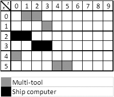
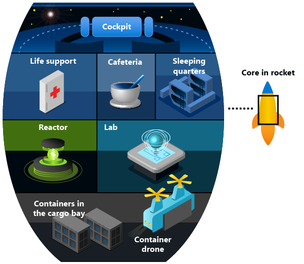

Recall your results from the previous unit:

```console
Config dict:
{'0': 1, '10': 0, '11': 0, '1': 0, '12': 1, '2': 0, '13': 0, '3': 0, '14': 0, '4': 0, '15': 0, '5': 0, '16': 0, '6': 0, '17': 0, '7': 0, '18': 0, '8': 0, '19': 0, '9': 0, '20': 1, '30': 0, '31': 0, '21': 0, '32': 1, '22': 0, '33': 0, '23': 0, '34': 0, '24': 0, '35': 0, '25': 0, '36': 0, '26': 0, '37': 0, '27': 0, '38': 0, '28': 0, '39': 0, '29': 0, '40': 0, '50': 0, '41': 0, '51': 0, '42': 0, '52': 0, '43': 1, '53': 0, '44': 0, '54': 1, '45': 0, '55': 0, '46': 0, '56': 0, '47': 0, '57': 0, '48': 0, '58': 0, '49': 0, '59': 0}

Config array:
[1, 0, 0, 0, 0, 0, 0, 0, 0, 0, 0, 0, 1, 0, 0, 0, 0, 0, 0, 0, 1, 0, 0, 0, 0, 0, 0, 0, 0, 0, 0, 0, 1, 0, 0, 0, 0, 0, 0, 0, 0, 0, 0, 1, 0, 0, 0, 0, 0, 0, 0, 0, 0, 0, 1, 0, 0, 0, 0, 0]

           Job ID: [0, 0, 1, 1, 2, 2]
     Operation ID: [0, 1, 2, 3, 4, 5]
Operation runtime: [2, 1, 2, 2, 1, 2]
 Assigned machine: [0, 0, 1, 1, 0, 0]

Operation matrix:
    t: 0 1 2 3 4 5 6 7 8 9
x_0,t: 1 0 0 0 0 0 0 0 0 0
x_1,t: 0 0 1 0 0 0 0 0 0 0
x_2,t: 1 0 0 0 0 0 0 0 0 0
x_3,t: 0 0 1 0 0 0 0 0 0 0
x_4,t: 0 0 0 1 0 0 0 0 0 0
x_5,t: 0 0 0 0 1 0 0 0 0 0

Operation start times (grouped into jobs):
[[0, 2], [0, 2], [3, 4]]

Makespan (time taken to complete all operations): 6
```

In this instance, it is possible to visually verify that the solution does not have any constraint violations. The Gantt chart shown below demonstrates this:



As you can see from the visual above:

- Operations belonging to the same job happen in order
- Operations are started once and only once
- Each machine only has one operation running at a time

In this particular instance, you can also tell that the solver scheduled the repair tasks in such a way that the **total time to complete them all (the makespan) was minimized** - both machines are continuously in operation, with no time gaps between scheduled operations. This is the solution with the lowest possible cost, also known as the global minimum for the cost function. However, you must remember that these solvers are heuristics and are therefore not guaranteed to find the best solution possible, particularly when the problem definition becomes more complex.

Depending on how well the cost function is defined and the weights are tuned, the solver will have varying degrees of success. This reinforces the importance of verifying and evaluating returned solutions, to enable tuning of the problem definition and parameters (such as weights/coefficients) in order to improve solution quality.

For larger or more complex problems, it will not always be possible to verify the solution by eye. It is therefore common practice to implement some code to verify that solutions returned from the optimizer are valid, as well as evaluating how good the solutions are (at least relative to solutions returned previously). This capability is also useful when it comes to tuning weights and penalty functions.

You can perform this validation using the following code snippet, which checks the solution against all three constraints before declaring the solution valid or not. If any of the constraints are violated, the solution will be marked as invalid. An example of an invalid solution has also been included, for comparison.

```python
def check_precedence(processing_time, jobs):
    """
    Check if the solution violates the precedence constraint.
    Returns True if the constraint is violated.

    Keyword arguments:
    processing_time (dict): Operation processing times
    jobs (List[List[int]]): List of operation start times, grouped into jobs
    """

    op_id = 0
    for job in jobs:
        for i in range(len(job) - 1):
            if job[i+1] - job[i] < processing_time[op_id]:
                return True
            op_id += 1
        op_id += 1
    return False

def check_operation_once(matrix):
    """
    Check if the solution violates the operation once constraint.
    Returns True if the constraint is violated.

    Keyword arguments:
    matrix (List[List[int]]): Matrix of x_i,t values
    """
    for x_it_vals in matrix:
        if sum(x_it_vals) != 1:
            return True
    return False

def check_no_overlap(op_start_times:list, machines_ops_map:dict, processing_time:dict):
    """
    Check if the solution violates the no overlap constraint.
    Returns True if the constraint is violated.

    Keyword arguments:
    op_start_times (list): Start times for the operations
    machines_ops_map(dict): Mapping of machines to operations
    processing_time (dict): Operation processing times
    """
    pvals = list(processing_time.values())

    # For each machine
    for ops in machines_ops_map.values():
        machine_start_times = [op_start_times[i] for i in ops]
        machine_pvals = [pvals[i] for i in ops]

        # Two operations start at the same time on the same machine
        if len(machine_start_times) != len(set(machine_start_times)):
            return True

        # There is overlap in the runtimes of two operations assigned to the same machine
        machine_start_times, machine_pvals = zip(*sorted(zip(machine_start_times, machine_pvals)))
        for i in range(len(machine_pvals) - 1):
            if machine_start_times[i] + machine_pvals[i] > machine_start_times[i+1]:
                return True

    return False

def validate_solution(matrix:dict, machines_ops_map:dict, processing_time:dict, jobs_ops_map:dict):
    """
    Check that solution has not violated any constraints. 
    Returns True if the solution is valid.

    Keyword arguments:
    matrix (List[List[int]]): Matrix of x_i,t values
    machines_ops_map(dict): Mapping of machines to operations
    processing_time (dict): Operation processing times
    jobs_ops_map (dict): Map of jobs to operations {job: [operations]}
    """

    jobs, op_start_times = extract_start_times(jobs_ops_map, matrix)

    # Check if constraints are violated
    precedence_violated = check_precedence(processing_time, jobs)
    operation_once_violated = check_operation_once(matrix)
    no_overlap_violated = check_no_overlap(op_start_times, machines_ops_map, processing_time)

    if not precedence_violated and not operation_once_violated and not no_overlap_violated:
        print("Solution is valid.\n")
    else:
        print("Solution not valid. Details:")
        print(f"\tPrecedence constraint violated: {precedence_violated}")
        print(f"\tOperation once constraint violated: {operation_once_violated}")
        print(f"\tNo overlap constraint violated: {no_overlap_violated}\n")

print_problem_details(ops_jobs_map, processing_time, machines_ops_map)

print("Azure Quantum solution:")
print_matrix(T, matrix)

print("Operation start times (grouped into jobs):")
print(jobs)
print()

validate_solution(matrix, machines_ops_map, processing_time, jobs_ops_map)
```

When you run this code, you will see the following in the output window:

```console
           Job ID: [0, 0, 1, 1, 2, 2]
     Operation ID: [0, 1, 2, 3, 4, 5]
Operation runtime: [2, 1, 2, 2, 1, 2]
 Assigned machine: [0, 0, 1, 1, 0, 0]

Operation matrix:
    t: 0 1 2 3 4 5 6 7 8 9
x_0,t: 1 0 0 0 0 0 0 0 0 0
x_1,t: 0 0 1 0 0 0 0 0 0 0
x_2,t: 1 0 0 0 0 0 0 0 0 0
x_3,t: 0 0 1 0 0 0 0 0 0 0
x_4,t: 0 0 0 1 0 0 0 0 0 0
x_5,t: 0 0 0 0 1 0 0 0 0 0

Operation start times (grouped into jobs):
[[0, 2], [0, 2], [3, 4]]

Solution is valid.
```

As you can see, the result returned by the Azure Quantum solver has been confirmed as valid (it does not violate any of the constraints).

The final step in solving this problem is to map this solution back to your repair tasks - below is shown the order in which your repair tasks should be completed to finish as quickly (and safely) as possible. If two tasks have the same order number, they can be performed at the same time by different crew members using different tools:

|Repair task|Required tool|Order|
|---|---|---|
|**$J_{0}$: Restart life support**||
|$O_{0}$: Open wall panel in the life support module (*2 minutes*)|Universal multi-tool|0|
|$O_{1}$: Replace fuse (*1 minute*)|Universal multi-tool|2|
|**$J_{1}$: Recalibrate navigation system**||
|$O_{2}$: Reboot the system (*2 minutes*)|Ship computer|0|
|$O_{3}$: Locate the three nearest stellar landmarks (*2 minutes*)|Ship computer|2|
|**$J_{2}$: Replace power transformer in the reactor**||
|$O_{4}$: Detach old transformer module (*1 minute*)|Universal multi-tool|3|
|$O_{5}$: Install new transformer module (*2 minutes*)|Universal multi-tool|4|

Congratulations, you can now start the repairs and avoid disaster!


