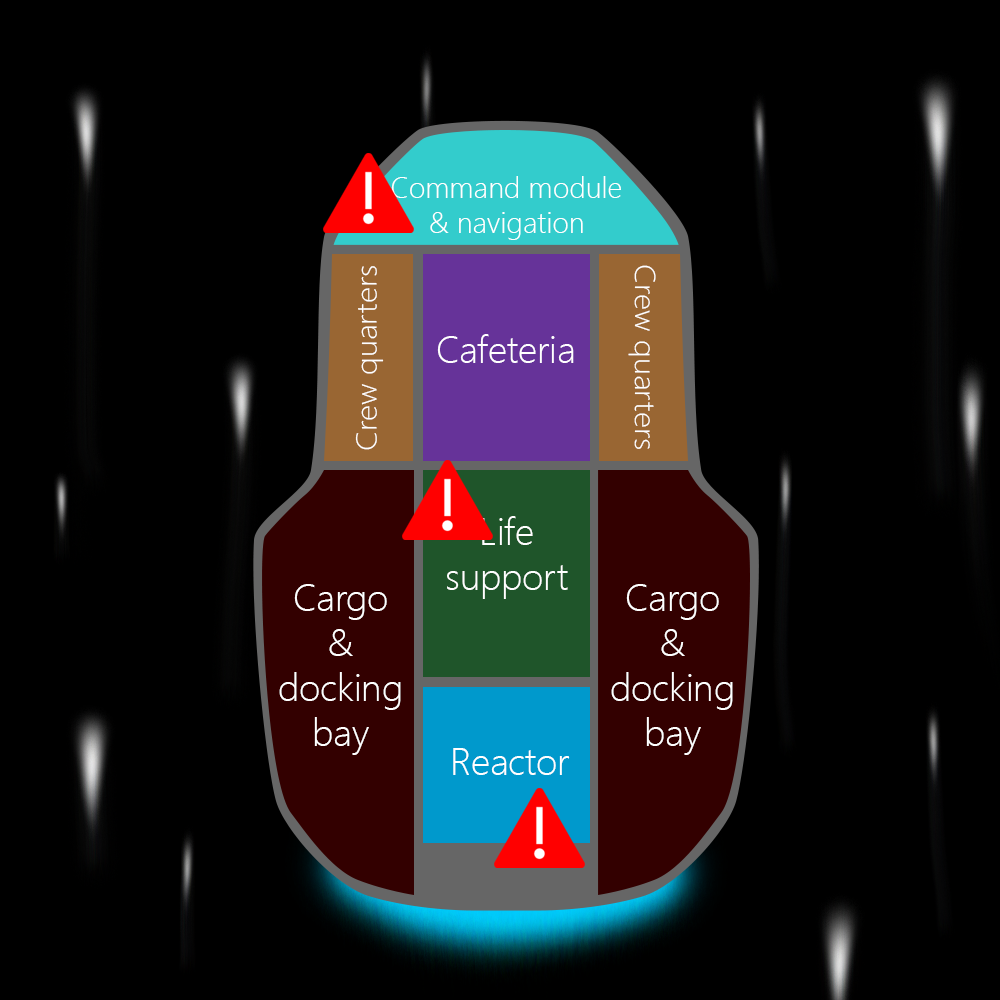

The job shop scheduling problem is defined as follows: you have a set of jobs $J_1, J_2, J_3,\dots, J_n$ which have various processing times and need to be processed using a set of machines $m_1, m_2, \dots, m_n$. The goal is to complete all jobs in the shortest time possible.

Each job consists of a set of operations, and the operations must be performed in the correct order to complete that job.

To illustrate the scenario, we are going to return to our spaceship, where a disaster is brewing...



Back onboard the spaceship, warning lights are flashing and alarms are blaring. You have been hit by the electromagnetic fallout from a coronal mass ejection event of a nearby star and are experiencing multiple failures across different critical systems!

Fortunately, you have the tools, team, and expertise on board to fix all the issues, however it's important that you follow procedure to ensure the repairs are successful. Below is the list of repair tasks that you must complete:

- Restart life support
  1. Open wall panel in the life support module (*2 minutes*)
  2. Replace fuse (*1 minute*)

- Recalibrate navigation system
  1. Reboot the system (*2 minutes*)
  2. Locate the three nearest stellar landmarks (*2 minutes*)

- Replace power transformer in the reactor
  1. Detach old transformer module (*1 minute*)
  2. Install new transformer module (*2 minutes*)

Each step that makes up a task takes a specific amount of time, and must be completed in the correct order.

To help you complete these tasks, you have access to your trusty **universal multi-tool** and the **ship computer** - you will use these machines to perform the repairs.

The mission is to **complete all of these tasks in as short a time as possible**, so that you can avoid disaster. For safety reasons, you must ensure that you follow procedure and thus there are some constraints on the way you complete the tasks:

1. Each of the steps (**operations**) in a repair task (**job**) must take place in order. You can't install the new transformer before removing the old one! This is called the **precedence constraint**.
2. You start an operation only once, and once started it must be completed before you do anything else. You can't afford to procrastinate! This is called the **operation-once constraint**.
3. Each tool (**machine**) can only do one thing at a time. For example, you can't simultaneously use the multi-tool to do several things. This is the **no-overlap constraint**.

### Cost functions

The rest of this learn module will be spent constructing what is known as a **cost function**, which is used to represent the problem. This cost function is what will be submitted to the Azure Quantum Optimization solver. If you have completed Module 9, [Solve optimization problems by using quantum-inspired optimization](https://docs.microsoft.com/learn/modules/solve-quantum-inspired-optimization-problems/), this concept should already be familiar.

Each point on a cost function represents a different solution configuration - in this case, each configuration is a particular assignment of starting times for the operations you are looking to schedule. The goal of the optimization is to minimize the cost of the solution - in this instance the aim is to minimize the amount of time taken to complete all operations.

Unfortunately, the Azure Quantum solvers can't accept the problem in its native format - the optimization task must be represented in a specific format that the solvers are able to deal with. This is done by creating an n-dimensional matrix of `Term` objects representing the various possible solution configurations, and adding penalties to terms that break the constraints - this increases the relative cost of those configurations and thus makes it unlikely that the optimizer will settle for these suboptimal solutions.

The idea is to make these invalid solutions so expensive that the solver can easily locate valid, low-cost solutions by navigating to low points (minima) in the cost function. However, you must also ensure that these solutions are not so expensive as to create peaks in the cost function that are so high that the solver can't travel over them to discover better optima on the other side.

### Azure Quantum setup

Before you get started with formulating the problem, you need to import some Python modules and set up an Azure Quantum `Workspace`.

> [!NOTE]
> If you haven't created an Azure Quantum Workspace yet, you can learn more about how to do this in [Module X](TODO).

You will need to enter your Azure Quantum workspace details in the cell below before you run it:

```python
from typing import List
from azure.quantum.optimization import Term
from azure.quantum import Workspace

workspace = Workspace (
    subscription_id = "",  # Add your subscription_id
    resource_group = "",   # Add your resource_group
    name = ""              # Add your workspace name
    )

workspace.login()
```

### Problem formulation

Now that you have set up our development environment, you can start to formulate the problem.

The first step is to take the constraints identified above and formulate them as mathematical equations that you can work with.

Let's first introduce some notation because you don't have time during an emergency to write things out in long form!

- $J_{0}$: Restart life support
  - $O_{0}$: Open wall panel in the life support module (*2 minutes*)
  - $O_{1}$: Replace fuse (*1 minute*)

- $J_{1}$: Recalibrate navigation system
  - $O_{2}$: Reboot the system (*2 minutes*)
  - $O_{3}$: Locate the three nearest stellar landmarks (*2 minutes*)

- $J_{2}$: Replace power transformer in the reactor
  - $O_{4}$: Detach old transformer module (*1 minute*)
  - $O_{5}$: Install new transformer module (*2 minutes*)

Above, you can see that the jobs have been labeled as $J$ and assigned index numbers $0$, $1$ and $2$, to represent each of the three tasks you have. The operations that make up each job have also been defined, and are represented by the letter $O$.

To make it easier to code up later, all operations are identified with a continuous index number rather than, for example, starting from $0$ for each job. This allows you to keep track of operations by their ID numbers in the code and schedule them according to the constraints and machine availability. You can tie the operations back to their jobs later on using a reference.

Below, you see how these definitions combine to give us a mathematical formulation for the jobs:

$$J_{0} = \{O_{0}, O_{1}\}$$
$$J_{1} = \{O_{2}, O_{3}\}$$
$$J_{2} = \{O_{4}, O_{5}\}$$

**More generally:**

$$J_{0} = \{O_{0}, O_{1}, \ldots , O_{k_{0}-1}\} \text{, where } k_{0} = x_{0} \text{, the number of operations in job } J_{0}$$

$$J_{1} = \{O_{k_{0}}, O_{k_{0}+1}, \ldots , O_{k_{1}-1}\} \text{, where } k_{1} = x_{0} + x_{1} \text{, the number of operations in jobs } J_{0} \text{ and } J_{1} \text{ combined}$$

$$\vdots$$

$$J_{n-1} = \{O_{k_{n-2}}, O_{k_{n-2}+1}, \ldots , O_{k_{n-1}-1}\} \text{, where } k_{n-1} = \text{ the total number of operations across all jobs }$$

The next piece of notation you will need is a binary variable, which will be called $x_{i, t}$.

You will use this variable to represent whether an operation starts at time $t$ or not:

$$\text{If } x_{i,t} = 1, \text{ } O_i\text{ starts at time } \textit{t}$$
$$\text{If } x_{i,t} = 0, \text{ } O_i\text{ does not start at time } \textit{t}$$

> [!NOTE]
> Because $x_{i, t}$ can take the value of either $0$ or $1$, this is known as a binary optimization problem. More generally, this is called a polynomial unconstrained binary optimization (or PUBO) problem. You may also see these PUBO problems referred to as Higher Order Binomial Optimization (HOBO) problems - these terms both refer to the same thing.

$t$ is used to represent the simulation time. It goes from time $0$ to $T - 1$ in integer steps. $T$ is the longest time the whole set of jobs can take in total (the max simulation time):

$$0 \leq t < T$$

Lastly, $p_{i}$ is defined to be the processing time for operation $i$ - the amount of time it takes for operation $i$ ($O_{i}$) to complete:

$$\text{If } O_{i} \text{ starts at time } \textit{t} \text{, it will finish at time } t + p_{i}$$
$$\text{If } O_{i+1} \text{ starts at time } \textit{s} \text{, it will finish at time } s + p_{i+1}$$

Now that the terms have been defined, you can move on to formulating the problem.

The first step is to represent the constraints mathematically. This will be done using a penalty model - every time the optimizer suggests a solution that violates one or more constraints, you need to give that solution a penalty:

| Constraint | Penalty condition |
|---|---|
|**Precedence constraint**<br>Operations in a job must take place in order.|Assign penalty every time $O_{i+1}$ starts before $O_{i}$ has finished (they start out of order).|
|**Operation-once constraint**<br>Each operation is started once and only once.|Assign penalty if an operation isn't scheduled within the allowed time.<br>**Assumption:** if an operation starts, it runs to completion.|
|**No-overlap constraint**<br>Machines can only do one thing at a time.|Assign penalty every time two operations on a single machine are scheduled to run at the same time.|

### Expressing a cost function using the Azure Quantum optimization SDK

As you will see during the exploration of the cost function and its constituent penalty terms below, the overall cost function is quadratic (because the highest order polynomial term you have is squared). This makes this problem a **Quadratic Unconstrained Binary Optimization (QUBO)** problem, which is a specific subset of **Polynomial Unconstrained Binary Optimization (PUBO)** problems (which allow for higher-order polynomial terms than quadratic). Fortunately, the Azure Quantum Optimization service is set up to accept PUBO (and Ising) problems, which means you don't need to modify our representation to fit the solver.

As introduced above, the binary variable you are optimizing for here is $x_{i,t}$, which can take a value of either 0 or 1, depending on if the operation $i$ starts at time $t$ or not:

$$\text{If } x_{i,t} = 1, \text{ } O_i\text{ starts at time } \textit{t}$$
$$\text{If } x_{i,t} = 0, \text{ } O_i\text{ does not start at time } \textit{t}$$

For $t = 0 \rightarrow t < T$ for every operation, you define an index $x_{i + t}$, which means that every operation in a job contributes to $T$ indices.

The operation starts at the value of $t$ for which $x_{i + t}$ equals 1.

In the next units, you will construct mathematical representations of the penalty terms and use these to build the cost function, which will be of the format:

$$H(x) = \alpha \cdot f(x) + \beta \cdot g(x) + \gamma \cdot h(x) $$

Where:

$$f(x) \text{, } g(x) \text{ and } h(x) \text{ represent the penalty functions.}$$
$$\alpha, \beta \text{ and } \gamma \text{ represent the different weights assigned to the penalties.}$$

The weights represent how important each penalty function is, relative to all the others.

From these mathematical representations, you will build out Python code which will output an array of terms, where each `Term` is an object that looks like:

```python
(w: float, indices: []) # Constant terms like +1
(w: float, indices: [int]) # Linear terms like x
(w: float, indices: [int, int]) # Quadratic terms like x^2
```

The `w` element represents the weight for each term, and the `indices` array represents the indices $i + t$ of the $x_{i+t}$ values.

If there were higher order terms (cubed, for example), you would just add more elements to the indices array, like so:

```python
(w: float, indices: [int, int, int, ...])
```

In the following units, you will explore how to formulate each of these constraints mathematically, and how this translates to code.

> [!NOTE]
> For this sample, penalties have not been added for operations that overrun the total simulation time $T$ - it is assumed that as long as an operation is started before the end of the simulation, it runs to completion.
