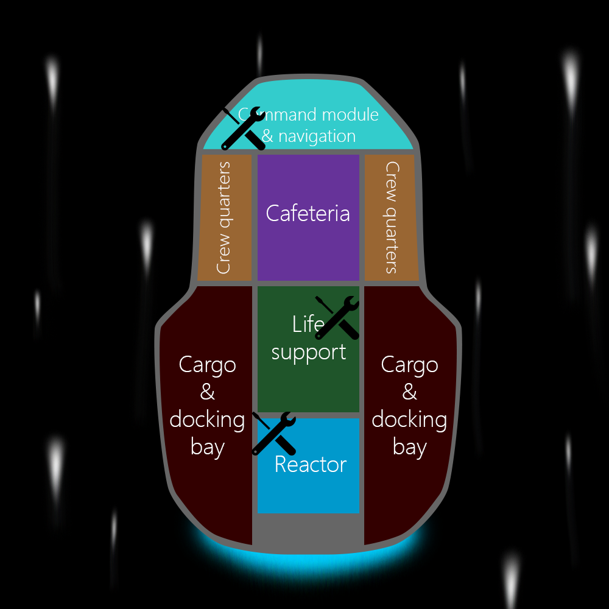

Recall your results from the previous unit:

```console
    Config dict:
    {'0': 1, '5': 0, '6': 0, '1': 0, '7': 1, '2': 0, '8': 0, '3': 0, '9': 0, '4': 0, '10': 1, '15': 0, '16': 0, '11': 0, '17': 1, '12': 0, '18': 0, '13': 0, '19': 0, '14': 0, '20': 0, '21': 0, '22': 0, '23': 1, '24': 0, '25': 0, '26': 0, '27': 0, '28': 0, '29': 1}

    Config array:
    [1, 0, 0, 0, 0, 0, 0, 1, 0, 0, 1, 0, 0, 0, 0, 0, 0, 1, 0, 0, 0, 0, 0, 1, 0, 0, 0, 0, 0, 1]

               Job ID: [0, 0, 1, 1, 2, 2]
         Operation ID: [0, 1, 2, 3, 4, 5]
    Operation runtime: [2, 1, 2, 2, 1, 2]
     Assigned machine: [0, 0, 1, 1, 0, 0]

    Operation matrix:
        t: 0 1 2 3 4
    x_0,t: 1 0 0 0 0
    x_1,t: 0 0 1 0 0
    x_2,t: 1 0 0 0 0
    x_3,t: 0 0 1 0 0
    x_4,t: 0 0 0 1 0
    x_5,t: 0 0 0 0 1

    Operation start times (grouped into jobs):
    [[0, 2], [0, 2], [3, 4]]
```

By inspection, you can tell that the solution above is valid (it does not violate any of the constraints defined previously):

- Operations belonging to the same job happen in order
- Operations are started once and only once
- Each machine only has one operation running at a time

For larger or more complex problems, it will not always be possible to verify the solution by eye. It is therefore common practice to implement some code to verify that solutions returned from the optimizer are valid, as well as evaluating how good the solutions are (at least relative to solutions returned previously). This capability is also useful when it comes to tuning weights and penalty functions.

You can perform this validation using the following code snippet, which checks the solution against all three constraints before declaring the solution valid or not. If any of the constraints are violated, the solution will be marked as invalid. An example of an invalid solution has also been included, for comparison.

```python
def check_precedence(p: List[int], jobs: List[List[int]]):
    """
    Check if a solution has violated the precedence constraint.

    Keyword arguments:
    p (List[int]): List of job processing times
    jobs (List[List[int]]): Mapping of operations to jobs
    """
    op_id = 0
    for job in jobs:
        for i in range(len(job) - 1):
            if job[i+1] - job[i] < p[op_id]:
                return True
            op_id += 1
        op_id += 1
    return False

def check_operation_once(matrix: List[List[int]]):
    """
    Check if a solution has violated the operation once constraint.

    Keyword arguments:
    matrix (List[List[int]]): Matrix of x_i,t values
    """
    for x_it_vals in matrix:
        if sum(x_it_vals) != 1:
            return True
    return False

def check_no_overlap(jobs: List[List[int]], ops_machines_map: List[List[int]], p: List[int]):
    """
    Check if a solution has violated the no overlap constraint.

    Keyword arguments:
    jobs (List[List[int]]): Mapping of operations to jobs
    ops_machine_map(List[List[int]]): Mapping of operations to machines
    p (List[int]): List of job processing times
    """
    # For each machine
    op_start_times = [ op for job in jobs for op in job]
    for m in range(len(ops_machines_map)):
        # Get operations assigned to this machine
        ops = ops_machines_map[m]
        machine_start_times = [op_start_times[i] for i in ops]

        # Two operations start at the same time on the same machine
        if len(machine_start_times) != len(set(machine_start_times)):
            return True

        # Operation i + 1 starts on machine m before operation i has finished
        for op_id in range(len(ops) - 1):
            if op_start_times[op_id] + p[op_id] < op_start_times[op_id + 1]:
                return True
    return False

def validate_solution(matrix, ops_machines_map, p, jobs):
    """
    Check if a solution has violated any of the problem constraints.

    Keyword arguments:
    matrix (List[List[int]]): Matrix of x_i,t values
    ops_machine_map(List[List[int]]): Mapping of operations to machines
    p (List[int]): List of job processing times
    jobs (List[List[int]]): Mapping of operations to jobs
    """
    precedence_violated = check_precedence(p, jobs)
    operation_once_violated = check_operation_once(matrix)
    no_overlap_violated = check_no_overlap(jobs, ops_machines_map, p)

    if not precedence_violated and not operation_once_violated and not no_overlap_violated:
        print("Solution is valid.\n")
    else:
        print("Solution not valid. Details:")
        print(f"\tPrecedence constraint violated: {precedence_violated}")
        print(f"\tOperation once constraint violated: {operation_once_violated}")
        print(f"\tNo overlap constraint violated: {no_overlap_violated}\n")

# Validate Azure Quantum solution
print_problem_details(n, o, p, ops_machines_map)
print("Azure Quantum solution:")
print_matrix(T, matrix)
validate_solution(matrix, ops_machines_map, p, jobs)

# Demonstrate an invalid solution
bad_matrix = [[1, 0, 0, 0, 1], [1, 0, 0, 0, 0], [1, 0, 0, 0, 0], [0, 1, 0, 0, 0], [0, 0, 0, 1, 0], [0, 0, 1, 0, 0]]
bad_jobs = extract_jobs(n, o, bad_matrix)

print("Invalid solution:")
print_matrix(T, bad_matrix)
validate_solution(bad_matrix, ops_machines_map, p, bad_jobs)
```

When you run this code, you will see the following in the output window:

```console
           Job ID: [0, 0, 1, 1, 2, 2]
     Operation ID: [0, 1, 2, 3, 4, 5]
Operation runtime: [2, 1, 2, 2, 1, 2]
 Assigned machine: [0, 0, 1, 1, 0, 0]

Azure Quantum solution:
    t: 0 1 2 3 4
x_0,t: 1 0 0 0 0
x_1,t: 0 0 1 0 0
x_2,t: 1 0 0 0 0
x_3,t: 0 0 1 0 0
x_4,t: 0 0 0 1 0
x_5,t: 0 0 0 0 1

Solution is valid.

Invalid solution:
    t: 0 1 2 3 4
x_0,t: 1 0 0 0 1
x_1,t: 1 0 0 0 0
x_2,t: 1 0 0 0 0
x_3,t: 0 1 0 0 0
x_4,t: 0 0 0 1 0
x_5,t: 0 0 1 0 0

Solution not valid. Details:
    Precedence constraint violated: True
    Operation once constraint violated: True
    No overlap constraint violated: True
```

As you can see, the result returned by the Azure Quantum solver has been confirmed as valid, and the invalid solution is correctly identified.

The final step in solving this problem is to map this solution back to your repair tasks - below is shown the order in which your repair tasks should be completed to finish as quickly (and safely) as possible. If two tasks have the same order number, they can be performed at the same time by different crew members using different tools:

|Repair task|Required tool|Order|
|---|---|---|
|**$J_{0}$: Restart life support**||
|$O_{0}$: Open wall panel in the life support module (*2 minutes*)|Universal multi-tool|1|
|$O_{1}$: Replace fuse (*1 minute*)|Universal multi-tool|2|
|**$J_{1}$: Recalibrate navigation system**||
|$O_{2}$: Reboot the system (*2 minutes*)|Ship computer|1|
|$O_{3}$: Locate the three nearest stellar landmarks (*2 minutes*)|Ship computer|2|
|**$J_{2}$: Replace power transformer in the reactor**||
|$O_{4}$: Detach old transformer module (*1 minute*)|Universal multi-tool|3|
|$O_{5}$: Install new transformer module (*2 minutes*)|Universal multi-tool|4|

Congratulations, you can now start the repairs and avoid disaster!


