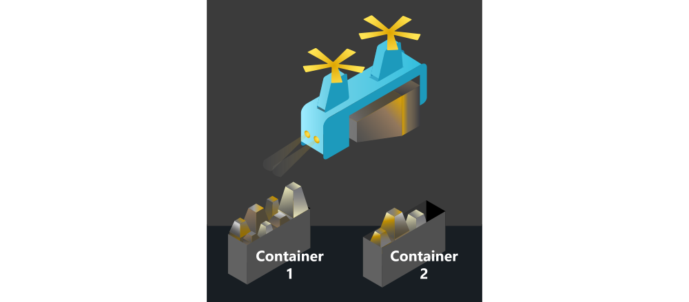

Welcome back space explorer! So far you have learned the basic concepts of quantum computing and how quantum algorithms can solve some of our problems such as security threat through passwords or tracing delivery routes to different stations and planets. Humans and in particular, the space fleet, are interested in other kind of problems, named optimization problems. An optimization problem is the problem of finding the best solution from all feasible solutions.

In this module, you'll learn about a *classical* computing method called quantum-inspired optimization (QIO). It refers to a class of algorithms inspired from quantum computing that are applied to solve optimization problems on traditional hardware. Throughout the [learning path](https://docs.microsoft.com/learn/paths/quantum-computing-fundamentals/?azure-portal=true),

We may want to optimize a particular task regarding the time it takes to be done, the number of people we need to complete it, the material cost, the total cost, etc. So you wonder why the space fleet care about optimization problem, it is all about saving cost and effectiveness. 

Your superior has told you about one problem the galactic trade federation is facing with. As you know, there are rare mineral exploitation mines in a recently discovered asteroid in a near cluster. The space fleet is dealing with the problem of transporting the mineral. To illustrate the optimization method, let's look at how the logistics division efficiently loads cargo vessels.

Two competing galactic shipping companies have laid claim to the asteroid, and the executive board of trade federation is discussing pros and cons of each of them. They have to chose a fair candidate if they want to avoid a political crisis at all costs. To resolve this conundrum, you decide to split the shipping between both companies. A freighter ship from each company will arive to the asteroid and they must be loaded with the mineral as evenly as possible. Taking into account that the mineral is mined in massive chunks of various sizes, so we can't easily divide in half them between the ships, how can you optimize the distribution of the mineral and avert an intergalactic crisis?

## Learning objectives

In this module you'll:

- Learn about the origins of quantum-inspired optimization.
- See which kinds of problems are best suited to these techniques.
- Understand how algorithms inspired by physical processes are used to solve difficult problems.
- Solve a combinatorial optimization problem using the Azure Quantum optimization service.

## Prerequisites

1. The latest version of the [Azure Quantum Optimization SDK](//TODO: Link)
2. [Jupyter Notebook](https://jupyter.readthedocs.io/en/latest/install.html?azure-portal=true)
3. An Azure Quantum workspace

If you don't have these tools yet, we recommend that you follow the [How to create an Azure Quantum workspace](//TODO link) module first.
