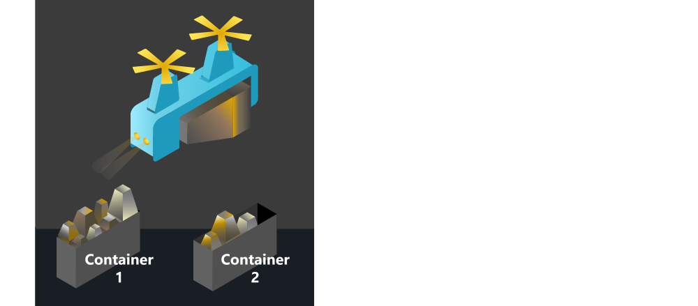

If you took some of the earlier modules in the [learning path](/learn/paths/quantum-computing-fundamentals/?azure-portal=true), you will already be familiar with the fundamental concepts of quantum computing and how quantum algorithms were able solve some of the problems you and your crew encountered on the spaceship.

In this module, you'll learn about a *classical* computing method called quantum-inspired optimization (QIO). It refers to a class of algorithms inspired by quantum computing that are applied to solve optimization problems on traditional hardware. Throughout the learning path, you have been working on a spaceship. One of your missions is an asteroid mining expedition. To illustrate the optimization method, let's look at how the logistics division efficiently loads cargo vessels.

Your spaceship is transporting a rare mineral from a recently discovered asteroid. However, two competing galactic federations have laid claim to the asteroid. To avoid a political crisis, the mineral supply should be split equally between them. Your crew is tasked with two deliveries so that both federations get approximately the same amount. To make the problem harder, the mineral is mined in massive chunks of various sizes, so you can't easily divide them. How can you optimize the distribution of the mineral and avert an intergalactic crisis?

## Learning objectives

In this module you'll:

* Learn about the origins of quantum-inspired optimization.
* See which kinds of problems are best suited to these techniques.
* Understand how algorithms inspired by physical processes are used to solve difficult problems.
* Solve a combinatorial optimization problem using the Azure Quantum optimization service.

## Prerequisites

* The latest version of the [Python SDK for Azure Quantum](/azure/quantum/optimization-install-sdk?azure-portal=true)
* [Jupyter Notebook](https://jupyter.org/install?azure-portal=true)
* An Azure Quantum workspace

If you don't have these tools yet, we recommend that you follow the [Get started with Azure Quantum](/learn/modules/get-started-azure-quantum/?azure-portal=true) module first.
