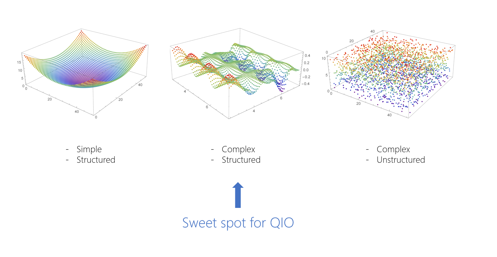

To understand [optimization problems](https://en.wikipedia.org/wiki/Optimization_problem), you first need to learn some terminology.

- **Cost function**. This is a mathematical function to be minimized. For the mineral transport, the cost function is the weight difference between the two space containers. In other scenarios, it might be length of travel or a monetary cost.
- **Search space**. This is the space that contains all the feasible solutions to the optimization problem. Each point in this search space is a valid solution to the problem but it's not necessarily the lowest point, which corresponds to the lowest cost solution.

Together, the search space and the cost function are often referred to as an *optimization landscape*. In the case of a problem that involves two continuous variables, the analogy to a landscape is quite direct.

Let's explore a few landscapes and see which are good candidates for QIO.

## A single, smooth landscape

Consider the following plot of a cost function that looks like a single smooth valley:

This kind of problem is easily solved with techniques such as gradient descent, where you begin from an initial starting point and greedily move to any solution with a lower cost. After a few moves, the solution converges to the *global minimum*. The global minimum is the lowest point in the optimization landscape. QIO offers no advantages over other techniques with these straightforward problems.

## A structured, rugged landscape

QIO works best with problems where the landscape is rugged, with many hills and valleys. Here's an example that considers two continuous variables.

In this scenario, one of the greatest challenges is to avoid getting stuck at any of the sub-optimal *local minima*. A rugged landscape can have multiple valleys. Each of these valleys will have a lowest point, which is the local minimum. One of these points will be the lowest overall, and that point is the global minimum. These rugged landscapes present situations where QIO can outperform other techniques.

## A scattered, random landscape

So far we have discussed smooth and rugged cost functions, but what if there is no structure at all? The following diagram shows such a landscape:

In these cases, where the solutions are completely random, then no algorithm can improve on a brute force search.

## How do we write a cost function?

As mentioned above, the cost function represents the quantity that you want to minimize. Its main purpose is to map each configuration of a problem to a single number. This allows the optimizer to easily compare potential solutions and determine which is better.

The key to generating a cost function for your problem is in recognizing what parameters of your system affect the chosen cost. In your mining mission, the cost is the weight difference between two containers. The parameters affecting this cost then are the assignments of each mineral chunk to a container.

In principle, the cost function could be any mathematical function $f = f(x_0, x_1, \dots)$, where the function variables $x_1, x_2, \dots$ encode the different configurations. The smooth landscape shown above could for example be generated using a quadratic function of two continuous variables $f(x, y) = x^2 + y^2$. However, certain optimization methods may expect the cost function to be in a particular form. For instance, the Azure Quantum solvers expect a *Binary Optimization Problem*. For this problem type, configurations must be expressed via binary variables with $x_i \in \{0, 1\}$. Many problems are naturally suited to be expressed in this form, such as whether a certain mineral chunk is loaded on the first or the second container.

The term **Polynomial Unconstrained Binary Optimization** (PUBO) refers to cost functions that are polynomials over the binary variables. *Unconstrained* implies that we do not impose additional restrictions on which variable assignments are valid, which simplifies the solver's task. The next [module](https://docs.microsoft.com/learn/modules/solve-job-shop-scheduling-optimization-problem?azure-portal=true) will teach you how to get around this restriction and express constraints in a PUBO setting. A special subset of PUBO problems are the **Quadratic Unconstrained Binary Optimization** (QUBO) problems, which employ polynomial cost functions of degree 2. The Azure Quantum solvers natively work on PUBOs of any degree, but other providers available on Azure may only work with QUBO problems for example.

You may also have come across problems referred to as **Ising** problems. Sometimes, it is more convenient to give our binary variables the values $\{-1, 1\}$ instead of $\{0, 1\}$. Otherwise, these problems function in an identical way to PUBO problems.

## Summary

To summarize, here are the necessary conditions for QIO to perform well, compared to other classical optimization algorithms:

- Optimization landscapes should be rugged but structured. Such landscapes occur frequently in real-world problems.
- If the number of variables is too small, then simplistic algorithms are already sufficient. For problems with hundreds of variables, QIO has achieved orders of magnitude improvement over previously used methods.
- Problem parameters that affect the chosen cost metric must be represented via the variables of a cost function. Express cost functions as polynomials over binary variables to obtain a PUBO problem.
