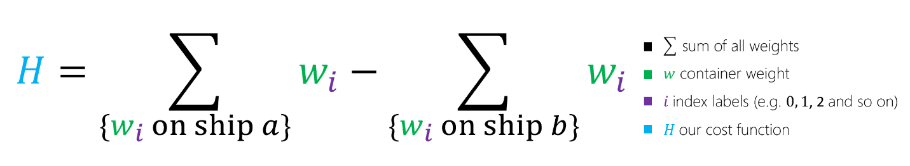
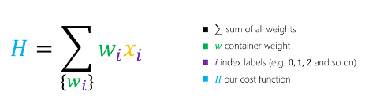
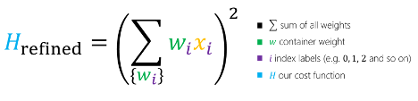

Recall that in our container ship problem, Contoso Logistics has to optimize how it distributes containers between two ships. In other words, we have a set of container weights, *w*, which we would like to partition into two sets.

This short animation shows one possible way to optimize the distribution:

> [!VIDEO https://channel9.msdn.com/Shows/Learn-Azure/Quantum-Optimization-Container-Demo/player?format=ny]

Those two sets correspond to whether the container is loaded onto ship *a* or ship *b*. $\Delta$ is the weight difference between the two ships. The running time of the optimizer is measured in steps. At each step, we show the best solution found so far.

In this part, we'll use quantum-inspired optimization to solve the problem.

> [!NOTE]
> This problem is known as a _number partitioning problem_. Although you can apply other heuristics to solve this type of problem, the container ship problem is a good introductory way to illustrate how to apply QIO concepts.

## Express the problem

Let's start by coming up with an equation for the weight of a given ship, which is the sum of all the containers on the ship. This sum is expressed in the following equation, where *wi* is the weight of container *i*:

Ideally, we want a solution where the weight difference between the ships is as small as possible.

This equation subtracts the sum of weights on ship _b_ from the sum of weights on ship _a_.

The letter *H* is used to represent a cost function. This originates from the model we are using to define our optimization problem, known as the _Ising model_. In this model, the energy (which represents the cost) is given by a Hamiltonian, whose variables take the value of +1 or -1. Our goal is to map the optimization to this form.

## Refine the problem

Next, we introduce a variable, *xi*, to represent whether an individual container *i* is assigned to ship *a* or ship *b*.

Because we can assign the container *i* to either ship, the variable *xi* can take on two different values, which makes it a binary variable. For convenience, we say the two values it can take on are *1* and *-1*. The value *1* represents that the container is placed on ship *a*, and *-1* represents that the container is placed on ship *b*. Because of our decision to make *xi* be either *1* or *-1*, our optimization problem is called an _Ising problem_.

By introducing this variable *xi*, we can simplify the equation as follows:

## Refine the problem again

There's one last change we need to make before we can solve our problem.

If we look at our cost function *H*, there's a flaw: the solution with the least cost is to simply assign all containers to ship *b* by setting all of the *xi* variables equal to *-1*. But that's not correct! To fix this, we square the right-hand side of the equation to ensure that it cannot be negative.

This final model gives us a cost function with the required properties.

- If all the containers are on one ship, the function is at its highest value. This is the least optimal solution.
- If the containers are perfectly balanced, the value of the summation inside the square is *0*. This means the function is at its lowest value.

## Plug in our values

Now that you've learned how a real problem can be cast in Ising form, we have one last step before we can apply an Azure Quantum solver.

In the video, you can see the containers of different weights. Let's take three of them and show how we would plug these values into our equation. Of course, in the video we use all the container values, and they are much larger weights.

$$H=(5x_0+10x_1+3x_2)^2$$

Here you can see we have plugged in weights 5, 10, and 3, corresponding to container 0, container 1 and container 2.

If we expand this equation, we have:

$$H=50x_0x_1+15x_0x_2+50x_1x_0+30x_1x_2+15x_2x_0+30x_2x_1+134$$

This now gives us the terms. These are the weights and the variables that we apply our solver to in order to minimize the cost function. In this case, we don't care about the actual value of *H*; it only has to be as small as possible.

These are the basics of creating quantum-inspired solutions to solve optimization problems.