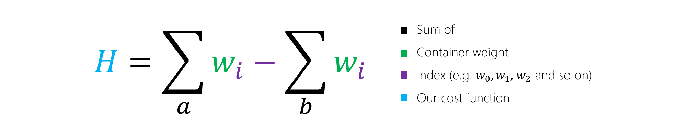

Recall that in our container ship problem, Contoso Logistics has to optimize how it distributes containers between two ships. In other words, we have a set of container weights, *w*, which we would like to partition into two sets.

This short animation shows one possible way to optimize the distribution:

> [!VIDEO https://channel9.msdn.com/Shows/Learn-Azure/Quantum-Optimization-Container-Demo/player?format=ny]

Those two sets correspond to whether the container is loaded onto ship *a* or ship *b*. In this part, we'll use QIO to solve the problem.

## Express the problem

Let's start by coming up with an equation for the weight of a given ship, which is the sum of all the containers on the ship. This sum is expressed in the following equation, where *wi* is the weight of container *i*:

Ideally, we want a solution where the weight difference between the ships is as small as possible.

This equation subtracts the sum of weights on ship _b_ from the sum of weights on ship _a_.

The letter *H* is typically used to represent a cost function. It is also referred to as a Hamiltonian as an acknowledgment to the quantum mechanical roots of QIO techniques. If the value of *H* is zero, we know the ships are equally loaded.

## Refine the problem

Next, we introduce a variable, *xi*, to represent whether an individual container *i* is assigned to ship *a* or ship *b*.

Because we can assign the container *i* to either ship, the variable *xi* can take on two different values, which makes it a binary variable. For convenience, we say the two values it can take on are *1* and *-1*. The value *1* represents that the container is placed on ship *a*, and *-1* represents that the container is placed on ship *b*. Because of our decision to make *xi* be either *1* or *-1*, our optimization problem is called an _Ising problem_.

By introducing this variable *xi*, we can simplify the equation as follows:

## Refine the problem again

There's one last change we need to make before we can solve our problem.

If we look at our cost function *H*, there's a flaw: the solution with the least cost is to simply assign all containers to ship *b* by setting all of the *xi* variables equal to *-1*. But that's not correct! To fix this, we square the right-hand side of the equation to ensure that it cannot be negative.

This final model gives us a cost function with the required properties.

- If all the containers are on one ship, the function is at its highest value. This is the least optimal solution.
- If the containers are perfectly balanced, the value of the summation inside the square is *0*. This means the function is at its lowest value.

In this case, we don't care about the actual value of *H*. It only has to be as small as possible.

That's it! You've learned the basics of QIO and seen how the Azure Quantum service can be used to solve optimization problems.