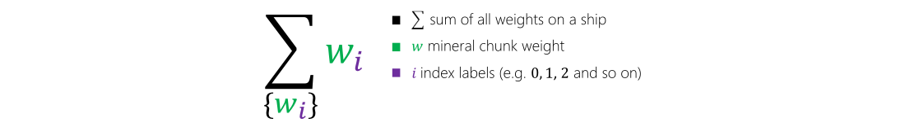

Now that you understand the basics of QIO, let's come back to our mineral shipment problem. Your spaceship has to optimize how it distributes the mineral chunks between the two container shipments. In other words, each chunk has a weight, $w$, associated to it, and you would like to partition these weights into two sets: $W_A$ and $W_B$.

Those two sets correspond to whether a mineral chunk is loaded onto container *A* or container *B*, and we define $\Delta$ as the weight difference between the two containers.

This short animation shows one possible way an optimizer might distribute the mineral. The running time of the optimizer is measured in steps. At each step, we show the best solution found so far.

> [!VIDEO <https://www.microsoft.com/videoplayer/embed/RE4MFtm>]

In this next part, we'll use quantum-inspired optimization to solve the problem.

> [!NOTE]
> This problem is known as a *number partitioning problem*. Although it is classified as NP-hard, in practice there exist other efficient algorithms able to provide approximate solutions much faster than QIO might. Nevertheless, we'll use the freight balancing problem to illustrate QIO concepts and how to use the Azure Quantum service, as it is a familiar and easily understood example. In a later [module](https://docs.microsoft.com/learn/modules/solve-job-shop-scheduling-optimization-problem?azure-portal=true), we'll tackle a more challenging problem where QIO might provide a practical advantage.

## Express the problem

Let's start by coming up with an expression for the weight of a given container. This is simply the sum of all the mineral chunks it contains. The sum is expressed in the following equation, where $w_i$ is the weight of chunk *i*:



Ideally, we want a solution where the weight difference between the containers, $\Delta$, is as small as possible.


This equation subtracts the sum of weights on container *B* from the sum of weights on container *A*.

The letter *H* is used to represent a cost function. This notation originates from the model we're using to define our optimization problem, known as the *Ising model*. In this model, the energy (which represents the cost) is given by a Hamiltonian, whose variables take the value of +1 or -1. Our goal is to map the optimization to this form.

## Refine the problem

We now introduce a variable, $x_i$, to represent whether an individual mineral chunk *i* is assigned to container *A* or container *B*.

Because we assign the chunk *i* to either of two containers, the variable $x_i$ can take on two different values, which makes it a binary variable. For convenience, we say the two values it can take on are *1* and *-1*. The value *1* corresponds the mineral chunk being placed on container *A*, and *-1* to the chunk being placed on container *B*. Because of our decision to make $x_i$ be either *1* or *-1*, our optimization problem is called an *Ising problem*.

By introducing the variable $x_i$, we can simplify the equation as follows:


## Refine the problem again

There's one last change we need to make before we can solve our problem.

If we look at our cost function *H*, there's a flaw: the solution with the least cost is to assign the entirety of the extracted mineral to container *B* by setting all of the $x_i$ variables equal to *-1*. But that's not correct! To fix this, we square the right-hand side of the equation to ensure that it cannot be negative.


This final model gives us a cost function with the required properties.

- If all the mineral is on one container, the function is at its highest value. This is the least optimal solution.
- If the freight containers are perfectly balanced, the value of the summation inside the square is *0*. This means the function is at its lowest, or optimal, value.

## Solving the Problem with Azure Quantum

Now that you've learned how our combinatorial optimization problem can be cast in Ising form, we're ready to invoke a QIO solver to compute solutions for us. We'll use Python to connect to the Azure Quantum services. As you make your way through the rest of this section, copy the code sequences into a Jupyter notebook to execute them. Feel free to play with the problem parameters and observe how the results change.

### Setup

First, we must instantiate a `Workspace` object, which allows you to connect to the workspace you've previously deployed in Azure. Return to the [Get Started with Azure Quantum](https://docs.microsoft.com/learn/modules/get-started-azure-quantum?azure-portal=true) module if you don't have a workspace set up yet. Be sure to fill in the settings below which can be retrieved from the [web interface](https://ms.portal.azure.com#home?azure-portal=true) or by running `az quantum workspace show` through the Azure CLI.

```python
from azure.quantum import Workspace

# Copy the settings for your workspace below
workspace = Workspace(
    subscription_id=    "", # add your subscription_id
    resource_group=     "", # add your resource_group
    name=               "", # add your workspace name
)

workspace.login()
```

### Problem instantiation

In order to submit a problem to the Azure Quantum services, we first need to create a `Problem` instance. This is a Python object that stores all the required information, such as the cost function details and what kind of problem we are modeling.

Some problem types were already introduced in a previous unit, such as the PUBO, QUBO, or Ising problem types. In this example, we'll be using the Ising type, which is available via `ProblemType.ising`.

To represent cost functions, we'll make use of a formulation using `Term` objects. Ultimately, any polynomial cost function can be written as a simple sum of products. That is, the function can be rewritten to have the following form, where $p_k$ indicates a product over the problem variables $x_0, x_1, \dots$:

$$ H(x) = \sum_k \alpha_k \cdot p_k(x_0, x_1, \dots) $$

$$ \text{e.g. } H(x) = 5 \cdot (x_0) + 2 \cdot (x_1 \cdot x_2) - 3 \cdot ({x_3}^2) $$

In this form, every term in the sum has a coefficient $\alpha_k$ and a product $p_k$. In the `Problem` instance, each term in the sum is represented by a `Term` object, with parameters `w` - corresponding to the coefficient, and `indices` - corresponding to the product. Specifically, the `indices` parameter is populated with the indices of all variables appearing in the term. For instance, the term $2 \cdot (x_1 \cdot x_2)$ translates to the following object: `Term(c=2, indices=[1,2])`.

Let's run through an example using the cost function we derived earlier, which we show again below. For $n$ mineral chunks, the index $i$ runs from $0$ to $n-1$ :

$$ H(x) = \left(\sum_{i} w_{i} \cdot x_{i}\right)^2 $$

After expanding the square we get a double summation, where $j$ also indexes the $n$ chunks:

$$ H(x) = \sum_i \sum_j (w_i \cdot w_j) \cdot (x_i \cdot x_j) $$

While it may not look like it, this double sum is just another way to write a large sum with $n^2$ terms. Using the transformation $k=i \cdot n + j$, with $\alpha_k = w_i \cdot w_j$ and $p_k(x_0, \cdots, x_{n-1}) = x_i \cdot x_j$, we would indeed obtain the single summation form:

$$ H(x) = \sum_{k=0}^{n^2-1} \alpha_k \cdot p_k(x_0, \cdots, x_{n-1}) $$

Let's plug in some numbers! We will use 3 mineral chunks with the weights $w_i \in [2,4,7]$, and thus with indices $i,j \in \{0,1,2\}$. The double summation form is easier to work with, so let's use that one. For every value of $i$, we add three terms, one for each value of $j$:

$$ H(x) = (2 \cdot 2) \cdot (x_0 \cdot x_0) + (2 \cdot 4) \cdot (x_0 \cdot x_1) + (2 \cdot 7) \cdot (x_0 \cdot x_2) $$
$$ \hspace{25pt} +\ (4 \cdot 2) \cdot (x_1 \cdot x_0) + (4 \cdot 4) \cdot (x_1 \cdot x_1) + (4 \cdot 7) \cdot (x_1 \cdot x_2) $$
$$ \hspace{25pt} +\ (7 \cdot 2) \cdot (x_2 \cdot x_0) + (7 \cdot 4) \cdot (x_2 \cdot x_1) + (7 \cdot 7) \cdot (x_2 \cdot x_2) $$

Because this is an Ising problem, the variables $x_i$ can take on a value of either $1$ or $-1$, which implies that $x_i^2$ will always equal $1$. As we do not care what the actual value of $H$ is, only that it is minimized, we can safely remove these terms. The final form, now containing six instead of nine terms, is then given by:

$$ H(x) = 8 \cdot (x_0 \cdot x_1) + 14 \cdot (x_0 \cdot x_2) + 8 \cdot (x_1 \cdot x_0) + 28 \cdot (x_1 \cdot x_2) + 14 \cdot (x_2 \cdot x_0) + 28 \cdot (x_2 \cdot x_1) $$

In Python, we would thus introduce the following `Terms`:

- `Term(c =  8, indices = [0, 1])`
- `Term(c = 14, indices = [0, 2])`
- `Term(c =  8, indices = [1, 0])`
- `Term(c = 28, indices = [1, 2])`
- `Term(c = 14, indices = [2, 0])`
- `Term(c = 28, indices = [2, 1])`

The function below generalizes the `Term` creation for any number of weights using some for loops. It takes an array of mineral weights and returns a `Problem` object containing the cost function.

```python
from typing import List
from azure.quantum.optimization import Problem, ProblemType, Term

def createProblemForMineralWeights(mineralWeights: List[int]) -> Problem:
    terms: List[Term] = []

    # Expand the squared summation
    for i in range(len(mineralWeights)):
        for j in range(len(mineralWeights)):
            if i == j:
                # Skip the terms where i == j as they form constant terms in an Ising problem and can be disregarded.
                continue

            terms.append(
                Term(
                    c = mineralWeights[i] * mineralWeights[j],
                    indices = [i, j]
                )
            )

    # Return an Ising-type problem
    return Problem(name="Freight Balancing Problem", problem_type=ProblemType.ising, terms=terms)
```

Before submission to Azure Quantum, we instantiate a problem by defining a list of mineral chunks via their weights:

```python
# This array contains the weights of all the mineral chunks
mineralWeights = [1, 5, 9, 21, 35, 5, 3, 5, 10, 11]

# Create a problem for the given list of minerals:
problem = createProblemForMineralWeights(mineralWeights)
```

### Submit to Azure Quantum

We're ready to submit our problem to Azure using the `ParallelTempering` solver:

> [!NOTE]
> Here we use a parameter-free Parallel Tempering solver with a timeout of 100 seconds. For more information about available solvers, see the [Microsoft Quantum Solution provider](//TODO) page. However, solver selection and tuning is beyond the scope of this module.

```python
from azure.quantum.optimization import ParallelTempering
import time

# Instantiate a solver to solve the problem.
solver = ParallelTempering(workspace, timeout=100)

# Optimize the problem
print('Submitting problem...')
start = time.time()
result = solver.optimize(problem)
timeElapsed = time.time() - start
print(f'Result in {timeElapsed} seconds: ', result)
```

```output
Submitting problem...
.......
Result in 35.41556143760681 seconds:  {'version': '1.0', 'configuration': {'0': 1, '1': -1, '2': 1, '3': 1, '4': -1, '5': -1, '6': -1, '7': -1, '8': 1, '9': 1}, 'cost': -2052.0, 'parameters': {'all_betas': [0.00020408163265306123, 0.0010031845282727856, 0.004931258069052868, 0.024240112818991428, 0.00020408163265306123, 0.00041416312947479666, 0.0008405023793001501, 0.0017057149691356173, 0.0034615768230851457, 0.007024921700835206, 0.014256371424073268, 0.028931870679351317, 0.058714319100389226, 0.00020408163265306123, 0.0003216601955060876, 0.000506979878727771, 0.0007990687098552142, 0.0012594401274306443, 0.001985047612326009, 0.003128702935041415, 0.0049312580690528685, 0.007772328229454337, 0.012250238227336452, 0.019308028713685834, 0.030432059025318557, 0.04796503207311015, 0.07559936381105262, 0.00020408163265306123, 0.0002853639172320586, 0.0003990195697643234, 0.0005579423586529702, 0.000780161423569038, 0.0010908866075247, 0.0015253684103382742, 0.0021328970135012235, 0.0029823940494438134, 0.004170231478526455, 0.0058311645933360684, 0.008153619454858395, 0.011401069057563778, 0.015941923261808107, 0.022291323383991948, 0.031169582869598398, 0.043583903904173556, 0.06094264037716683, 0.08521506986401543, 0.00020408163265306123, 0.0002661133962019146, 0.0003470000642267741, 0.0004524726913109797, 0.0005900043184095882, 0.0007693394594342792, 0.0010031845282727856, 0.001308108124995844, 0.0017057149691356171, 0.002224176656606702, 0.002900227698828882, 0.0037817682692016645, 0.004931258069052867, 0.006430141778288393, 0.0083846196467327, 0.010933172089261346, 0.01425637142407326, 0.018589675944162696, 0.02424011281899142, 0.031608031858238926, 0.04121547145476594, 0.05374314651596505, 0.0700786790855087, 0.09137948893466513], 'replicas': 70, 'sweeps': 600}}
```

Notice that the solver returned the results in the form of a Python dictionary, along with some metadata. For a more human-readable format, use the function below to print a summary of what the solution means:

```python
def printResultSummary(result):
    # Print a summary of the result
    containerAWeight = 0
    containerBWeight = 0
    for chunk in result['configuration']:
        chunkAssignment = result['configuration'][chunk]
        chunkWeight = mineralWeights[int(chunk)]
        container = ''
        if chunkAssignment == 1:
            container = 'A'
            containerAWeight += chunkWeight
        else:
            container = 'B'
            containerBWeight += chunkWeight

        print(f'Mineral chunk {chunk} with weight {chunkWeight} was placed on Container {container}')

    print(f'\nTotal weights: \n\tContainer A: {containerAWeight} tons \n\tContainer B: {containerBWeight} tons')

printResultSummary(result)
```

```output
Chunk 0 with weight 1 was placed on Container A
Chunk 1 with weight 5 was placed on Container B
Chunk 2 with weight 9 was placed on Container A
Chunk 3 with weight 21 was placed on Container A
Chunk 4 with weight 35 was placed on Container B
Chunk 5 with weight 5 was placed on Container B
Chunk 6 with weight 3 was placed on Container B
Chunk 7 with weight 5 was placed on Container B
Chunk 8 with weight 10 was placed on Container A
Chunk 9 with weight 11 was placed on Container A

Total weights:
    Container a: 52 tons
    Container b: 53 tons
```

Great! The solver found a partition such that the containers are within 1 ton of each other. A satisfactory outcome, as a perfectly balanced solution doesn't exist for this problem instance.

## Improving the Cost Function

The cost function we've built works well so far, but let's take a closer look at the `Problem` that was generated:

```python
print(f'The problem has {len(problem.terms)} terms for {len(mineralWeights)} mineral chunks:')
print(problem.terms)
```

```output
The problem has 90 terms for 10 mineral chunks:
[{'c': 5, 'ids': [0, 1]}, {'c': 9, 'ids': [0, 2]}, {'c': 21, 'ids': [0, 3]}, {'c': 35, 'ids': [0, 4]}, {'c': 5, 'ids': [0, 5]}, {'c': 3, 'ids': [0, 6]}, {'c': 5, 'ids': [0, 7]}, {'c': 10, 'ids': [0, 8]}, {'c': 11, 'ids': [0, 9]}, {'c': 5, 'ids': [1, 0]}, {'c': 45, 'ids': [1, 2]}, {'c': 105, 'ids': [1, 3]}, {'c': 175, 'ids': [1, 4]}, {'c': 25, 'ids': [1, 5]}, {'c': 15, 'ids': [1, 6]}, {'c': 25, 'ids': [1, 7]}, {'c': 50, 'ids': [1, 8]}, {'c': 55, 'ids': [1, 9]}, {'c': 9, 'ids': [2, 0]}, {'c': 45, 'ids': [2, 1]}, {'c': 189, 'ids': [2, 3]}, {'c': 315, 'ids': [2, 4]}, {'c': 45, 'ids': [2, 5]}, {'c': 27, 'ids': [2, 6]}, {'c': 45, 'ids': [2, 7]}, {'c': 90, 'ids': [2, 8]}, {'c': 99, 'ids': [2, 9]}, {'c': 21, 'ids': [3, 0]}, {'c': 105, 'ids': [3, 1]}, {'c': 189, 'ids': [3, 2]}, {'c': 735, 'ids': [3, 4]}, {'c': 105, 'ids': [3, 5]}, {'c': 63, 'ids': [3, 6]}, {'c': 105, 'ids': [3, 7]}, {'c': 210, 'ids': [3, 8]}, {'c': 231, 'ids': [3, 9]}, {'c': 35, 'ids': [4, 0]}, {'c': 175, 'ids': [4, 1]}, {'c': 315, 'ids': [4, 2]}, {'c': 735, 'ids': [4, 3]}, {'c': 175, 'ids': [4, 5]}, {'c': 105, 'ids': [4, 6]}, {'c': 175, 'ids': [4, 7]}, {'c': 350, 'ids': [4, 8]}, {'c': 385, 'ids': [4, 9]}, {'c': 5, 'ids': [5, 0]}, {'c': 25, 'ids': [5, 1]}, {'c': 45, 'ids': [5, 2]}, {'c': 105, 'ids': [5, 3]}, {'c': 175, 'ids': [5, 4]}, {'c': 15, 'ids': [5, 6]}, {'c': 25, 'ids': [5, 7]}, {'c': 50, 'ids': [5, 8]}, {'c': 55, 'ids': [5, 9]}, {'c': 3, 'ids': [6, 0]}, {'c': 15, 'ids': [6, 1]}, {'c': 27, 'ids': [6, 2]}, {'c': 63, 'ids': [6, 3]}, {'c': 105, 'ids': [6, 4]}, {'c': 15, 'ids': [6, 5]}, {'c': 15, 'ids': [6, 7]}, {'c': 30, 'ids': [6, 8]}, {'c': 33, 'ids': [6, 9]}, {'c': 5, 'ids': [7, 0]}, {'c': 25, 'ids': [7, 1]}, {'c': 45, 'ids': [7, 2]}, {'c': 105, 'ids': [7, 3]}, {'c': 175, 'ids': [7, 4]}, {'c': 25, 'ids': [7, 5]}, {'c': 15, 'ids': [7, 6]}, {'c': 50, 'ids': [7, 8]}, {'c': 55, 'ids': [7, 9]}, {'c': 10, 'ids': [8, 0]}, {'c': 50, 'ids': [8, 1]}, {'c': 90, 'ids': [8, 2]}, {'c': 210, 'ids': [8, 3]}, {'c': 350, 'ids': [8, 4]}, {'c': 50, 'ids': [8, 5]}, {'c': 30, 'ids': [8, 6]}, {'c': 50, 'ids': [8, 7]}, {'c': 110, 'ids': [8, 9]}, {'c': 11, 'ids': [9, 0]}, {'c': 55, 'ids': [9, 1]}, {'c': 99, 'ids': [9, 2]}, {'c': 231, 'ids': [9, 3]}, {'c': 385, 'ids': [9, 4]}, {'c': 55, 'ids': [9, 5]}, {'c': 33, 'ids': [9, 6]}, {'c': 55, 'ids': [9, 7]}, {'c': 110, 'ids': [9, 8]}]
```

That's a lot of terms for just 10 chunks! On closer inspection, you'll note that there are essentially duplicate terms. These terms are the result of having squared the right-hand side of the equation when we built our cost function. For example, look at the last term: `{'w': 110, 'ids': [9, 8]}`. If you look through the rest of the terms, you'll find a symmetrical copy of it: `{'w': 110, 'ids': [8, 9]}`.

This duplicate encodes the exact same information in our cost function. However, because we don't actually care about the value of the cost function (just the shape), we can omit these terms as follows:


Notice that we've expanded the square in our previous cost function to a summation over two indices, $i$ and $j$. With the constraint $i<j$, we exclude the symmetric copies of terms mentioned above. As a bonus, "constant" $i=j$ terms are excluded as well, which don't contribute to the solution.

Modify your `createProblemForMineralWeights` function as follows to implement the improved cost function:

```python
def createSimplifiedProblemForMineralWeights(mineralWeights: List[int]) -> Problem:
    terms: List[Term] = []

    # Expand the squared summation
    for i in range(len(mineralWeights)-1):
        for j in range(i+1, len(mineralWeights)):
            terms.append(
                Term(
                    w = mineralWeights[i] * mineralWeights[j],
                    indices = [i, j]
                )
            )

    # Return an Ising-type problem
    return Problem(name="Freight Balancing Problem (Simplified)", problem_type=ProblemType.ising, terms=terms)
```

Let's check that this creates a smaller problem:

```python
# Create the simplified problem
simplifiedProblem = createSimplifiedProblemForMineralWeights(mineralWeights)
print(f'The simplified problem has {len(simplifiedProblem.terms)} terms')
```

```output
The simplified problem has 45 terms
```

Success! The problem has half as many terms. Now let's run it and verify the result:

```python
# Optimize the problem
print('Submitting simplified problem...')
start = time.time()
simplifiedResult = solver.optimize(simplifiedProblem)
timeElapsedSimplified = time.time() - start
print(f'Result in {timeElapsedSimplified} seconds: ', simplifiedResult)
printResultSummary(simplifiedResult)
```

```output
Submitting simplified problem...
......
Result in 21.3847393989563 seconds:  {'version': '1.0', 'configuration': {'0': 1, '1': -1, '2': 1, '3': 1, '4': -1, '5': -1, '6': -1, '7': -1, '8': 1, '9': 1}, 'cost': -1026.0, 'parameters': {'all_betas': [0.00040816326530612246, 0.002006369056545571, 0.009862516138105735, 0.048480225637982856, 0.00040816326530612246, 0.0008283262589495933, 0.0016810047586003002, 0.0034114299382712347, 0.006923153646170291, 0.014049843401670412, 0.028512742848146536, 0.05786374135870263, 0.11742863820077845, 0.00040816326530612246, 0.0006433203910121752, 0.001013959757455542, 0.0015981374197104284, 0.0025188802548612886, 0.003970095224652018, 0.00625740587008283, 0.009862516138105737, 0.015544656458908674, 0.024500476454672904, 0.03861605742737167, 0.060864118050637114, 0.0959300641462203, 0.15119872762210523, 0.00040816326530612246, 0.0005707278344641172, 0.0007980391395286468, 0.0011158847173059405, 0.001560322847138076, 0.0021817732150494, 0.0030507368206765485, 0.004265794027002447, 0.005964788098887627, 0.00834046295705291, 0.011662329186672137, 0.01630723890971679, 0.022802138115127556, 0.03188384652361621, 0.044582646767983895, 0.062339165739196796, 0.08716780780834711, 0.12188528075433366, 0.17043013972803087, 0.00040816326530612246, 0.0005322267924038292, 0.0006940001284535482, 0.0009049453826219594, 0.0011800086368191764, 0.0015386789188685584, 0.002006369056545571, 0.002616216249991688, 0.0034114299382712343, 0.004448353313213404, 0.005800455397657764, 0.007563536538403329, 0.009862516138105733, 0.012860283556576787, 0.0167692392934654, 0.021866344178522693, 0.02851274284814652, 0.03717935188832539, 0.04848022563798284, 0.06321606371647785, 0.08243094290953187, 0.1074862930319301, 0.1401573581710174, 0.18275897786933026], 'replicas': 70, 'sweeps': 600}}
Chunk 0 with weight 1 was placed on Container A
Chunk 1 with weight 5 was placed on Container B
Chunk 2 with weight 9 was placed on Container A
Chunk 3 with weight 21 was placed on Container A
Chunk 4 with weight 35 was placed on Container B
Chunk 5 with weight 5 was placed on Container B
Chunk 6 with weight 3 was placed on Container B
Chunk 7 with weight 5 was placed on Container B
Chunk 8 with weight 10 was placed on Container A
Chunk 9 with weight 11 was placed on Container A

Total weights:
    Container A: 52 tons
    Container B: 53 tons
```

As you can see, the quality of the solution is the same for both cost functions - the containers are loaded within 1 ton of each other. This reveals an important fact about using QIO solvers: it is often possible (and necessary) to optimize the cost function in order to generate more optimal solutions more quickly.
