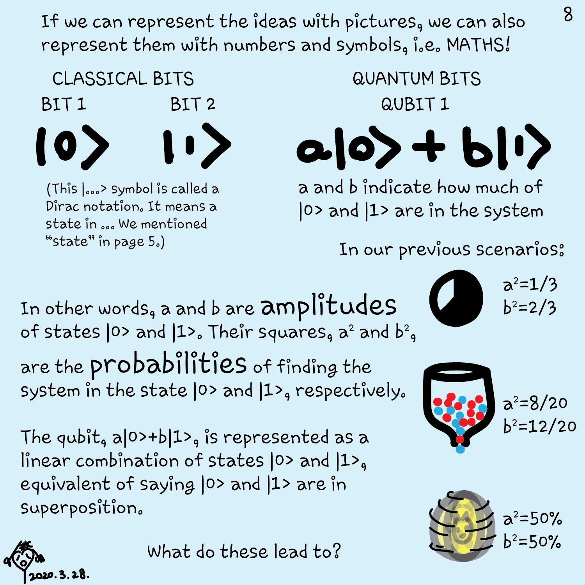
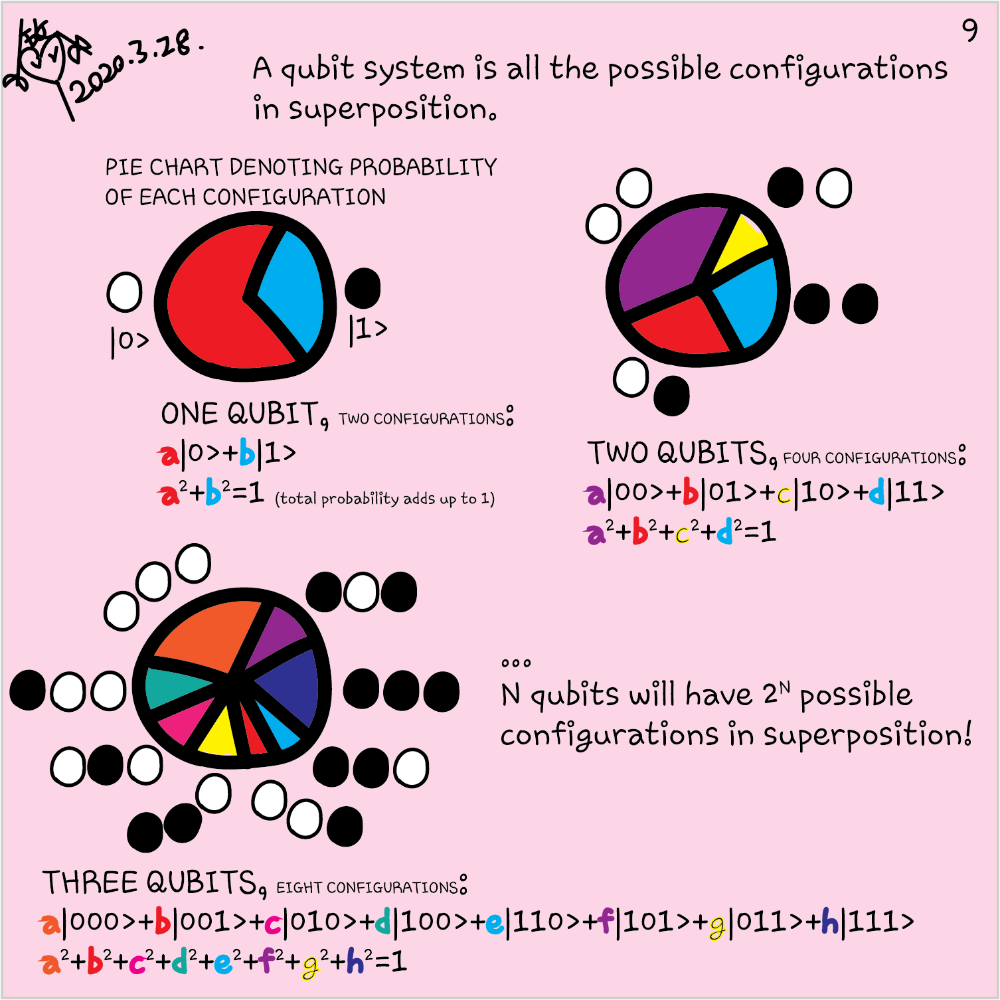
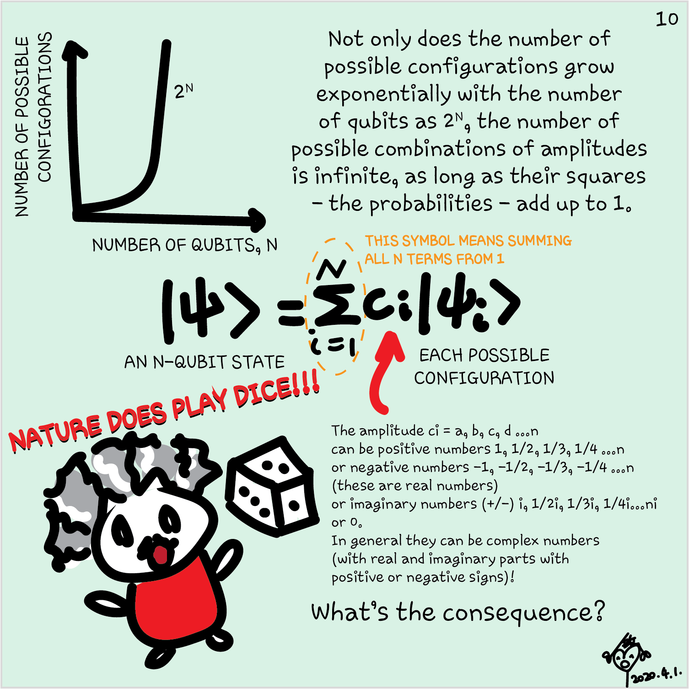

For some computational tasks, quantum computing provides exponential speed-ups.
This is rooted from the fact that quantum computing uses three phenomena from
quantum mechanics: superposition, interference, and entanglement. In the last MS
Learn module [Create your first Q# program by using the Quantum Development
Kit](https://docs.microsoft.com/learn/modules/qsharp-create-first-quantum-development-kit?azure-portal=true),
you have experienced superposition by creating a random number generator from
qubits. In this unit, you will learn more about the concept.  

## Quantum computers are quantum systems

Quantum computers are controllable quantum mechanical devices that exploit the
properties of quantum physics to do computations. You may have seen or heard
about the Schrödinger equation that describes every quantum mechanical system:

$$i \hbar \frac{\partial}{\partial t}\psi(t)= H \psi(t).$$

It captures the wave function, $\psi(t)$, and the energy Hamiltonian, $H$, of
the system, with $t$ being time and $\hbar$ being the Plank constant.
However, fortunately, you don't need the Schrödinger equation to do
quantum programming. In practice, nobody thinks in terms of the Schrödinger
equation when writing quantum algorithms. But we can use it to assist us to
understand some concepts of quantum computing.

The Schrödinger equation determines the evolution of the state of the system,
represented by the wave function $\psi$. Each wave function is associated with an important concept in quantum
computing - **probability amplitude** of an observable. The probability
amplitude determines the probability of obtaining a certain outcome when measuring
the system. This is an important difference with respect to classical computing:
in quantum computing, we don't describe bits as being in determined factual states, but in
terms of the probabilities of finding those states when we observe them.

A handy notation to describe quantum states is the Dirac bra-ket notation. In
this notation, we describe the possible states of quantum systems with kets
$\ket{ }$.  For example, $\ket{0}$ and $\ket{1}$ are two possible states of a
qubit. If a qubit is in the state $\ket{\psi} = \ket{0}$, it means the
probability of observing `Zero` when measuring the qubit is 100%. Similarly, if
a qubit is in the state $\ket{\psi} =\ket{1}$, it yields `One` after a
measurement.

> [!NOTE] The concept of *measurement* is delicate and has been historically
> controversial. But for quantum computing you don't have to worry about it.
> Here we will understand by measurement the informal idea of "looking" at a
> qubit, which immediately collapses the quantum superposition to one of the two
> classical states. If you want to learn more about the historical discussion
> about measurements in the context of quantum mechanics, you will find a
> detailed discussion in the [Wikipedia article about the measurement
> problem](https://en.wikipedia.org/wiki/Measurement_problem).

## Linear operators

An **operator** (sometimes known as **gate**) is a function that transforms the
state of a quantum system to another state.

$$\hat A \ket{\psi} = \ket{\psi'}$$

We say that an operator $\hat A$ is linear when it presents two simple
properties, additivity

$$\hat A(\ket{\psi_1} + \ket{\psi_2}) = \hat A\ket{\psi_1} + \hat
A\ket{\psi_2}$$

and homogeneity

$$\hat A(a\ket{\psi})=a \hat A(\ket{\psi})$$

where $a$ is a complex number.

## Quantum superposition

The Schrödinger equation is a linear equation. It implies that if two states
$\ket{\psi_1}$ and $\ket{\psi_2}$ are solutions of the Schrödinger equation
(i.e. valid quantum states), then any linear combination of them is also a valid
quantum state:

$$\ket{\psi}=a\ket{\psi_1}+b\ket{\psi_2}.$$

This linear combination of $\ket{\psi_1}$ and $\ket{\psi_2}$ is called a
superposition of $\ket{\psi_1}$ and $\ket{\psi_2}$. Here, $a$ and $b$ are the
probability amplitudes of $\ket{\psi_1}$ and $\ket{\psi_2}$, respectively.
Remember that in the module [Create your first Q# program by using the Quantum
Development
Kit](https://docs.microsoft.com/learn/modules/qsharp-create-first-quantum-development-kit?azure-portal=true)
we already used superposition to create a quantum random number generator. We
used the operator `H` to put a qubit in the state $\ket{0}$ into superposition.
Mathematically this is: $$ \hat H \ket{0} = \frac1{\sqrt2} \ket{0} +
\frac1{\sqrt2} \ket{1}.$$

Linearity is a fundamental property of
quantum mechanics and therefore of quantum computing.

## Quantum computers are probabilistic

A fundamental difference between classical computers and quantum computers is
that programs in quantum computers are probabilistic. Quantum algorithms consist
of linear operations to a register of qubits to modify their states to a
particular superposition of all possibilities. Each possible state has an
associated probability amplitude. When we make a measurement, we obtain one of
the possible states with a certain probability. This fact contrasts with
classical computing, where a bit can only be deterministically `Zero` or `One`.
It means that sometimes we have to run the algorithm several times to ensure the
highest probability result in the output. This repetition might look
inefficient, but running several times quantum algorithms in many cases is much
more efficient than solving the task classically.

How do we know the probabilities associated with a given superposition? Suppose
we have a register of two qubits that can be in a superposition of four possible
states: $$\ket{\psi} = a \ket{00} + b \ket{01} + c \ket{10} + d \ket{11}.$$

Remember that $a,b,c$ and $d$ are probability amplitudes for each state. Their
absolute values, for example $|a|$, squared give the corresponding probabilities. For
instance, the probability for observing $\ket{00}$ is $P(00)=|a|^2$, for
$\ket{01}$ is $P(01)=|b|^2$ and so on.  

There are no restrictions on the types of numbers the probability amplitudes can
be. They can be positive, negative or in general complex numbers. However, for a
valid quantum superposition all probabilities sum to one:
$|a|^2+|b|^2+|c|^2+|d|^2=1$. This constraint is often known as the normalization
condition. You can think of it as the fact that you always obtain an outcome
when you measure, so the probabilities of measuring every possible outcome must
sum to one.

In the example state we produced for the quantum random bit generator,
$\ket{\psi}=\frac1{\sqrt2} \ket{0} + \frac1{\sqrt2} \ket{1}$, the probability
for each state is:

$$P(0)=\left|\frac1{\sqrt{2}}\right|^2=\frac12;$$
$$P(1)=\left|\frac1{\sqrt{2}}\right|^2=\frac12.$$

Each state has a 50% probability of being measured and hence we have a balanced
bit generator. We also can check that $\frac12 + \frac12 = 1$.

In the next unit, we are going to use Q# to see how we can create different
superpositions of qubits and inspect the probabilities.
