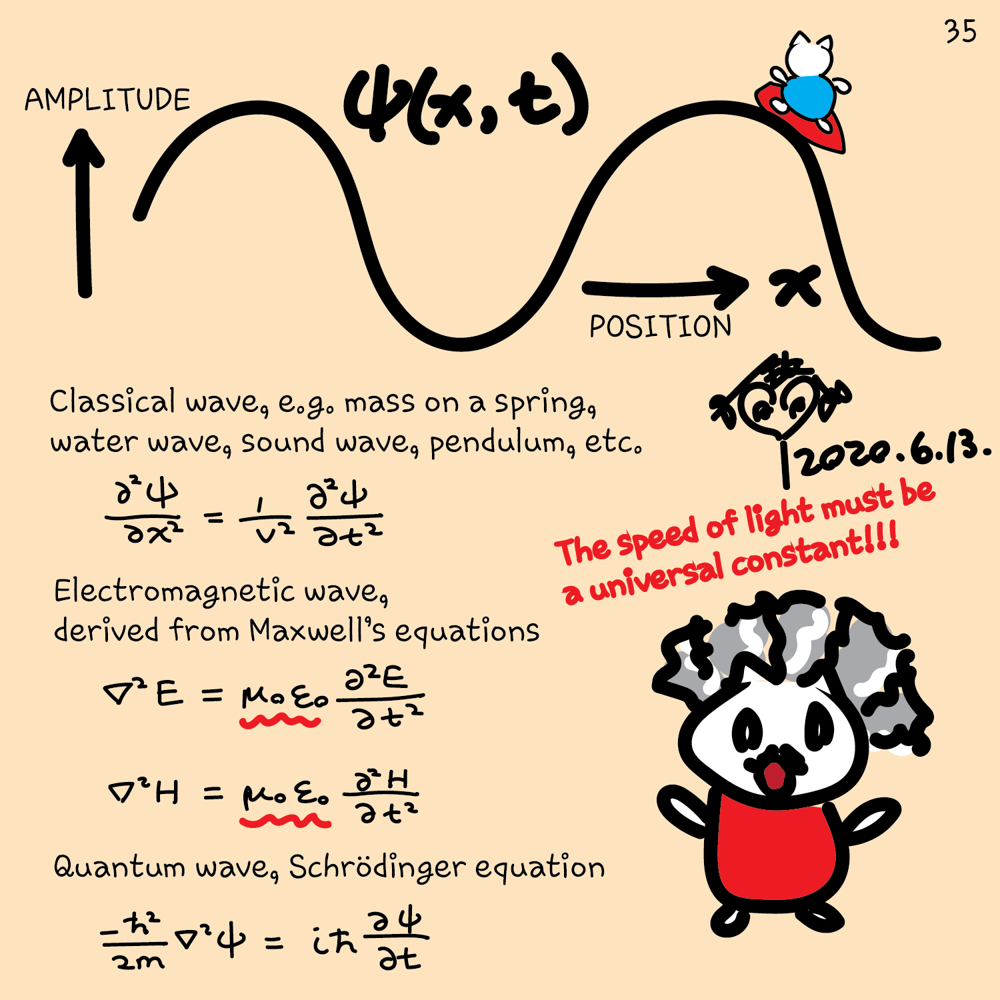
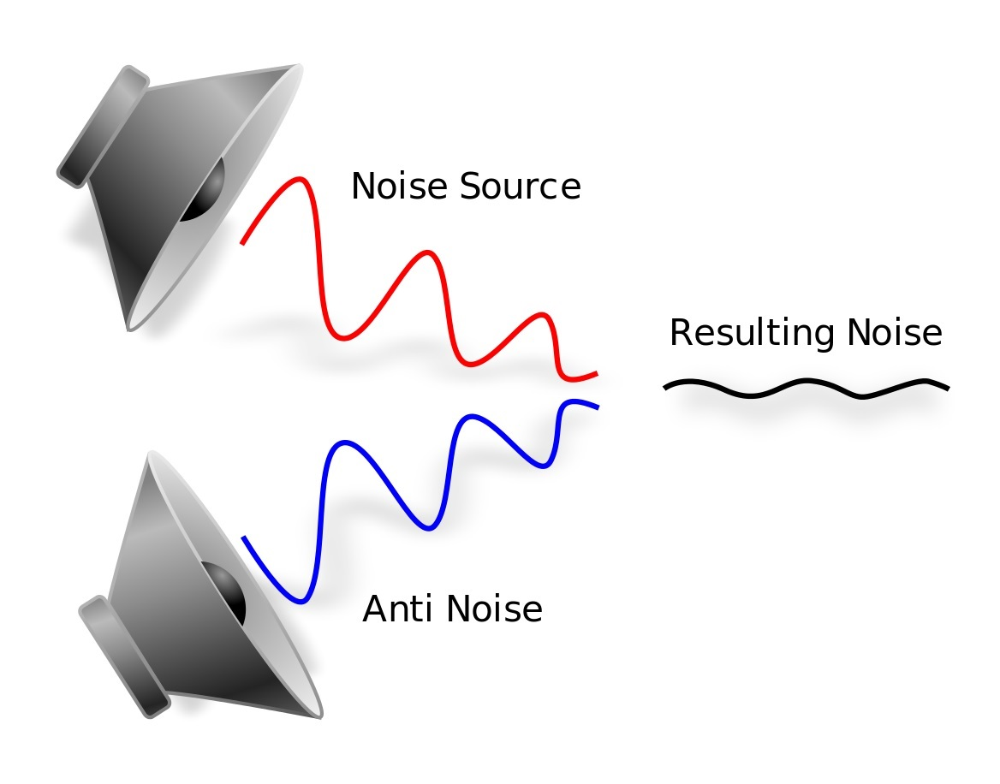
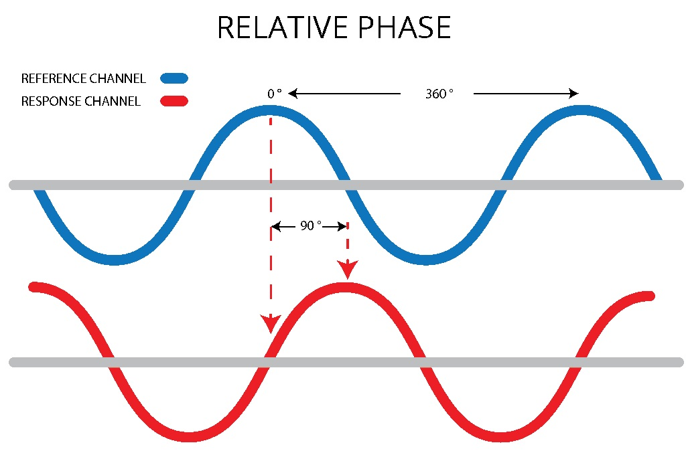
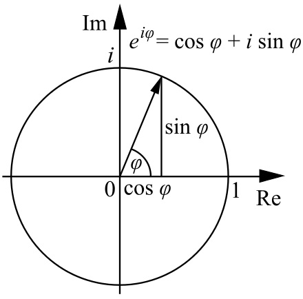

Until now, we only have been using superpositions with real positive amplitudes.
You might be wondering, why not use directly the probabilities to represent the
superposition? Well, this aspect is one of the main ingredients that makes
quantum computing work. Let's explain it.

## Waves of probabilities

The term *wave function* might be familiar to you (in fact, the `DumpMachine`
function we just used names the quantum state as "wave function"). Physicists
often use this term as a synonym to design the quantum state of a system. This
is because the Schrödinger equation that we introduced at the beginning of this
module has the same mathematical structure as classical wave equations.

You might have also heard the term "probability wave". In fact, the term
*probability amplitude* is inspired directly from the term *amplitude* of a
wave.

If probability amplitudes of qubits are governed by a wave-like equation, this
implies that we'll observe many of the different well-known physical
properties of waves. Quantum algorithms exploit these properties to perform
calculations. In particular, quantum computers exploit the phenomenon of **wave
interference**.

## Complex numbers to describe waves

We have mentioned earlier, the probability amplitudes can be complex numbers.
Complex numbers are a handy mathematical tool to describe waves. In fact, they
were already used to describe waves long before the discovery of quantum
mechanics. They provide intuition to understand interference. 

But, what is wave interference? Waves are governed by a linear equation
(remember, waves, and quantum states are mathematically the same thing). This
implies that waves can be superposed, just like we discussed for quantum states
in the previous units. Superposition of different waves enables their amplitudes
to interfere, resulting in different effects on the overall state. There are two
types of interference:

- **Constructive interference**: two waves add up to increase the amplitude of
  the resulting wave. For example, in our daily experience, when two water waves
  meet in a pool, we may see a bigger wave when their peaks add up.
- **Destructive interference**: two waves subtract to decrease the amplitude of
  the resulting wave. Again in our daily experience, some fancy headphones use
  an external microphone to catch the noise in the environment. It then
  reproduces sound waves that have the same magnitude but opposite phase to the
  noise and plays them in the inner speakers to cancel the noise for the
  listener. This is using destructive interference for noise cancellation.

Constructive and destructive interference are due to **relative phases** between
the waves.

In general an amplitude is a complex number, which describes both the magnitude
and the phase of the wave.

## Interference in quantum computing

Qubit states follow the same mathematics as waves.

We used the following superposition to create the quantum random number
generator:

$$\ket{\psi_1}= \frac1{\sqrt2}\ket{0}+\frac1{\sqrt2}\ket{1}$$.

In this case, the probabilities of measuring **0** and **1** are both $\frac12$
(remember each amplitude squared gives the probability of obtaining each state).
The following state is probabilistically equivalent:

$$\ket{\psi_2}= \frac1{\sqrt2}\ket{0}-\frac1{\sqrt2}\ket{1}$$.

Notice the minus sign, which makes the relative phase between the $\ket{0}$ and
$\ket{1}$ states different.

If we then put $\ket{\psi_1}$ and $\ket{\psi_2}$ in superposition:

$$\ket{\psi}=\frac1{\sqrt2}\ket{\psi_1}+\frac1{\sqrt2}\ket{\psi_2}=
\frac1{\sqrt2}\left(\frac1{\sqrt2}\ket{0}+\frac1{\sqrt2}\ket{1}\right)+\frac1{\sqrt2}\left(\frac1{\sqrt2}\ket{0}-\frac1{\sqrt2}\ket{1}\right)$$
$$= \frac12 \left(\ket{0}+\ket{0}\right)+ \frac12\left(\ket{1}-\ket{1}\right)=
\ket{0}$$.

The amplitudes of $\ket{0}$ had the same phase. Like waves, they constructively
interfered doubling the probability of obtaining **0**. On the other hand, the
amplitudes of $\ket{1}$ had the opposite phase and destructively interfered,
eliminating the probability of obtaining **1**.

Interference is one of the basic principles behind the power of quantum
computing. Quantum interference can be harnessed to perform computations to
bring advantage over classical algorithms.

In the next unit, you are going to see how you can we use Q# to
explore quantum interference.