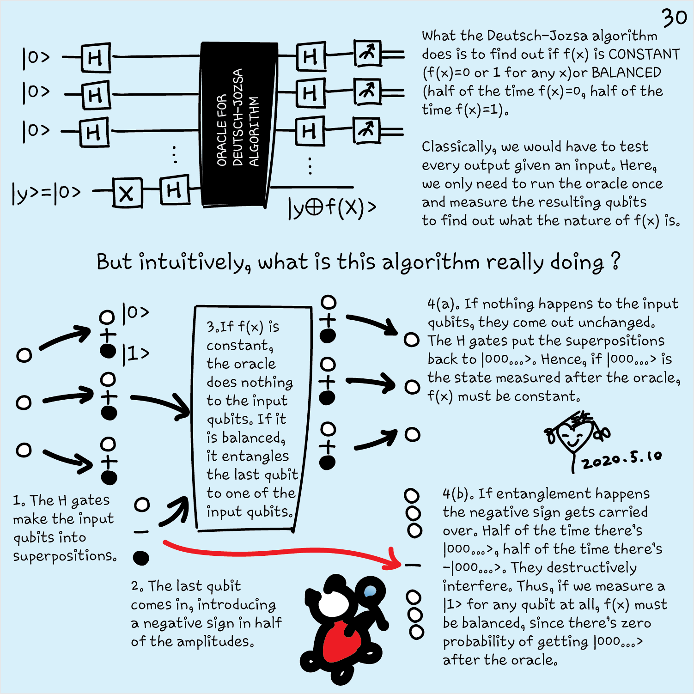
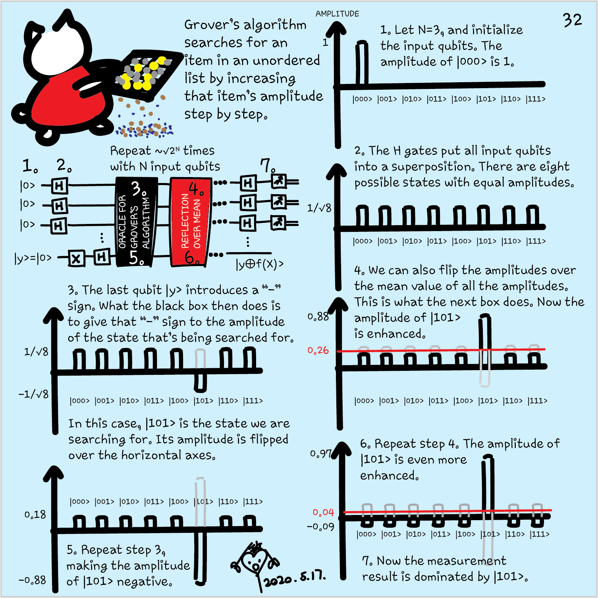

In this unit, you'll see some of the most famous quantum computing algorithms.
We'll outline how they use superposition, interference, and entanglement to
achieve a quantum advantage over classical algorithms. In future modules, you
will be able to explore in detail some of these algorithms.

## Quantum oracle

First, we need to introduce the concept of *quantum oracle*. In many problems, we
are interested in solving a problem while making the fewest number of evaluations of a
function $f:\\{ 0,1 \\}^n \rightarrow \\{0,1\\}^m$. For example, if we're searching an element in
a database we can encode the problem in a binary function $f:
\\{0,1\\}^n \rightarrow \\{0,1\\}$. The function $f(x)$ can be considered as a
black-box that outputs $1$ if the consulted element $x$ is our target, and $0$
otherwise. An efficient search finds the target element with few uses of $f$.

A quantum oracle is
a quantum operation that is used to implement some black-box function $f:
\\{0,1\\}^n \rightarrow \\{0,1\\}^m$. This
operation is implemented in a way that allows to evaluate the black-box function
not only on individual inputs, but also on superposition of basis states.

> [!NOTE]
> This is not the same as being able to calculate the function on all
> inputs at once, since you'll be able to extract only the evaluation of the qubit you
> decide to measure!

The oracle has to act on quantum states instead of classical bits. To enable
this, the input $x$ with binary representation $x=(x_0,x_1,...,x_{n-1})$
can be encoded into an n-qubit register: $\ket{x}=\ket{x_0x_1...x_{n-1}}$.

## Deutsch–Jozsa algorithm

This quantum algorithm is famous for being one of the earliest examples of
quantum computing solving a problem exponentially faster than its classical counterpart. It has very limited real-life applications, but its relative
simplicity makes it a fantastic example to show how quantum computers can
improve classical results using superposition, interference and entanglement.

### Problem: finding out if a function is constant

First let's introduce the problem we're going to solve. Suppose you're given a
function $f(x):\\{0,1\\}^n\rightarrow\\{0,1\\}$, this is, a binary function that
takes a string of bits and outputs a single bit. You're guaranteed that the
function is:

- either *constant*: outputs the same value for all inputs.
- or *balanced*: for exactly half of the inputs it outputs $1$ and for
  the other half it outputs $0$.

For example, the function $f(x)=1$ for all $x$ is a constant function. On the
other hand, the function $f(x)= x_{n-1}$, where $x_{n-1}$ is the last bit of
$x$, is balanced.

The task is to find out whether or not a given black-box function $f(x)$ is constant
or balanced with the least amount of calls possible.

### Classical solution

If we solve this problem classically, how many calls to the given function will
we need?

The first call will give us no information - regardless of whether it returns 0
or 1, the function could still be constant or balanced. In the best case
scenario, the second call will return a different value and we'll be able to
conclude that the function is balanced in just two calls. However, if we get the
same value for the first two calls, we'll have to keep querying the function
until either we get a different value or until we do $\frac{2^{n}}{2}+1$ queries
that will return the same value - in this case we'll know for certain that the
function will be constant.

This is, if the function is constant we need to use the function on half plus
one of the possible inputs to be completely sure that the function isn't balanced.

### Quantum solution: the Deutsch-Jozsa algorithm

Suppose you are given an oracle operation $U_f$ that acts as a black-box
implementing the function $f(x)$. Both, $f(x)$ and $U_f$ are unknown to you and
the only information you have is that $f(x)$ takes a bit string of length $n$ as
input and you're guaranteed that the function is either constant or balanced.

#### Outline of the algorithm

The algorithm is as follows:

1. Start with a register of $n$ qubits initiated in the state \ket{0...0}.
1. Apply $\hat H$ to every qubit to create a superposition of all possible states.
1. Apply the oracle $U_f$ to the superposition to cause quantum interference.
1. Apply $\hat H$ to every qubit again to get out of superposition.
1. Measure every qubit: if all measurements results are $0$, the function is
   constant, otherwise, it is balanced.

This is, we solve the problem with just one query to the oracle, exponentially
faster than the classical solution.

If you're interested in the details of this algorithm and want to implement it
in Q#, check our [quantum katas tutorial on Deutsch-Jozsa algorithm](https://github.com/microsoft/QuantumKatas/tree/master/tutorials/ExploringDeutschJozsaAlgorithm?azure-portal=true).

## Grover's algorithm

Grover's search algorithm is one of the most popular quantum algorithms. The
algorithm searches for an item in a list of unstructured data, for example the
searching for a specific card in a deck of randomly-ordered cards.

### Problem: Search in an unstructured database

In this case, the function that we use to construct the oracle is a function
$f(x):\\{0,1\\}^n\rightarrow\\{0,1\\}$, and our task is to find an input $x'$ for
which $f(x')=1$. For example, in the card searching problem the input of $f(x)$
would be any card of the deck, represented by $x$, and the function $f$ would be
a comparison between our reference card and the drawn card. If the drawn card
matches our reference card, $f$ outputs $1$, if not, it outputs $0$.

### Classical solution

If we don't know anything about the internal structure of the function, the best
we can do is evaluate the function on different inputs until we find the desired
output or we try all inputs and conclude that the desired input doesn't exist.

In the worst case scenario, we need to try all the inputs and we need
$2^n$ uses of $f(x)$.

### Quantum solution: Grover's algorithm

If we're given the number of bits in the function input $n$, and the function
$f(x)$ implemented with a quantum oracle $U_f$, we can use Grover's algorithm to
find the target efficiently. This algorithm exploit superposition and
interference and the oracle $U_f$ to increase the probability of measuring the
correct target $x_0$ when measuring the qubit register.

#### Outline of the algorithm

A high-level outline of the algorithm is:

1. Initialize the quantum register to a well-known superposition state.
1. Apply a sequence of operations involving a call of the oracle for each
   iteration. This sequence is designed to exploit interference and entanglement
   to increase the probability amplitude of the target elements.
1. Perform a measurement to obtain the desired target elements with high
   probability.

This algorithm obtains the target element $x_0$ with very high probability using
$\sqrt{2^n}$ queries to the oracle. This is a quadratic improvement over the
classical method. More specifically, it obtains $x_0$ with a probability
$1-O(\frac1{2^n})$ using $O(\sqrt{2^n})$ queries.

If you're interested in the details of this algorithm and want to implement it
in Q#, check our [quantum katas tutorial on Grover's algorithm(https://github.com/microsoft/QuantumKatas/tree/master/GroversAlgorithm?azure-portal=true).

If you want to know how to implement this algorithm with the Q# high-level
functionality, you can also check the tutorial [Implement Grover's search
algorithm in Q#](https://docs.microsoft.com/quantum/tutorials/search?azure-portal=true).

## Shor's algorithm

Shor's algorithm is a quantum factoring algorithm that offers an exponential
speed-up over any known classical factoring algorithm. It's important since it
implies that public key cryptography can be broken with sufficiently large
quantum computers.

### Problem: integer factorization

The factoring problem consists on finding the prime factors of any
integer $N$.

### Classical solution

There are many classical approaches to find the prime factors of an integer.
They go from just trying the division for every prime number smaller than $N/2$
to very sophisticated algorithms involving advanced number theory tools. The
best known classical algorithm is the *general number field sieve* algorithm.

### Quantum solution: Shor's algorithm

Shor's algorithm takes advantage of the fact that the factoring problem can be
transformed to a problem that consists on finding the period of a periodic
function. This is known as the order finding problem. Shor's algorithm uses
superposition and interference to apply the quantum Fourier transform - a
version of the discrete Fourier transform for quantum computers - to find the 
period of the function faster than any known classical algorithm.

#### Outline of the algorithm

The algorithm consists of three parts:

1. A classical part that transforms the factoring problem into a problem of
   finding the period $r$ of a periodic function $f(x)=a^x mod N$, where $a$ is
a random number whose greater common divisor with $N$ is $1$.

1. A quantum part that finds the period $r$ using the quantum Fourier transform.

Shor's algorithm succeeds in finding a prime factor with high probability but
it can fail. However, repeating the algorithm several times until it finds the
prime factors is exponentially faster than the best known classical algorithm.

If you want to know how to implement this algorithm with the Q# high-level
functionality, you can also check the [Q# sample for integer
factorization](https://github.com/microsoft/Quantum/tree/master/samples/algorithms/integer-factorization#integer-factorization-sample?azure-portal=true.)

In  the next unit, you'll take a knowledge check to test what you learned on
this module.
