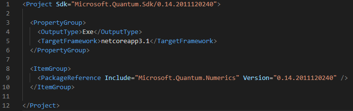

You are probably already familiar with libraries in other programming languages. 
Q# as a language for quantum programming is not different in this case. 
The Quantum Development Kit includes several libraries which allow you to develop high-level quantum applications in Q# without worrying about the details of actual implementation on target machines, e.g. whether it will be run on a trapped ion, superconducting qubit, or a simulated quantum computer. 

## What is a Q# library?

At its core, a Q# library is simply a collection of operations, functions, and user-defined types. 
Since these are always defined within namespaces in Q#, we could consider a library a collection of namespaces. 

When such a library has been made available to a Q# project, its namespaces can then be accessed via standard `open NamespaceName;` statements at the beginning of your Q# file, and thus its operations, functions, and types can be utilized.

Note that namespaces essentially just provide the fully qualified names of the particular callables or types contained in them.
Therefore it's possible for callables/types from distinct libraries or packages (installable units of library code) to ultimately belong to the same namespace.

## How are Q# libraries distributed?

Libraries in Q# are distributed as [NuGet](https://www.nuget.org/) packages. 
NuGet is a package manager used for a variety of different platforms, and is the primary package manager used by most .NET languages.
It enables developers to produce, share, and consume useful code. 
A NuGet *package* is essentially a ZIP file containing compiled code and related files.

The Quantum Development Kit uses NuGet to give Q# projects access to, and thus use the code from, any compatible package.
Naturally only those packages meant for use with Q# can be used, such as those containing Q# libraries, new/custom simulators, or new magic commands for [Q# Jupyter Notebooks](https://docs.microsoft.com/quantum/quickstarts/install-jupyter?tabs=tabid-conda).
Since they are all hosted through NuGet, users can easily use the Q# libraries produced by Microsoft, as well as other third-party Q# libraries that are not released as part of the QDK. 

As you will learn further below, the simple process of adding these libraries to your projects is the same regardless.

## What libraries come with the QDK?

There are four libraries provided by Microsoft as part of the QDK.

Firstly, the *standard library* provides much of Q#'s primary functionality and is the focus of this module. 
Then, there are three libraries focused on more domain-specific functionality: 
- The *quantum chemistry library*, which provides a data model for loading representations of fermionic Hamiltonians (e.g. molecular systems) and casting them to a representation that can be mapped to a quantum computer's physical qubits, as well as operations to reveal system properties and simulate dynamics. 
- The *quantum machine learning library*, which provides an implementation of a hybrid quantum-classical algorithm that makes use of quantum computing to encode and process the data. 
    This library is not meant to be ready for production but as a research environment for those interested in running experiments to explore the use of quantum computing in machine learning.
- The *quantum numerics library*, which provides tools to implement a host of mathematical functions in the native operations of a quantum computer.
    Many quantum algorithms require some level of arithmetic manipulation for the information encoded in the qubit registers, and the operations implemented in this library provide you the necessary arithmetic operations to implement algorithms like Shor's factoring algorithm.


## How can I add a Q# library to my project?

The standard library is included in every Q# project by default, but accessing other libraries--including the domain-specific libraries discussed above--requires adding their respective packages to the project.

Depending on your Q# development setup, the method will vary. 

For Q# applications for the command line interface or with .NET interoperability, each Q# project includes a `.csproj` project file, which, among other things, defines any NuGet packages that have been added to the project.
In this case, adding packages is as simple as running a single command.

For the situations based on IQ#, Q# Jupyter Notebooks or interoperability with Python, project files are not a necessary part of the workflow.
Instead, you can interactively add packages directly in your Notebook workspace or from the Python host file.

Note that IQ# also supports using project files to define packages, so the instructions for Q# applications also apply in that scenario.
Below, we only describe the methods to do so interactively. 


### [Q# applications or .NET interoperability](#tab/tabid-csproj)

**Command prompt or Visual Studio Code:** Using the command prompt on its own or from within Visual Studio Code, you can use the `dotnet` command to add a NuGet package reference to your project.

For example, to add the [**Microsoft.Quantum.Numerics**](https://www.nuget.org/packages/Microsoft.Quantum.Numerics) package, run the following command:

```dotnetcli
dotnet add package Microsoft.Quantum.Numerics
```

Before adding any new packages, your project file will look similar to 


After running the command and adding a package, you will see the corresponding update in the project file:


### [IQ# Notebooks](#tab/tabid-notebook)

You can make additional packages available for use in an IQ# Notebook by using the [`%package` magic command](https://docs.microsoft.com/qsharp/api/iqsharp-magic/package).
For example, to add the [**Microsoft.Quantum.Numerics**](https://www.nuget.org/packages/Microsoft.Quantum.Numerics) package for use in an IQ# Notebook, run the following command in a notebook cell:

```
%package Microsoft.Quantum.Numerics
```

Following this command, the package is available to any cells within the notebook.
To make the package available from Q# code in the current workspace, reload the workspace after adding your package:

```
%workspace reload
```

### [Python interoperability](#tab/tabid-python)


You can make additional packages available for use in a Python host program by using the [`qsharp.packages.add`](https://docs.microsoft.com/python/qsharp-core/qsharp.packages.packages) method.
For example, to add the [**Microsoft.Quantum.Numerics**](https://www.nuget.org/packages/Microsoft.Quantum.Numerics) package for use in an IQ# Notebook, run the following Python code:

```python
import qsharp
qsharp.packages.add("Microsoft.Quantum.Numerics")
```

Following this command, the package will be made available to any Q# code compiled using `qsharp.compile`.
To make the package available from Q# code in the current workspace, reload the workspace after adding your package:

```python
qsharp.reload()
```

***

## What's next?

In the next unit you will learn about the Q# API documentation, specifically how it is structured and how to navigate it.
