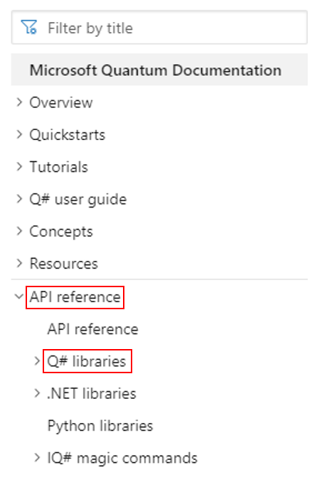
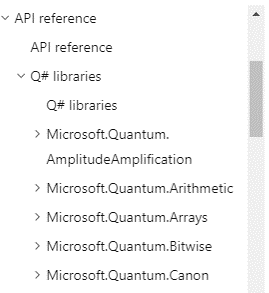
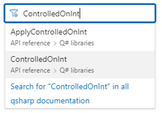

When working with nearly any programming language, one of the most important development tools at your disposal is the API documentation itself.
API documentation is essentially the reference manual for a language, containing the specifics about how all the puzzle pieces fit together; for example, all types or classes as well as functions and any required/optional inputs.

Besides checking QKD libraries, quantum space crew members can contribute to its growth and add their own programs and consideration to the documentation. By doing so, other space crew members can easily solve similar problems, save time and resources for their missions. 

In this unit, you will familiarize yourself with the Q# API documentation: where to find it and how to read it. 

## Where is it?

The official documentation for the Q# libraries can be found from the [Microsoft Quantum Documentation](https://docs.microsoft.com/quantum) homepage, under the **API reference** tab in the table of contents:

### Other API references

Alongside **Q# libraries**, notice there are a few other sets of API documentation. 
We won't focus on them here, but note that they concern various other parts of the QDK:
- *.NET libraries* contains references for the trace simulator target machine and the *.NET* quantum chemistry library (those parts of the quantum chemistry library which are represented outside the Q# program).
- *Python libraries* contains details regarding integration with Python as a host program.
- *IQ# magic commands* contains the magic commands that can be used in Jupyter Notebooks (e.g. `%package` used to add a package to the workspace).

### Q# library API references

In the **Q# libraries** dropdown, you find the documentation for all of the Q# libraries (i.e. the operations, functions, and user-defined types) organized by namespace:

### Looking for something in particular?

Looking for a specific callable or type? 
Use the *Filter by title* box above the table of contents—it includes the API references and can take you straight to the right page.
We'll be using the `ControlledOnInt` function later in the module, so lets take it as our example:

## Where does it come from?

The API documentation is automatically generated from the documentation comments within the Q# source code. 
For the Q# libraries, these API documentation comments are located in the [microsoft/QuantumLibraries](https://github.com/microsoft/QuantumLibraries), [microsoft/qsharp-runtime](https://github.com/microsoft/qsharp-runtime), and [microsoft/quantum-nc](https://github.com/microsoft/quantum-nc) repositories on GitHub.

Later in the module, you'll learn more about how the documentation is written in the source code when you write documentation comments for your own operations.

For now though, we'll take you through an example to show you what you can expect and learn from the documentation of a function. 
Let's keep getting familiar with [`ControlledOnInt`](https://docs.microsoft.com/qsharp/api/qsharp/microsoft.quantum.canon.controlledonint?view=qsharp-preview).

## What does it tell me?

Video explanation talking through the page goes here.

### What's next?

In the next unit, we change gears to actually start using the Q# libraries.
Specifically, you'll make use of the Standard and Numerics libraries to define an oracle and use Grover's algorithm to determine the missing digit of the ISBN of a book you desperately need to save your spaceship.
