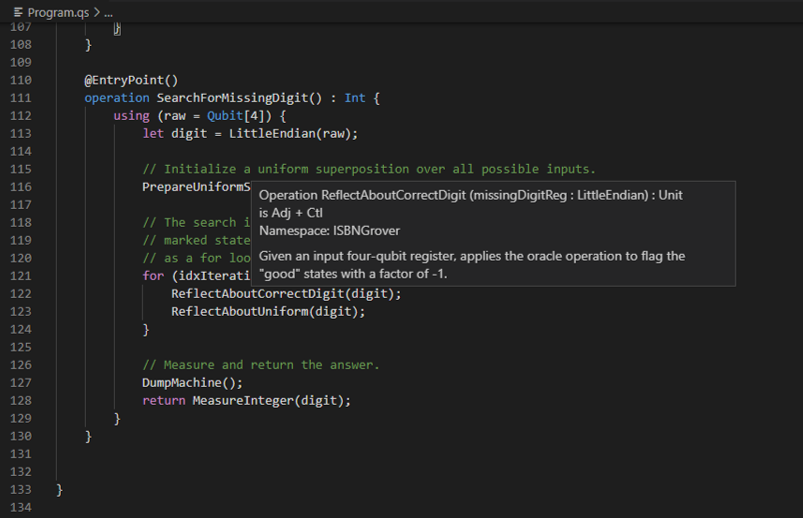

In the previous unit you successfully used your quantum program to find the missing digit of an ISBN, and thus you can access the book you need!

But what if other space explorers find themselves in a similar predicament? 
You can share your code on the Galactic Information Technology Hub, but they would certainly appreciate it being nicely documented. 
In this unit you will learn how to write API documentation comments for your Q# operations, functions, and user-defined types. 

## Documentation comments

As you've already seen, general comments can be written anywhere in Q# source code by using two forward slashes `//`.
The comment then extends from the slashes to the end of the line. 

Documentation comments for a declared callable or type, however, are written differently.
To be recognized as documentation by the compiler, these utilize three slashes (`///`) and are written *before* the declaration.

Within the comments, the text is formatted as [Markdown](https://daringfireball.net/projects/markdown/syntax) and different parts of the documentation are indicated by different specially-named headers---each provided as an "H1" header with a single `#` preceding it.
We provide a full list of the possible headers below, but first let's document the oracle reflection operation as an example:

```qsharp
    /// # Summary
    /// Given an input four-qubit register, applies the oracle operation to flag the 
    /// "good" states with a factor of -1. 
    ///
    /// # Description
    /// Allocates a "flag" qubit and puts it in the state |−⟩ to be used by the oracle in 
    /// flagging the solution states. This is deallocated at the end of the call. 
    ///
    /// # Input
    /// ## missingDigitReg
    /// The input four-qubit register which will be operated on.
    ///
    /// # Remarks
    /// The oracle operation applies the oracle using a four-qubit scratch register.
    operation ReflectAboutCorrectDigit(missingDigitReg : LittleEndian) : Unit is Adj + Ctl {
        using (flagQubit = Qubit()) {
            within {
                // put flagQubit in |−⟩
                X(flagQubit);
                H(flagQubit);
            } apply {
                // uses phase kickback to flag the good solutions with a -1 phase
                ApplyIsbnOracle(missingDigitReg, flagQubit);
            }
        }
    }
```

## Using help

Besides others, documenting your code can always help you too. 
The QDK makes this even easier by enabling help functions in various editors. 

For example, if you are using VS Code, IntelliSense enables autocomplete functionality and you can see the overview of your callable by simply hovering the mouse over it:



If using Q# with Jupyter Notebooks, for example, this works with the `?` magic functions. 
That is, running a cell with `<OperationName>?` returns the API reference and other related information.

## Additional documentation headers

The following names are recognized as documentation comment headers.

- **Summary**: A short summary of the behavior of a function or operation,
  or of the purpose of a type. The first paragraph of the summary is used
  for hover information. It should be plain text.
- **Description**: A description of the behavior of a function or operation,
  or of the purpose of a type. The summary and description are concatenated to
  form the generated documentation file for the function, operation, or type.
  The description may contain in-line LaTeX-formatted symbols and equations.
- **Input**: A description of the input tuple for an operation or function.
  May contain additional Markdown subsections indicating each individual
  element of the input tuple.
- **Output**: A description of the tuple returned by an operation or function.
- **Type Parameters**: An empty section which contains one additional
  subsection for each generic type parameter.
- **Named Items**: A description of the named items in a user defined type.
  May contain additional Markdown subsections with the description for each 
  individual named item.
- **Example**: A short example of the operation, function or type in use.
- **Remarks**: Miscellaneous prose describing some aspect of the operation,
  function, or type.
- **See Also**: A list of fully qualified names indicating related functions,
  operations, or user-defined types.
- **References**: A list of references and citations for the item being
  documented.

## Learn more

This is precisely the documentation format used in the Q# source code to generate the official API documentation you explored earlier in the module.
You can find more details and examples on the official [Q# documentation page](https://docs.microsoft.com/en-us/quantum/user-guide/language/programstructure/comments?view=qsharp-preview), including the ability to cross-reference other callables and write examples. 
