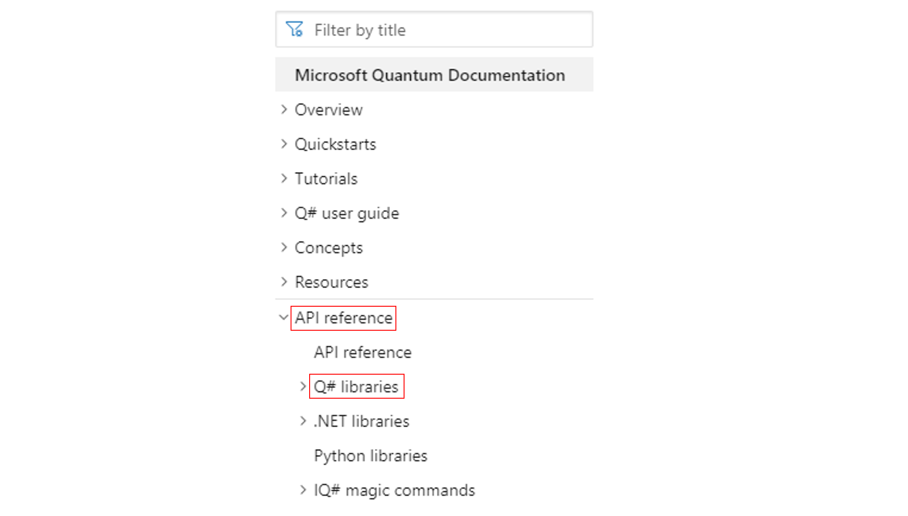
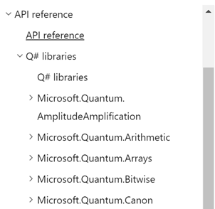

When working with nearly any programming language, one of the most important development tools at your disposal is the API documentation.
API documentation is essentially the reference manual for the libraries of a language, containing the specifics about how all the puzzle pieces fit together; for example, all types and functions along with any required/optional inputs.
Such documentation often includes both nitty-gritty details as well as bigger-picture context—e.g. the accepted input types to a function along with a conceptual description of what the function actually does.

By taking advantage of this documentation for the Q# libraries, quantum space crew members can explore the vast capabilities of the QDK and develop the skills to tackle complex problems independently. 

In this unit, you will familiarize yourself with the Q# API documentation: where to find it and how to read it. 

## Where is it?

The official documentation for the Q# libraries provided with the Quantum Development Kit can be found from the [Microsoft Quantum Documentation](https://docs.microsoft.com/quantum?azure-portal=true) homepage, under the **API reference** tab in the table of contents:

### Other API references

Alongside **Q# libraries**, there are a few other sets of API documentation. 
We won't focus on them here, but note that they concern various other parts of the QDK:
- *.NET libraries* contains references for the trace simulator target machine and the *.NET* quantum chemistry library (those parts of the quantum chemistry library which are represented outside the Q# program).
- *Python libraries* contains details regarding integration with Python as a host program.
- *IQ# magic commands* contains the magic commands that can be used in Jupyter Notebooks (e.g. the [`%package` command](https://docs.microsoft.com/qsharp/api/iqsharp-magic/package?azure-portal=true) used to add a package to the workspace).

### Q# library API references

In the **Q# libraries** dropdown, you find the documentation for all of the Q# libraries (i.e., the operations, functions, and user-defined types) organized by namespace:

### Looking for something in particular?

Looking for a specific operation, function, or type? 
Use the *Filter by title* box above the table of contents—it includes the API references and can take you straight to the right page.
Suppose we wanted to find the `ControlledOnInt` function:

## Where does it come from?

The API documentation is automatically generated from the documentation comments within the Q# source code. 

Later in the module, you'll learn more about how the documentation is embedded in the source code when you write documentation comments for your own operations.

For now though, we'll take you through an example to show you what you can expect and learn from the documentation. 
Since it will be the centerpiece of our oracle in the next unit, let's check out the [`MultiplyAndAddByModularInteger` operation](https://docs.microsoft.com/qsharp/api/qsharp/microsoft.quantum.arithmetic.multiplyandaddbymodularinteger?azure-portal=true). 
Although this is an operation, note that the pages for functions and types are laid out in the same fashion.

## What does it tell me?

Video explanation talking through the page goes here.

### What's next?

In the next unit, we change gears to actually start using the Q# libraries.
You'll use the Standard library to define an oracle and use Grover's algorithm to determine the missing digit of the ISBN of a book you desperately need to save your spaceship.
