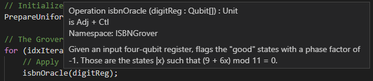

In the previous unit you successfully used your quantum program to find the missing digit of an ISBN, and thus you can access the book you need!

But what if other space explorers find themselves in a similar predicament? 
You can share your code on the Galactic Information Technology Hub, but they would certainly appreciate it being nicely documented. 

The ability to write documentation allows quantum space crew members to contribute to the growth of the QDK and the Q# libraries with their own programs and insights. 
By doing so, other space crew members can more easily solve similar problems, saving both time and resources for future missions. 

In this unit you will learn how to write API documentation comments for your Q# operations, functions, and user-defined types. 

## Documentation comments

As you've already seen, general comments can be written anywhere in Q# source code by using two forward slashes `//`.
The comment then extends from the slashes to the end of the line. 

Documentation comments for a declared callable or type, however, are written differently.
To be recognized as documentation by the compiler, these utilize three slashes (`///`) and are written *before* the declaration.

Within the comments, the text is formatted as [Markdown](https://daringfireball.net/projects/markdown/syntax) and different parts of the documentation are indicated by different specially-named headers---each provided as an "H1" header with a single `#` preceding it.
We provide a full list of the possible headers below, but first let's document the oracle operation as an example:

:::code language="qsharp" source="code/6-program-1.qs":::

## Using help

Besides others, documenting your code can always help you too. 
The QDK makes this even easier by enabling help functions in various editors. 

For example, if you are using VS Code, IntelliSense enables autocomplete functionality and you can see the overview of your callable by simply hovering the mouse over it:

## Learn more

This is precisely the documentation format used in the Q# source code to generate the official API documentation you explored earlier in the module.
You can find a full list of the recognized documentation headers on the official [Q# documentation page](https://docs.microsoft.com/quantum/user-guide/language/programstructure/comments).
There, you will also see more details and examples, including the ability to cross-reference other callables and add code examples to documentation. 
