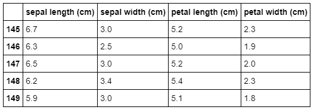

After you load your data into pandas, the data most likely will be in a DataFrame. However, if the data set in your DataFrame has 60,000 rows and 400 columns, how do you even begin to get a sense of what you're working with? Fortunately, pandas provides some convenient tools to quickly look at overall information about a DataFrame and the first few and last few rows.

To explore DataFrames in pandas, we will import the Python scikit-learn library and use an iconic dataset that every data scientist has seen hundreds of times: British biologist Ronald Fisher's Iris dataset that Fisher used in his 1936 paper *The use of multiple measurements in taxonomic problems*.

First, import pandas and import the Python scikit-learn dataset:

```python
import pandas as pd
from sklearn.datasets import load_iris
 
iris = load_iris()
iris_df = pd.DataFrame(data=iris['data'], columns=iris['feature_names'])
```

## `DataFrame.info`

Let's take a look at this dataset to see what we have:

```python
iris_df.info()
```
```output
<class 'pandas.core.frame.DataFrame'>
RangeIndex: 150 entries, 0 to 149
Data columns (total 4 columns):
sepal length (cm)    150 non-null float64
sepal width (cm)     150 non-null float64
petal length (cm)    150 non-null float64
petal width (cm)     150 non-null float64
dtypes: float64(4)
memory usage: 4.8 KB
```

From the output, we know that the Iris dataset has 150 entries in four columns. All of the data is stored as 64-bit floating-point numbers.

## `DataFrame.head`

Next, let's see what the first few rows of our DataFrame look like:

```python
iris_df.head()
```

Here's the output:


### Exercise

By default, `DataFrame.head` returns the first five rows of a DataFrame. In the code cell below, can you figure out how to get it to show more?

> [!TIP]
> Consult the documentation by using `iris_df.head`.

## `DataFrame.tail`

The flip side of `DataFrame.head` is `DataFrame.tail`, which returns the last five rows of a DataFrame:

```python
iris_df.tail()
```

Here's the output:



In practice, it's useful to be able to easily examine the first few rows or the last few rows of a DataFrame, particularly when you are looking for outliers in ordered datasets.

> [!div class="alert is-tip"]
> ### Takeaway
>
> Even just by looking at the metadata about the information in a DataFrame or the first and last few values in one, you can get an immediate idea about the size, shape, and content of the data you are dealing with.