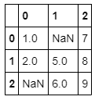

Most of the time the datasets you want to use (of have to use) have missing values in them. How missing data is handled carries with it subtle trade-offs that can affect your final analysis and real-world outcomes.

Pandas handles missing values in two ways. The first you've seen before in previous sections: **NaN**, or Not a Number. This is actually a special value that is part of the IEEE floating-point specification. **NaN** is used only to indicate missing floating-point values.

For missing values apart from floats, pandas uses the Python **None** object. While it might seem confusing that you will encounter two different kinds of values that say essentially the same thing, there are sound programmatic reasons for this design choice and, in practice, going this route enables pandas to deliver a good compromise for the vast majority of cases. Notwithstanding this, both **None** and **NaN** carry restrictions that you need to be mindful of with regards to how they can be used.


## None: Non-float missing data

Because **None** comes from Python, it can't be used in NumPy and pandas arrays that are not of data type `object`. Remember, NumPy arrays (and the data structures in pandas) can contain only one type of data. This is what gives them their tremendous power for large-scale data and computational work, but it also limits their flexibility. Such arrays have to upcast to the “lowest common denominator,” the data type that will encompass everything in the array. When **None** is in the array, it means you are working with Python objects.

To see this in action, consider the following example array (note the `dtype` for it):

```python
import numpy as np

example1 = np.array([2, None, 6, 8])
example1
```

Here's the output:

```output
array([2, None, 6, 8], dtype=object)
```

The reality of upcast data types carries two side effects with it. First, operations will be carried out at the level of interpreted Python code rather than compiled NumPy code. Essentially, this means that any operations involving Series or DataFrames with **None** in them will be slower. Although you probably wouldn't notice this performance hit, for large datasets, it might become an issue.

The second side effect stems from the first. Because **None** essentially drags Series or DataFrames back into the world of vanilla Python, using NumPy/pandas aggregations like `sum()` or `min()` on arrays that contain a **None** value will generally produce an error:

```python
example1.sum()
```

This is returned:

```output
---------------------------------------------------------------------------
TypeError                                 Traceback (most recent call last)
<ipython-input-108-ce9901ad18bd> in <module>
----> 1 example1.sum()

/opt/anaconda3/lib/python3.7/site-packages/numpy/core/_methods.py in _sum(a, axis, dtype, out, keepdims, initial)
     34 def _sum(a, axis=None, dtype=None, out=None, keepdims=False,
     35          initial=_NoValue):
---> 36     return umr_sum(a, axis, dtype, out, keepdims, initial)
     37 
     38 def _prod(a, axis=None, dtype=None, out=None, keepdims=False,

TypeError: unsupported operand type(s) for +: 'int' and 'NoneType'
```

> [!div class="alert is-tip"]
> ### Key takeaway
>
> Addition (and other operations) between integers and **None** values is undefined, which can limit what you can do with datasets that contain them.

## NaN: Missing float values

In contrast to **None**, NumPy (and therefore pandas) supports **NaN** for its fast, vectorized operations and ufuncs. The bad news is that any arithmetic performed on **NaN** always results in **NaN**. For example:

```python
np.nan + 1
```

Here's the output:

```output
nan
```

> [!NOTE]
> 
> **SARAH** - It would be best to have some intro/explanatory text before each command. That is, no "stacked" commands, either input or output (because they look the same in the module).

```python
np.nan * 0
```

Here's the output:

```output
nan
```

The good news: aggregations run on arrays with **NaN** in them don't pop errors. The bad news: the results are not uniformly useful:

```python
example2 = np.array([2, np.nan, 6, 8]) 
example2.sum(), example2.min(), example2.max()
```

Here's the output:

```output
(nan, nan, nan)
```

### Exercise

What happens if you add np.nan and **None** together?

Remember: **NaN** is just for missing floating-point values; there is no **NaN** equivalent for integers, strings, or Booleans.

## NaN and None: Null values in pandas

Even though **NaN** and **None** can behave somewhat differently, pandas is nevertheless built to handle them interchangeably. To see what we mean, consider a Series of integers:

```python
int_series = pd.Series([1, 2, 3], dtype=int)
int_series
```

Here's the output:

```output
0    1
1    2
2    3
dtype: int64
```

### Exercise

Now set an element of int_series equal to **None**.

How does that element show up in the Series?

What is the `dtype` of the series?

In the process of upcasting data types to establish data homogeneity in series and DataFrames, pandas will willingly switch missing values between **None** and **NaN**. Because of this design feature, it can be helpful to think of **None** and **NaN** as two different flavors of "null" in pandas. Indeed, some of the core methods you will use to deal with missing values in pandas reflect this idea in their names:

* `isnull()`: Generates a Boolean mask indicating missing values
* `notnull()`: Opposite of `isnull()`
* `dropna()`: Returns a filtered version of the data
* `fillna()`: Returns a copy of the data with missing values filled or imputed

These are important methods to master and get comfortable with, so let's go over them each in some depth.

## Detect null values

Both `isnull()` and notnull() are your primary methods for detecting null data. Both return Boolean masks over your data.

```python
example3 = pd.Series([0, np.nan, '', None])
```

```python
example3.isnull()
```

Here's the output:

```output
0    False
1     True
2    False
3     True
dtype: bool
```

Look closely at the output. Does any of it surprise you? While 0 is an arithmetic null, it's nevertheless a perfectly good integer and pandas treats it as such. '' is a little more subtle. While we used it in Section 1 to represent an empty string value, it is nevertheless a string object and not a representation of null as far as pandas is concerned.

Now, let's turn this around and use these methods in a manner more like you will use them in practice. You can use Boolean masks directly as a Series or DataFrame index, which can be useful when trying to work with isolated missing (or present) values.

### Exercise

Try running example3[example3.notnull()].

Before you do so, what do you expect to see?

> [!div class="alert is-tip"]
> ### Key takeaway
>
> Both the `isnull()` and `notnull()` methods produce similar results when you use them in DataFrames: they show the results and the index of those results, which will help you enormously as you wrestle with your data.

## Drop null values

Beyond identifying missing values, pandas provides a convenient means to remove null values from `Series` and `DataFrames`. (Particularly on large data sets, it is often more advisable to simply remove missing [NA] values from your analysis than deal with them in other ways.) To see this in action, let's return to example3:

```python
example3 = example3.dropna()
example3
```

Here's the output:

```output
0    0
2     
dtype: object
```

Note that this should look like your output from `example3[example3.notnull()]`. The difference here is that, rather than just indexing on the masked values, dropna has removed those missing values from the series `example3`.

Because DataFrames have two dimensions, they afford more options for dropping data.

```python
example4 = pd.DataFrame([[1,      np.nan, 7], 
                         [2,      5,      8], 
                         [np.nan, 6,      9]])
example4
```

Here's the output:



Did you notice that pandas upcast two of the columns to floats to accommodate the **NaN**s?

You cannot drop a single value from a DataFrame, so you have to drop full rows or columns. Depending on what you are doing, you might want to do one or the other, and so pandas gives you options for both. Because in data science, columns generally represent variables and rows represent observations, you are more likely to drop rows of data; the default setting for `dropna()` is to drop all rows that contain any null values:

```python
example4.dropna()
```

The output looks like this:

> [!NOTE]
> 
> **SARAH** - *Insert image*: Add screenshot of the output table.
>

If necessary, you can drop NA values from columns. Use axis=1 to do so:

```python
example4.dropna(axis='columns')
```

The output looks like this:

> [!NOTE]
> 
> **SARAH** - *Insert image*: Add screenshot of the output table.
>

Notice that this can drop a lot of data that you might want to keep, particularly in smaller datasets. What if you just want to drop rows or columns that contain several or even just all null values? You specify those setting in `dropna` with the `how` and `thresh` parameters.

By default, how='any' (if you would like to check for yourself or see what other parameters the method has, run example4.dropna? in a code cell). You could alternatively specify `how=all` so as to drop only rows or columns that contain all null values. Let's expand our example DataFrame to see this in action.

```python
example4[3] = np.nan
example4
```

The output looks like this:

> [!NOTE]
> 
> **SARAH** - *Insert image*: Add screenshot of the output table.
>

### Exercise

How might you go about dropping just column 3?

<div class="test-collapsible-container">
<h2 class="test-collapsible-controller">How might you go about dropping just column 3?</h2>
<div class="test-collapsible-target">
<p>remember that you will need to supply both the axis parameter and the `how` parameter.</p>
</div>


The `thresh` parameter gives you finer-grained control: you set the number of non-null values that a row or column needs to have in order to be kept:

```python
example4.dropna(axis='rows', thresh=3)
```

The output looks like this:

> [!NOTE]
> 
> **SARAH** - *Insert image*: Add screenshot of the output table.
>

Here, the first and last row were dropped because they contain only two non-null values.

## Fill null values

Depending on your dataset, it can sometimes make more sense to fill null values with valid ones rather than drop them. You could use `isnull` to do this in place, but that can be laborious, particularly if you have a lot of values to fill. Because this is such a common task in data science, pandas provides fillna, which returns a copy of the Series or DataFrame with the missing values replaced with one that you choose. Let's create another example Series to see how this works in practice.

```python
example5 = pd.Series([1, np.nan, 2, None, 3], index=list('abcde'))
example5
```

The output looks like this:

```output
a    1.0
b    NaN
c    2.0
d    NaN
e    3.0
dtype: float64
```

You can fill all of the null entries with a single value, such as 0:

```python
example5.fillna(0)
```

The output looks like this:

```output
a    1.0
b    0.0
c    2.0
d    0.0
e    3.0
dtype: float64
```

### Exercise

What happens if you try to fill null values with a string, like ''?

You can forward-fill null values, which is to use the last valid value to fill a null:

```python
example5.fillna(method='ffill')
```

The output looks like this:

```output
a    1.0
b    1.0
c    2.0
d    2.0
e    3.0
dtype: float64
````

You can also back-fill to propagate the next valid value backward to fill a null:

```python
example5.fillna(method='bfill')
```

The output looks like this:

```output
a    1.0
b    2.0
c    2.0
d    3.0
e    3.0
dtype: float64
````

As you might guess, this works the same with DataFrames, but you can also specify an axis along which to fill null values:

```python
example4
```

The output looks like this:

> [!NOTE]
> 
> **SARAH** - *Insert image*: Add screenshot of the output table.
>

```python
example4.fillna(method='ffill', axis=1)
```

The output looks like this:

> [!NOTE]
> 
> **SARAH** - *Insert image*: Add screenshot of the output table.
>

Notice that when a previous value is not available for forward-filling, the null value remains.

### Exercise

What output does example4.fillna(method='bfill', axis=1) produce?

What about example4.fillna(method='ffill') or example4.fillna(method='bfill')?

Can you think of a longer code snippet to write that can fill all of the null values in example4?

You can be creative about how you use fillna. For example, let's look at example4 again, but this time, we'll fill the missing values with the average of all of the values in the DataFrame:

```python
example4.fillna(example4.mean())
```

The output looks like this:

> [!NOTE]
> 
> **SARAH** - *Insert image*: Add screenshot of the output table.
>

Notice that column 3 is still valueless: the default direction is to fill values row-wise.

> [!div class="alert is-tip"]
> ### Takeaway
>
> There are multiple ways to deal with missing values in your datasets. The specific strategy you use (removing them, replacing them, or even how you replace them) should be dictated by the particulars of that data. You will develop a better sense of how to deal with missing values the more you handle and interact with datasets.

