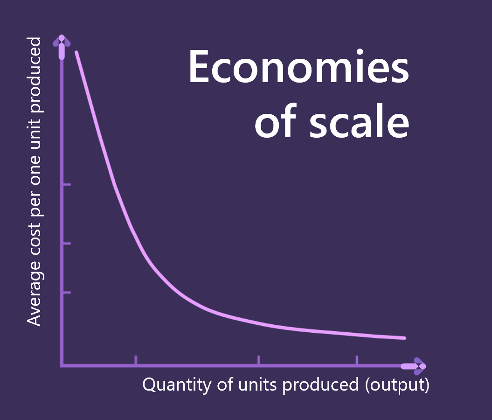
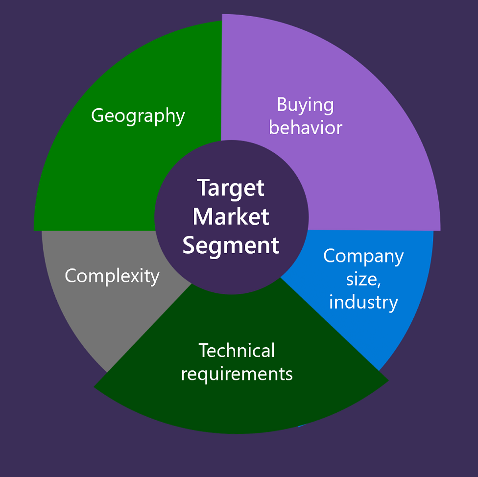

One of the most popular forms of cloud computing is Software as a Service, or SaaS, and is often used daily by consumers and for business.

SaaS provides a complete software solution that you purchase on a pay-as-you-go basis from a service provider. You rent the use of an app for your organization, and your users connect to it over the Internet, usually with a web browser or mobile app. All the underlying infrastructure, middleware, app software, and app data are in the service provider’s datacenter. The service provider manages the hardware and software, and with the appropriate service agreement, will ensure the availability and the security of the app and your data as well. SaaS allows your organization to get quickly up and running with an app at minimal upfront cost.

The idea of success behind SaaS model is not new, and the term which you might hear often, is Economies of scale. In production it is also called subtractive manufacturing – the more you produce, the higher margins it's possible to achieve.

 

It works with software too – but only in case you are NOT producing customizable software for each customer and reusing infrastructure. However, there are cases with dedicated or isolated tiers of service in SaaS with their own infrastructure.

For example, Microsoft has a special offer called Azure Government, which can only be sold to the government, since they have high security standards and requirements, and because of that the infrastructure is fully isolated from the Azure Public Cloud.  

## SaaS business models

On a high level, we can distinguish 2 different business models for SaaS companies:
* B2B (Business – to Business) company that provides software and services to other businesses.
* B2C (Business-to-Consumer) company that sells software and operates this software directly to individual consumers.

The biggest difference is the audience of your products. And even though you might have a product which suits both business and individual consumers, it has a direct impact on your company and implemented solution.

Some other differences (but not limited to) between B2B and B2C include:
* Pricing models
* Sales process
* Customer service or account management

Both B2B and B2C models can provide your company with sales and revenue, but you should create a strategy which suits your company the best.
And it's possible to serve both B2B and B2C customers, as we can see with example of Microsoft itself, there are different models of purchasing Azure subscriptions, tailored for enterprise-size customers (Enterprise Agreements), as well as individual consumers (Pay-As-You-Go). However, when starting with new solution, it's a good idea to focus only on one customer segment to begin with.

When working on defining business model for SaaS solution, you need to identify the market you are targeting, which will help you gather more insights about your customers and their problems, so that you can define more clear requirements for your tech team about what solution they have to build.  

## Contoso scenario

Let's have a look at example and consider a fictitious Contoso company. 

UK based company Contoso has idea to develop *subscription-based service to generate and improve website designs*. Contoso created AI model which can generate UI for website, and track the performance of design over time and suggest improvements.

While the technical capability of this service won't be much different for private users or large corporates, from business perspective it makes sense to focus on only one segment at a time, and not try to capture both markets of individual consumers as well businesses, because marketing and business development efforts will be different for these segments, as well as might bring different technical requirements for the solution itself. 

Due to several reasons Contoso decided to focus initially on B2B model, in particular small companies, who can't afford to have their own in-house designers, and they have found out through market and user research that it is mostly lawyers, who are willing to pay for service like this, where it's important to have attractive design, which also is not too complex in order for AI to be able to provide high quality service.

This way, the identified market segment could look something like this:

#### Buying behaviors

- Customers search for service online and purchase online

- Requires free trial in order for user to try out the design and decide if it's suitable

#### Company size, industry

- Small size companies

- Legal industry

#### Technical requirements

For the sake of example, requirements are simplified, but here are some examples to give you an idea:

- Need to be able to collect the usage of the website, which will allow to analyze this data to improve the design of the website 

- Due to collection of the sensitive data, Contoso will have to comply with several regulations, such as UK GDPR
- Provide capability for customers to book appointment with lawyer 

#### Complexity

- AI model was trained on the set of simple landing pages and will be able to handle well designs for websites which are not too complex and mostly are informational and used for booking time slots.
- Complexity of customers business should be low.

#### Geography 

- Initially Contoso is focusing on UK region due to its origins, preferred language and financial capability of companies providing legal services within UK region. In the future, after Contoso establishes stable business within UK region, they'll start going into other markets. 

  Each geographical region will bring additional challenges, in term of technical delivery of the service, as well as over all Go-To-Market strategies and activities. If Contoso decides, that next market is Europe, they'll have to create a strategy of how to market the product in countries/regions, where English is not default language and take into account specifics of local legal industry.  

Now, with clear understanding of who Contoso is focusing on as customers and what are the requirements for the service, you should understand why SaaS is preferred model and why Contoso shouldn't just sell AI generated designs to customers. 
