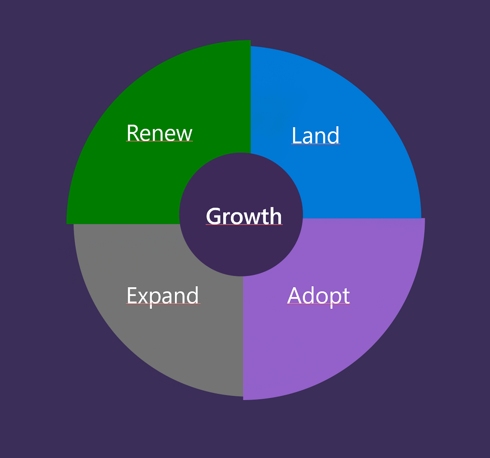
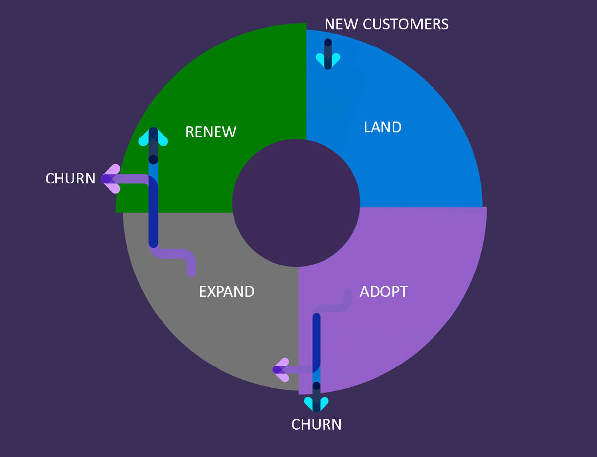
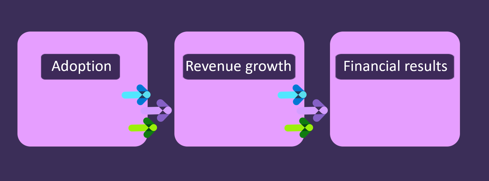
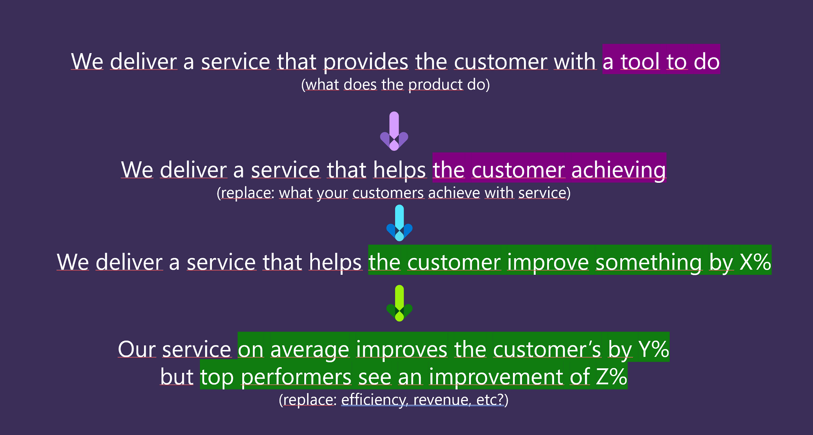

In this unit we'll address the difference between transactional (license-based) model and SaaS, in particular:
* Software vs Service
* Consumption model
* The importance of adoption

## Software vs service
Now you're selling software as a SERVICE. Not just software, but also the value of how effectively your organization can deliver this service without friction.
You must shift the mindset from:

*"What we deliver" to "How can we better align our solution to the customer's problem and ROI?"*

Move away from long lists of product features and descriptions of what the product can do. Instead, focus on challenges and how your solutions can address those problems.

Essentially, everything changes in the way that your company operates. SaaS companies follow a product-centric design, where the focus is on the value customers can get from using their service. Thus, not only the billing is different, but also branding, marketing messages and sales processes are changing. 
In SaaS model, software providers must ensure the maintenance, updates and support, as well as  security of the solution, while in the traditional model this responsibility is on customers. 
In the next units, you'll learn about this in more details.

## Consumption model

To start with, we need to understand how the consumption model differs from the transaction based model.
The LAER Model was introduced in the book called "Technology-as-a-Service Playbook" and it consists of 4 phases:

* Land: the phase, which is familiar to those who used to sell traditional licenced-based software - the first phase of landing the customer with your solution. 
* Adoption: next, you need to ensure that the customer was able to successfully use it, or adopt it and gain value, after which you'll be able to expand with other offerings.
* Expand: the process of up-selling extra functionality or upgrading the purchased plan.
* Renewal: and finally, the renewal phase, where customers decide to continue with your software.

And this is a significant difference compared to transactional model, where it didn't really matter what happened after the software was sold. 

In a SaaS model, the sales costs often are higher than the revenue from the first billing period, and if customers don’t recognize the value, they won't use the service.

## Importance of adoption

Low adoption rates lead to high customer churn rates, thus investments in sales and marketing don't pay off if customers are not able to realize the value of the service. 

* Adoption reduces churn

* Churn impacts revenue growth

* No chance for expansion if the product isn't adopted

  

As we can see, in order for this cycle to function we need to make sure that the level of churn is low, and level of adoption is high. This way improving adoption will improve revenue growth. And Predictable revenue growth will improve company financial results and evaluation.

As you can see, adoption plays a VERY important part in SaaS.

In SaaS companies often there's Customer Success department established. The purpose of it is to ensure that customers are realizing the value of the service and discover new features which can help solve their problems. Success organization should take charge and help customers understand and find the VALUE of the service you're providing. 

Understanding customer success becomes crucial to the value generation of the company. Being able to define customer success is a prerequisite for proper execution of all other activities.

What has happened is that the definition of customer success has gone from the company delivering a tool (which really isn't success) to an improvement of something by X% by the use of the service.

Based on these definitions above you can set possible targets for Customer Success organization. The main objective of this organization should be making sure that customers are adopting the service and gather value from using it. 

In a larger organization these measure also become the basis for breaking down department and individual goals.

## Contoso scenario

Let's get back to Contoso and try to shift their mindset from the tool towards the value their service provides to customers:

- Contoso delivers the service, which provides a tool for lawyers to generate and track website design performance => 

- Contoso delivers a service that helps lawyers create user-friendly and attractive designs and provide improvements based on customer interaction, which allows them to attract more customers and save time (money) by focusing more on what they know best - laws =>

- Contoso customers increase their customer base by 5% by improving their website design => 

- Contoso customers on average increase customer base by 5% when improving website design, while Contoso's top customers increased their customer base by 15% 

