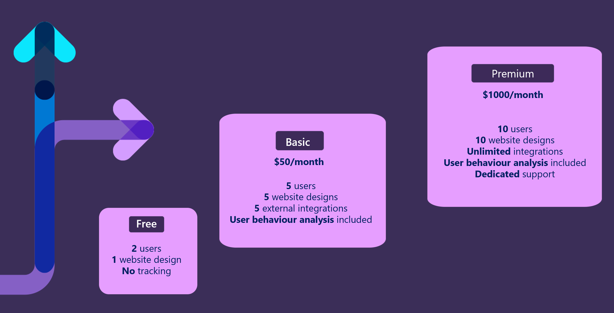

## Balance pricing with costs

When you determine the pricing model for your product, you need to balance the return on value (ROV) for your customers with the cost of goods sold (COGS) to deliver the service. Offering more flexible commercial models (for a solution) might increase the ROV for customers, but it might also increase the architectural and commercial complexity of the solution (and therefore also increase your COGS).

In this module, we'll focus on common pricing models.

### Consumption-based
This model is often called as well "pay-as-you-go", as the use of your service increases, your revenue increases proportionally.

From your customers' perspective, there is minimal upfront investment that's required to use your solution, so this model has a low barrier to entry. From your perspective as the service operator, your hosting and management costs increase as your customers' usage and your revenue increases. This increase can make it a highly scalable pricing model. Consumption pricing models work especially well when the Azure services which are used in the solution are consumption-based too.

### Seat-based
Per-user pricing models are very common, due to their simplicity to implement in a multitenant solution. Multitenant solution is a solution, which is shared across all the customers and users, in opposite to single-tenant, where each customer gets their own installation of the solution. However, they're associated with several commercial risks, for example different user consumption patterns might result in a reduced profitability. For example, heavy users of the solution might cost more to serve, than light users. 

In addition, there's a limitation of how much you can earn on each customer, because if customer has only 100 employees, the maximum potential deal for this customer is capped by 100 seats. Better business approach could be to focus on the value your service provides to customers and tie up pricing according to this value. In this case, the more customers use the product and the more value they gain, the more revenue they bring.

When you bill your customers for each user, it's easy to calculate and forecast your revenue stream. Additionally, assuming that you have fairly consistent usage patterns for each user, then revenue increases at the same rate as service adoption, making this scalable model.

### Unit-based
In many systems, the number of users isn't the element that has the greatest effect on the overall COGS. For example, in device-oriented solutions, also referred to as the internet of things or IoT, the number of devices often has the greatest impact on COGS. In these systems, a per-unit pricing model can be used, where you define what a unit is, such as a device

## Packaging 
One of the optimal pricing strategies which works well in B2C or B2B for small businesses is packaging. With packaging, SaaS providers can create the optimal packages with a certain set of features and pricing for the overall package. Package is a set of features which are bundled together.

For example, let's consider simple example and the pricing for SaaS service where users can digitally sign contracts, as well as search through contents of contracts. 

- Free version includes 5 seats (users) and 10 searches per month.
- Basic version includes 10 seats (users), 100 searches per month and 10 integrations. The price of this package is 10$ per month.
- Premium version includes 100 seats (users), unlimited searches per month, unlimited integrations and premium (dedicated) support services for 100$ / month. 

## Contoso scenario

Let's consider how Contoso could define pricing model for their lawyer solution. 

Contoso created 3 packages, starting from the very basic "Free" plan where only 1 website is allowed and no user behavioral analysis is included. 

In the "Basic" plan additional functionality is included, such as: 

- Up to 5 designs per website (customers often want to compare different designs and how they perform, or have additional designs for special occasions and promotions)
- Up to 5 external integrations 
- Ability to track and analyze users' behavior on the website and get auto-suggestions for improvement

"Premium" plan has more extensive capabilities on top of the Basic plan, such as dedicated support service. 

As you can see, Contoso tried to align their pricing to the most valuable features their customers are using within Contoso solution.

