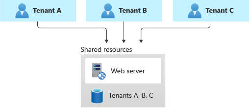
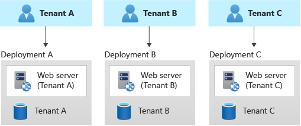
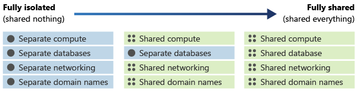

Selecting a tenancy model isn't just a technical decision, it has direct implication on your business model and financial results, because it directly affects costs of entire solution and underlying infrastructure, and the way you're delivering software for your customers. 

Let's start with a definition of multitenant and single-tenant solution. It helps you understand pros and cons of each model and make the right choice for your solution.

## Multitenant vs Single-tenant
A multitenant solution is one used by multiple customers, or tenants. Tenants are distinct from users. Multiple users from a single organization, company, or group from a single tenant. Example of multitenant SaaS solution can be Office 365 or Microsoft Teams, and Azure is itself a multitenant service.

In contrast, single-tenant solutions deployed per each tenant - for example, each customer gets their own deployment of solution, which you, as software provider, will have to maintain.

When choosing between multitenant or single-tenant solution in Azure (or in general), there are several elements you need to consider that factor into your architecture.

You have to work closely with your customers or colleagues responsible for business part and collect the following information, which will help you define technical requirements for the solution:
- How do you define what a tenant is? 
  - Does a tenant correspond to a customer, a user, or a group of users (like a team)?
- How do you plan to grow your business or solution, and will it scale to the number of tenants you expect?
  - If it scales per tenant, how does this affect the costs of the solution? How does this affect "Time to Value" for customers, meaning that if the new customer can't be onboarded quickly, what are the business implications of this?
- How would preferred tenancy model impact your compliance requirements, or your customer's compliance requirements?
- Do your customers prefer to use their own identity and authenticate using SSO, or they prefer you to implement a custom identity in your solution? 
  - With B2C business model, need to research the need to authenticate with popular identity providers, including Microsoft, Facebook and Google. 

- Do any of your tenants have unusual or special requirements? 
  - For example, in case you're building B2B solution, does your biggest customer need higher performance or stronger guarantees than others?
- How large is your operations team, and how much of your infrastructure management are you able to automate?

One of the biggest considerations in the design of a multitenant architecture is the level of isolation that each tenant needs. Isolation can mean different things, such as separate instances of your application and separate databases for each tenant, or having separate infrastructures for each customer. 

Rather than thinking of isolation as a discrete property, you should think about it as being on a continuum. You can deploy components of your architecture that are more or less isolated than other components in the same architecture, depending on your requirements. The following diagram demonstrates a continuum of isolation: 

Different degree of isolation makes it possible to have a mixed architecture - for example, compute resources can be shared between all tenants, but data store and database can be deployed individually for every tenant in order to achieve strong isolation.

In complex scenarios, especially in B2B solutions, it's also an option to deploy the biggest customers separately as single-tenant deployments, and create a multitenant deployment for the rest of the customers. Using this hybrid model it's possible to solve the "noisy neighbor" problem, where one customer(tenant) is consuming majority of the infrastructure resources which creates troubles for the rest of the tenants. It also solves the problem of strong isolation, which often large customers (businesses) might have due to compliance and regulations.

- Benefits: Because you're still sharing infrastructure, you can gain some of the cost benefits of using shared multitenant deployments. You can deploy cheaper shared resources for certain customers, like customers who are evaluating your service with a trial. You can even bill customers a higher rate to use a single-tenant deployment, thereby recouping some of your costs.

- Risks: Your codebase will probably need to be designed to support both multitenant and single-tenant deployments. If you plan to allow migration between infrastructures, you need to consider how to migrate customers from a multitenant deployment to their own single-tenant deployment. You also need to know which of your tenants are on each deployment, so that you can communicate information about system issues or upgrades to the relevant customers.

More detailed guidance can be found at the official Microsoft documentation: [https://learn.microsoft.com/azure/architecture/guide/multitenant/considerations/tenancy-models](https://learn.microsoft.com/azure/architecture/guide/multitenant/considerations/tenancy-models) 

Next, you're going to have a closer look into different aspects of multitenant architecture.