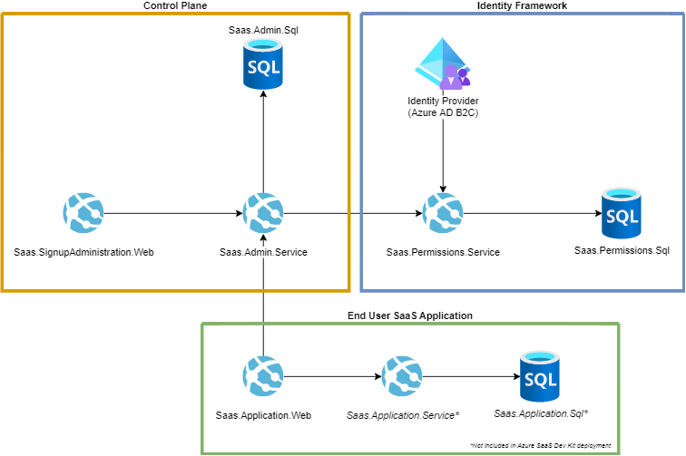

Now, let's focus on multitenant architecture and its different aspects such as:
* Data isolation
* Control plane
* How to avoid "noisy neighbor" problem

## Data isolation
Hopefully by now you have gathered the requirements for your solution, and in particular you know by now compliance requirements, which will have a large impact on the data isolation strategy. There are several other factors to consider when making decisions on levels of isolation for data:

* Security: Ensuring that the data of one tenant is isolated and segregated from the data of other tenants is crucial. This involves implementing robust access controls, encryption, and ensuring that there are no unintended data leaks or cross-tenant data access.
* Costs: the higher the density of tenants to your deployment infrastructure, the lower the cost to provision that infrastructure. However, shared infrastructure increases the likelihood of issues like the noisy neighbor problem.
* Performance: when multiple customers or tenants share the same infrastructure, performance is a critical factor to consider. It's important to find a balance between isolation and performance. To achieve that, you should implement monitoring and profiling tools to continuously monitor the performance of the system, including response times, throughput, and resource utilization. Analyze data to identify performance bottlenecks and areas for optimization. Data stores often become bottle neck and create a noisy neighbor problem. 
* Scalability: when working with data-storing services, factor in tenant count and data volume. For a few tenants with limited per-tenant data, planning extensive scalable storage or full automation is wasteful. However, with growth, a clear strategy for scaling data, storage, and automation becomes valuable. For ambitious scaling, prioritize designing your data and storage approach with scalability in mind. Assess your scaling plans and meticulously tailor your data storage architecture accordingly.

For multitenant solutions there are several levels of data isolation:

* The least isolated: shared database / datastore between all tenants. This approach provides the highest density of tenants to infrastructure, so it tends to come at the lowest cost of any approach. It also often reduces the management overhead, because there's a single database or resource to manage, back up, and secure. However, as explained above, security, performance, and scalability have to be accounted when the database shared between all tenants. Sharding of databases can help to scale horizontally and accommodate higher volumes of data. 

* Dedicated database for each tenant, while the compute (app instance) is shared between tenants. In this model, each tenant's data is isolated from the others, and you might be able to support some degree of customization for each tenant.

  

## Control plane
The control plane's structure and tasks vary based on your solution's requirements and architecture. In some multitenant setups, it carries diverse complex responsibilities, while in others, it's simpler.

Typical core control plane responsibilities include:

- Handling tenant lifecycle events like onboarding, moving, and offboarding.
- Monitoring tenant feature usage and system performance.
- Allocating and managing system resources for workloads, including tenant-specific ones. This might involve deploying via a pipeline or executing deployments directly.
- Adapting shared resources for new tenants, such as configuring network routing or scaling capacity.
- Storing and overseeing tenant configurations.
- Measuring tenant resource consumption for billing or governance.

For fully multitenant models without tenant-specific resources, a basic control plane could manage tenant data in a database, like updating records when new tenants sign up.

As an example, we can have a look at the architecture of [Azure SaaS Dev Kit](https://azure.microsoft.com/resources/development-kit/saas/). 

Azure SaaS Dev Kit has control plane, which consists of two parts: "SaaS Admin service" and "SignUp Administration" web page:

The SaaS Admin Service module (Admin Service) is an API that has two main responsibilities:

1. Preforming Create, Read, Update, and Delete (CRUD) operations on tenants
2. Serving as a broker to the permissions API to assign roles and permissions to tenants

The SaaS SignUp Administration Web (SignupAdmin) module is a web application meant to facilitate self service onboarding to your SaaS product. End Users/Customers can visit this site to:

- Sign up for an account
- Go through an onboarding flow to create a new tenant
- Manage their existing tenants

This site also supports administrative functionality for global administrators to view and manage all tenants and users of the application.

## Noisy neighbor problem

Noisy neighbor problems are an inherent risk in shared systems, and it's impossible to completely eliminate the possibility of being affected by a noisy neighbor.

The noisy neighbor effect happens when one user or application consumes most of the available resources, causing performance issues for others.

To reduce the likelihood of noisy neighbor problems, software providers should track the success rate and performance of their requests, and establish baseline metrics for comparison. 

Software providers can establish the following practices':

* Provision more infrastructure offer pre-provisioned or reserved capacity to tenants
* Monitor resource usage and implement autoscalability of the underlying infrastructure 
* Apply resource governance policies
* To smooth out resource usage implement these techniques:
  * If you host multiple instances of your solution, consider rebalancing tenants across the instances or stamps. For example, consider placing tenants with predictable and similar usage patterns across multiple stamps, to flatten the peaks in their usage
  * Consider whether you have background processes or resource-intensive workloads that aren't time-sensitive. To preserve your peak resource capacity for time-sensitive workloads run these workloads asynchronously at off-peak times

Additionally, service providers can check if downstream services provide controls to mitigate noisy neighbor problems, restrict certain tenant operations, and establish a Quality of Service (QoS) system.

Each service may have its own specific approaches and best practices to address the noisy neighbor problem.

You can find more information in the following documentation: [Noisy Neighbor antipattern - Azure Architecture Center | Microsoft Learn](https://learn.microsoft.com/azure/architecture/antipatterns/noisy-neighbor/noisy-neighbor)

