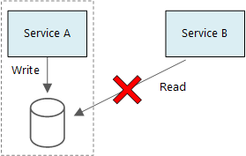

Choosing the right architectural approach for developing SaaS solution is a pivotal decision that can significantly impact the scalability, maintainability, and agility of an application. In the realm of software architecture, the debate between monoliths and microservices has become a cornerstone topic. 

In this module you will learn different aspects of monolithic and microservices architectures, examining their strengths, weaknesses, and the considerations that will help you make informed architectural choices.

## Monolithic architecture

A monolithic design can be reasonable as an initial step for an application. Monoliths often offer the quickest route to creating a proof-of-concept or minimum viable product. During early development stages, monoliths are:

* Simpler to construct as there is a solitary shared code base.

* Easier to troubleshoot as the code operates within one process and memory space.

* More comprehensible since there are fewer moving components.

Initially small, these systems tend to expand gradually to fulfill business requirements. As new functionalities are integrated, a monolithic application can face the subsequent issues:

* Components of the system cannot be scaled individually due to tight interconnections.

* Code maintenance becomes challenging due to strong interdependence and concealed interlinks.

* Testing complexity increases, elevating the risk of introducing vulnerabilities.

These challenges can impede future growth and stability. Teams become cautious about modifications, especially if original developers are absent and design documentation is lacking or outdated. 

Larger monoliths often become progressively tougher to construct, debug, and comprehend. Eventually, the downsides outweigh the advantages. 

This is when considering a shift to a microservices setup makes sense. Unlike monoliths, microservices usually mean separate, loosely connected parts.

## Microservices architecture

A microservices setup involves small, self-contained services, each handling a distinct business function in a defined domain area called a bounded context. Main characteristics of microservices are the following: 

* Microservices are small, separate, and loosely connected. A small team of developers can handle each service. Each service has its own codebase, manageable by a small team.

* Services can be updated without having to redo the whole application, and they store their own data or external state, unlike the usual model where a different data layer manages data storage.

* Services communicate through clear APIs, keeping their inner workings hidden.

* They allow diverse programming approaches; for example, services don't need the same tech or tools.

  

Some of the common benefits of microservices approach include:

- **Agility:** Microservices allow independent bug fixes and feature updates. Services can be updated without needing a full application redeployment. Rollbacks are feasible, preventing issues from halting feature releases.
- **Data Isolation:** Schema updates are simpler, affecting only one microservice. Monolithic apps face challenges due to shared data.
- **Compact Code:** Microservices reduce tangled code dependencies seen in monoliths. This eases feature additions as code and data stores are not shared, minimizing dependencies.
- **Technology Mix:** Teams can choose fitting technologies for services, supporting diverse technology stacks.
- **Fault Isolation:** Individual service failures don't disrupt the whole app, given correct handling of faults in upstream services. Patterns like Circuit Breaker or asynchronous messaging maintain stability.
- **Scalability:** Services can be independently scaled, efficiently allocating resources to subsystems. Tools like Kubernetes enable denser service packing on hosts, optimizing resource usage.

However, these benefits come with challenges, such as:

- **Complexity:** More parts in microservices create system complexity, though individual services are simpler.
- **Data Consistency:** Individual data persistence leads to data integrity challenges. Embracing eventual consistency is key.
- **Dev & Testing:** Creating services with dependencies needs a different approach. Tools might not support service dependencies well. Refactoring and testing across services pose difficulties, especially with evolving apps.
- **Governance:** Decentralized microservices can lead to diverse languages and frameworks, potentially making maintenance hard. Setting project-wide standards without stifling teams' flexibility helps, especially for cross-cutting tasks like logging.
- **Network Impact:** Granular services mean more interservice communication. Long chains of service dependencies can introduce latency. Careful API design, avoiding chattiness, and using async communication mitigate this.
- **Management:** Microservices demand mature DevOps culture. Correlating logs across services is tough. Logging for user operations involving multiple services requires attention.

### Data approach in microservices architecture

A basic principle of microservices is that each service manages its own data. Two services should not share a data store. Instead, each service is responsible for its own private data store, which other services cannot access directly.

The reason for this rule is to avoid unintentional coupling between services, which can result if services share the same underlying data schemas. If there is a change to the data schema, the change must be coordinated across every service that relies on that database. By isolating each service's data store, we can limit the scope of change, and preserve the agility of truly independent deployments. Another reason is that each microservice may have its own data models, queries, or read/write patterns. Using a shared data store limits each team's ability to optimize data storage for their particular service.

This approach naturally leads to *polyglot persistence* - the use of multiple data storage technologies within a single application. One service might require the flexible schema capabilities of a document database. Another might need the strong consistency provided by an RDBMS. 

Dealing with data in a distributed way brings some challenges. One issue is that data might end up repeated in different places. For instance, data could be stored in a transaction and then stored again for other purposes like analysis or saving history. Having data copied or split like this can cause problems with keeping data right and consistent. Also, when data connects with many services, the usual methods for managing these connections can't be used.

Traditional data design follows the rule of "one fact in one place." Each piece of information is only in the schema once. Other parts might refer to it, but they don't copy it. The benefit is that changes happen in one spot, which helps avoid issues with data being different. 

In microservices, you need to think about how updates spread across services, and how to handle when data is in different spots without perfect consistency.

Here are guidelines for managing data in microservices:

1. **Prioritize Consistency:** Choose between strong consistency or eventual consistency based on needs. For strong consistency, have a single source of truth for data and other services with eventual consistency.
2. **Handle Transactions:** Use techniques like Scheduler Agent Supervisor and Compensating Transaction for consistent data across services. Store work state to avoid issues during multi-step transactions.
3. **Minimal Data Storage:** Store only needed data. Consider domain specifics and use Domain-Driven Design (DDD) to decide what data each service requires.
4. **Service Cohesion:** Keep services coherent and loosely connected. If services over-communicate, consider merging or refactoring them.
5. **Event-Driven Approach:** Services publish events on changes, and other services subscribe to them. This style facilitates data updates and querying.
6. **Schema for Events:** Publish event schemas for automated serialization. Use JSON schema, Microsoft Bond, Protobuf, or Avro to avoid tight coupling.
7. **Scalable Events:** At high scale, optimize event handling by considering aggregation or batching to lessen system load.

