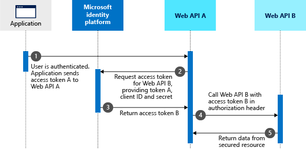

In this module, you learn about authentication and authorization, how it can be implemented with Microsoft Entra ID, and how to handle identity in microservices architecture.

### Difference between authentication and authorization

**Authentication** is the process of challenging a person, software component, or hardware device for credentials in order to verify their identity, or prove that person, component or hardware are who or what they claim to be. Authentication typically requires the use of credentials (like username and password, fingerprints, certificates, or one-time passcodes). 

Single sign-on (SSO) allows users to authenticate their identity once and then later silently authenticate when accessing various resources that rely on the same identity. Once authenticated, the IAM system acts as the source of identity truth for the other resources available to the user. It removes the need for signing on to multiple, separate target systems.

**Authorization** validates that the user, machine, or software component has access to certain resources. Authorization grants or denies the user, machine, or software component access to certain resources.

Both Authentication and authorization processes can be performed with [Microsoft Identity platform](https://learn.microsoft.com/entra/identity-platform/v2-overview) as part of Microsoft Entra ID (Formerly known as Azure Active Directory) and [Microsoft Entra ID for Customers](https://learn.microsoft.com/entra/external-id/customers/overview-customers-ciam). Microsoft identity platform is suited for solutions where customers' users have Microsoft Entra ID accounts, often that would be B2B solutions. *Microsoft Entra ID for customers* is suitable for solutions serving end-users directly since those users don't have Microsoft Entra ID account and don't belong to any organizational tenant. 

Both platforms implement the OAuth 2.0 authorization protocol. OAuth 2.0 is a method through which a third-party app can access web-hosted resources on behalf of a user.

#### Application roles

One of the key features of Microsoft Entra ID for SaaS providers is the ability to define *app roles*, and later assign app roles to individual users and groups. App roles are used to control access to various resources and actions within an application. 

For example, an application may have the role of "admin", or "Support operator", which allows users with that role to access certain features and functionality that regular users can't. You can create any kind of role and name it based on business needs.

App roles can be created via the Azure portal under “Application Registrations” <u>in the tenant of the SaaS developer</u>.

 App roles can also be created programmatically (for example, using Graph API).

Administrators of <u>customer tenants</u> can assign these roles to users or groups. Assignment is done under “Enterprise Applications”:

#### Scopes

Another important aspect for SaaS providers is the use of scopes. Scopes are used to restrict access to data and functionality protected by an API. Custom scopes can be created to provide granular control over what users can access within an application or provide granular permissions to different APIs / microservices.

Scopes can be defined as a collection of permissions that are required to access a particular resource. You can define multiple scopes for different levels of access on APIs and services, registered under App Registrations in Microsoft Entra ID:

When a user or application attempts to access a protected resource (for example, emails through Graph API), Graph API verifies that the requested scope is associated with the user or application. This association is passed as part of the JWT access token. If the user or application has the appropriate scope, they're granted access to the resource.

In the scenario, where the user is using delegated permissions and gives consent to the SaaS app to access email records using Graph API, this SaaS app is only able to retrieve email items for this user.

In the situation when you're granting permission to one of the APIs protected by Microsoft, which are part of the SaaS application, you have to implement similar logic.

Let’s assume that you provide a custom API that allows digital contract signing. If user allows delegated permissions for the SaaS app to access digital contacts through your API, it should only return contracts for this particular user. It should also check the scope – is it only *Contract.Read*, or also *Contract.Sign*, which should give users the possibility to sign the contract. It is your responsibility as a SaaS provider to implement the authorization logic in your application. 

Once you figure out how to handle granular consent for users, the next step will be to implement identity for different microservices.

## Identity in microservices architecture

In microservice scenarios, authentication is typically handled centrally. One of the design patters, which can help with simplifying authentication process is *API Gateway* pattern. If you use this approach, make sure that the individual microservices can't be reached directly without the API Gateway, unless extra security is in place to authenticate messages whether they come from the gateway or not.

When the API Gateway centralizes authentication, it adds user information when forwarding requests to the microservices. If services can be accessed directly, an authentication service like Microsoft Entra ID or a dedicated authentication microservice acting as a security token service (STS) can be used to authenticate users. Trust decisions are shared between services with security tokens or cookies. 

When microservices are accessed directly, trust that includes authentication and authorization is handled by a security token issued by a dedicated microservice, shared between microservices.

When using Microsoft Entra ID, it's possible to register your individual microservices (APIs) and create individual scopes for each. In that way it's possible to assign different scopes (permissions) for each API. Microsoft Entra ID is performing the authentication role (verifying the identity of the user), while your APIs perform the authorization - deciding if this particular user can access required API. Authorization is implemented by looking into the content of the access token passed to API after authenticating with Microsoft Entra ID.

### The on-behalf-of (OBO) flow

The on-behalf-of (OBO) flow describes the scenario of a web API using an identity other than its own to call another web API. Referred to as delegation in OAuth, the intent is to pass a user's identity and permissions through the request chain.

For the middle-tier service to make authenticated requests to the downstream service, it needs to secure an access token from Microsoft Entra ID platform. It only uses delegated *scopes* and not application *roles*. *Roles* remain attached to the principal (the user) and never to the application operating on the user's behalf. This occurs to prevent the user gaining permission to resources they shouldn't have access to.

The steps that follow constitute the OBO flow and are explained with the help of the following diagram.

1. The client application makes a request to API A with token A (with an `aud` claim of API A).
2. API A authenticates to the Microsoft identity platform token issuance endpoint and requests a token to access API B.
3. The Microsoft identity platform token issuance endpoint validates API A's credentials along with token A and issues the access token for API B (token B) to API A.
4. Token B is set by API A in the authorization header of the request to API B.
5. Data from the secured resource is returned by API B to API A, then to the client.

In this scenario, the middle-tier service has no user interaction to get the user's consent to access the downstream API. Therefore, the option to grant access to the downstream API is presented upfront as part of the consent step during authentication.

