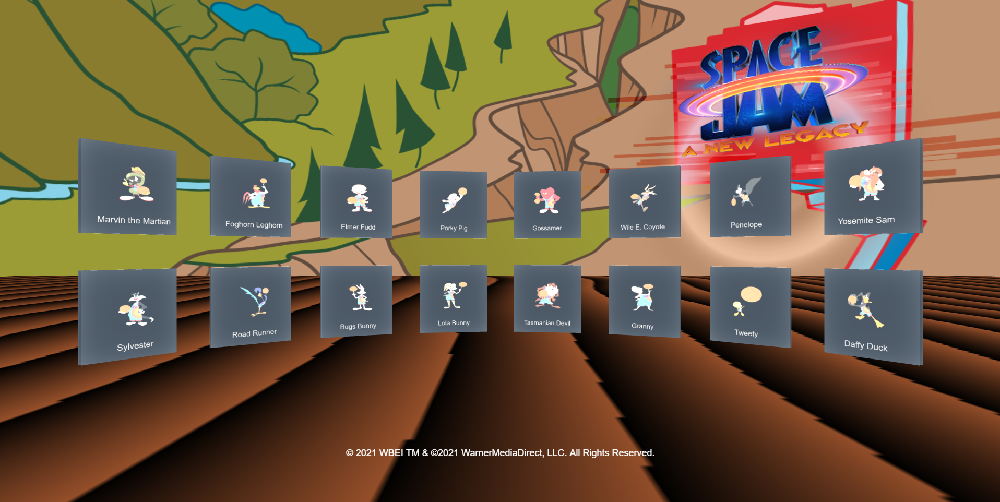

To make a Mixed Reality project for the web you will need a couple key frameworks. This project will use:

- WebXR
- BabylonJS

## WebXR

WebXR is a technology that allows you to create Virtual Reality (VR) and Augmented Reality (AR) experiences in the browser by leveraging WebGL. WebGL allows the browser to use the GPU and enables you to build 3D experiences.  Some XR applications are specific to a device or platform, but not WebXR. WebXR is cross platform so it will work on multiple devices and platforms. All you need to create a WebXR app is JavaScript with a little HTML and CSS. You will see this when we get started building our WebXR project in the next step.

There are a few different WebXR frameworks available, we are going to be using one called [BabylonJS](https://www.babylonjs.com/?azure-portal=true). Let's learn a little more about BabylonJS.

## BabylonJS

BabylonJS is a complete JavaScript framework for building 3D games and experiences with HTML5, WebGL, WebVR and Web Audio. Babylon now has Babylon Native which allows you to bring these experiences beyond the browser.

Being able to use JavaScript to create 3D experiences makes building new metaverse worlds even more accessible to all types of developers. A great way to get started building and learning with BabylonJS is by checking out the [BabylonJS Playground](https://playground.babylonjs.com/?azure-portal=true). The playground allows you to try out completely in the browser without downloading anything.

We are going to build a scene to display our the different characters in the Space Jam: A New Legacy. We will display a button for each character and when you click on the tile it will display the PER score for the character. Now lets dive into how we are going to start building out the below Space Jam: A New Legacy Scene with BabylonJS!!

© 2021 Warner Bros. Ent. All Rights Reserved.
