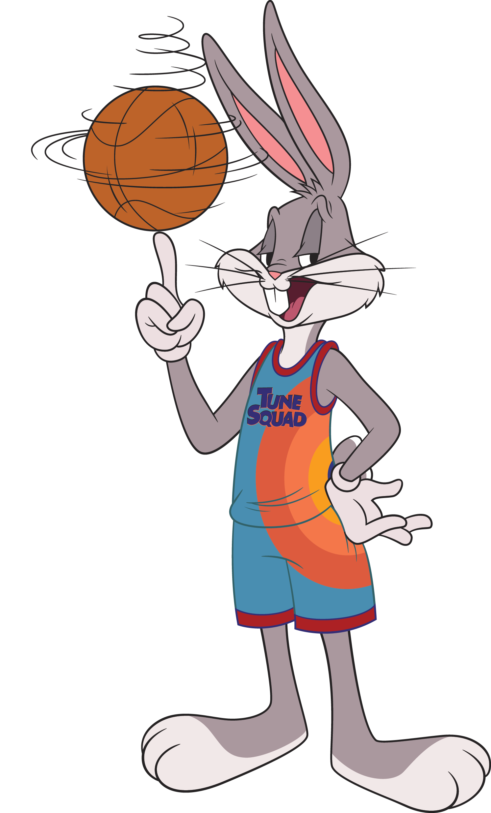

The next two modules in this learning path inspired by *Space Jam: A New Legacy* explore the world of Mixed Reality by using two different frameworks:

- Babylon.js
- Mixed Reality Toolkit

This unit briefly introduces each of these frameworks. It also calls out a couple of the key components that you'll use throughout the rest of the themed Mixed Reality modules in this learning path.

## Babylon.js

[Babylon.js](https://www.babylonjs.com/?azure-portal=true) is a 3D engine that's rendered in the web. With the power of this framework, plus a bit of JavaScript and HTML, you can have an immersive, interactive 3D experience right in your browser. This framework also pairs with WebXR, which is what elevates this experience to a Mixed Reality experience.

Creating 3D objects is a complex task that takes practice. There are 3D models available for purchase or for free on the web. But Babylon.js has built-in mesh models and procedural textures that you can use without having to do any modeling.

Especially if you're building a prototype or you want to create 3D games or Mixed Reality experiences, starting with 2D images and having them handled and moved to 3D saves you the hassle.

Even so, the Tune Squad characters that you want to show in your basketball fan stat card experience are complex. For example, you won't create a 3D model out of this image of Bugs Bunny.

You'll start by creating a 3D grid with 16 areas for each of the Tune Squad players. Then you'll add the 2D image of each player into each space within the grid.

One aspect of learning new frameworks is learning how to work with them to create your unique Mixed Reality experience. When you're prototyping or beginning your learning journey, it's OK to start by having your 3D space filled with 2D icons. As you learn more about the framework, you can swap them out for 3D models or more detailed 2D images.

## Mixed Reality Toolkit

The Windows [Mixed Reality Toolkit](/windows/mixed-reality/mrtk-unity/?view=mrtkunity-2021-05?azure-portal=true) (often written MRTK) is a framework that provides components and features that support you while you create cross-platform Mixed Reality applications by using Unity.

Because the Mixed Reality Toolkit is dependent on Unity, you get an entire platform that was built to create 2D and 3D interactive games and experiences to support your learning. In Unity, for example, everything that you want to do is part of an object in a scene. Common objects include:

- Light sources
- Cameras
- Prefabs

You'll be using many prefabs in the Mixed Reality Toolkit module inspired by the film. Prefabs are already created 3D models that you can customize. An example of how you'll use them is by creating a simple gray cube from the Unity prefabs. You then customize that cube to show the image of the Tune Squad player. By using the Mixed Reality Toolkit framework, you'll add simple scripts to that cube object/prefab to track when the object has been clicked in 3D space. An example is when your actual finger "clicks" the cube if you have a headset on. The interface of the cube then changes to show the player's name and player efficiency rating (PER) value.

In Unity, the prefab of the cube gets various components added to it that make it display and make it clickable.

The Mixed Reality Toolkit elevates what Unity already does by providing scripts and features that work when you're wearing a Mixed Reality headset, like HoloLens. What's the best part though? With the Mixed Reality Toolkit and Unity, you don't have to have a Mixed Reality headset to test out your Mixed Reality experiences. Unity and the Mixed Reality Toolkit work together to provide you with a play space on your desktop where your mouse can act as your finger and head.

© 2021 Warner Bros. Ent. All Rights Reserved.
