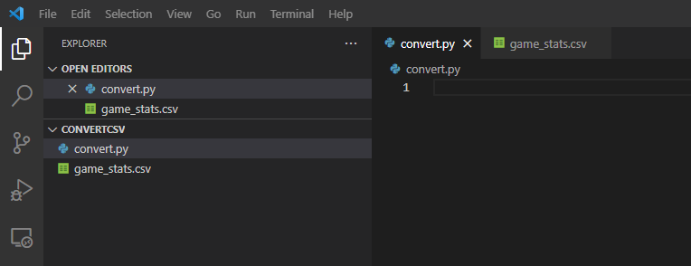
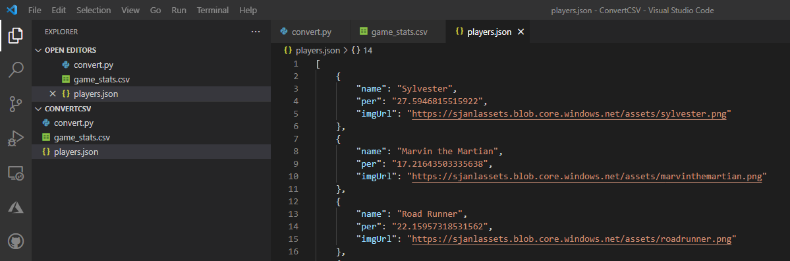

Getting your data ready for the Mixed Reality world is mostly a matter of making sure you have complete json files! 

> [!NOTE]
> Creating images and 3D models is beyond the scope of this Learn module, but that would be an additional step if you were creating a Mixed Reality experience from scratch. In this module, we're focusing on using existing images and ensuring images and data is correlated.

In the previous module from this *Space Jam: A New Legacy* inspired learning path we created a web application that displayed players and their PER values for a basketball coach to decide which players to put on the court and which to give a rest to ensure a healthy team.

The data behind this web app was a CSV (comma-separated-value) file called `game_stats.csv`. You can find the [sample file on the GitHub repository here](https://github.com/microsoft/space-jam-a-new-legacy-template/blob/main/game_stats.csv?azure-portal=true).

For the BabylonJS and Mixed Reality Toolkit
For the BabylonJS Mixed Reality project, you'll be able to pull all of the images of the Tune Squad from the Web. But to do that, you will need a JSON file that has each players:

- Name
- PER
- Image URL

Luckily, we can use a little bit of Python to do this!

## Convert CSV to JSON with Python

To convert the CSV file from the previous module into a JSON file to be used in the next module, you will need to do the following:

1. Open Visual Studio Code
2. Open a new folder, for example `ConvertCSV`
3. Create a new file, for example `convert.py`
4. Download the CSV file by going to the file on GitHub and clicking "Raw", or [opening this page here](https://raw.githubusercontent.com/microsoft/space-jam-a-new-legacy-template/main/game_stats.csv?azure-portal=true). Then, right click anywhere on the screen and click "Save As".
5. Move the `game_stats.csv` file into the `ConvertCSV` folder you created in Visual Studio Code

You should have the following setup in Visual Studio Code:



# Write the CSV Reader

Next, you need to extract only the relevant parts of the CSV file - name and PER for each player.

Make sure you have imported the csv package and create a set of constants that will represent our current team:

```python
import csv

# The name of the player is in the second column (index 1)
NAME_INDEX = 1

# The PER of the player is in the 10th column (index 9)
PER_INDEX = 9

# There are only 15 players that we are reading in
COUNT = 15
```

The CSV file has the PER for each player 4 times (one for each quarter of a game). We only need the first PER value (the value before the game has started).

Use the following code to open the CSV file, go through the first 15 rows (after the header), and create a list of names, PERs, and the URL where the image of the player can be found:

```python
# Open the game_stats.csv file 
with open('game_stats.csv') as csv_file:
    # Use the CSV reader and confirm the delimeter is a comma
    csv_reader = csv.reader(csv_file, delimiter=',')

    # Initialize the counter and empty lists
    character_count = 0
    names = []
    pers = []
    urls = []

    # Loop through each row in the CSV file
    for row in csv_reader:
        # Ignore the firt row, since that is the header
        if character_count == 0:
            character_count += 1
        # Only take data from the first 15 because we only need the player's initial PER, not for each quarter
        elif character_count <= COUNT:
            # The name of the player is in the second column (at index 1)
            names.append(row[NAME_INDEX])

            # The image file of the player is their name with no spaces or period all lowercase
            urls.append("https://sjanlassets.blob.core.windows.net/assets/" + row[NAME_INDEX].replace(" ","").replace(".","").lower()+".png")

            # The PER of the player is in the 10th row (at index 9)
            pers.append(row[PER_INDEX])

            # Increment the counter so we only get one set of data for each player
            character_count += 1
        else:
            break
```

Finally, you can write all of this to a JSON file. Open the JSON file in write mode so that you overwrite anything that was already there. Then, loop through the 15 players and create a JSON object for each player:

```python
# Create a players.json file if it isn't already created and open it
# The paramter "w" will overwrite the file if anything is in it
f = open("players.json", "w")

# Write the opening bracket of the JSON object to the file
f.write("[\n")

# Iterate over all of the players 
for index in range(0,COUNT):
    # Write the opening bracket of the first player object to the file
    f.write("\t{\n")

    # Write the name, PER, and image url, with their labels, to the file
    f.write("\t\t\"name\": \""+names[index]+"\",\n")
    f.write("\t\t\"per\": \""+pers[index]+"\",\n")
    f.write("\t\t\"imgUrl\": \""+urls[index]+"\"\n")
    f.write("\t},\n")
```

This JSON file hasn't been completed yet, but that's because we had an outlier in our original data that we removed, but we want to make sure he is part of our Mixed Reality experience.

## Add the missing player back in the data

In the first module of this *Space Jam: A New Legacy* inspired learning path, we realized that there were some outliers in our data. If you completed this module, you might remember that in [Unit 5: Check for Outliers](/learn/sports-machine-learning/predict-basketball-player-efficiency-ratings/5-check-for-outliers?azure-portal=true) there was an outlier who had a very low value for points and possessions. This was row 35, ID 40. It turns out that was Yosemite Sam!

We want to make sure he gets added back in to our JSON data so that he can show up in our Mixed Reality experience, so you will have to write a bit more code:

> [!NOTE]
> Make sure that the rest of the code is not indented since this doesn't belong in the for loop.

```python
# Write the opening bracket of the Yosemite Sam object to the file
f.write("\t{\n")

# Write his name, PER (0), and image url, with the data labels, to the file
f.write("\t\t\"name\": \"Yosemite Sam\",\n")
f.write("\t\t\"per\": \"0\",\n")
f.write("\t\t\"imgUrl\": \"https://sjanlassets.blob.core.windows.net/assets/yosemitesam.png\"\n")

# Since he is the last of hte Tune Squad, don't include a comma after closing his object.
f.write("\t}\n")

# Write the closing bracket to the JSON object to the file
f.write("]")

# Close the file
f.close()
```

Now you should see a JSON file in your Visual Studio Code folder:



© 2021 Warner Bros. Ent. All Rights Reserved.
