The Mixed Reality Toolkit is equipped with 18 button prefabs that you can add to your mixed reality project. Although the button prefabs are configured with components such as scripts, you can further customize the prefabs to meet your specific needs. Furthermore, you can leverage the existing prefabs to create your own prefabs.

For this project, you'll create a button prefab that contains the following:

- A button that displays the player's name and photo
- A card that appears when the button is pressed that displays the player's name and stats

All button objects will be created as the children of an empty GameObject. Consider this parent object as a container for all button objects. This structure provides organization for your prefab.

Now you'll use scripts provided by MRTK to create a button from scratch that displays the player's name and photo.

> [!IMPORTANT]
> To ensure that the objects you'll create don't conflict with the project scripts, name all objects as written in this module.

## Create a container for the prefab

1. In the **Hierarchy** window, click the **+** icon and select **Create Empty**.

    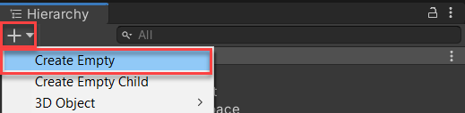

1. Select the **GameObject** in the **Hierarchy** window. The **GameObject** properties will display in the **Inspector** window. In the **Inspector** window, rename the object **PlayerContainer**.

    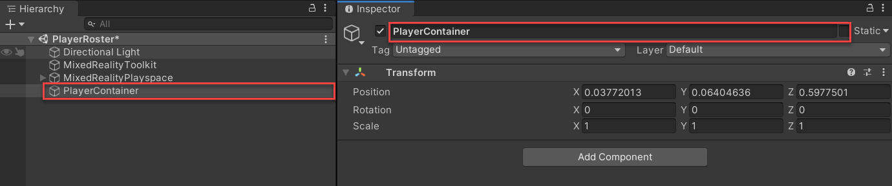

1. In the **Inspector** window, click the triple dots to the right of the **Transform** component and select **Reset**. This resets the position of the container to 0, 0, 0 -- which we consider to be origin (or the middle of your head if you're wearing a headset). Since the button objects will be created as children of **PlayerContainer**, the child objects position will be relative to the **PlayerContainer** position.

    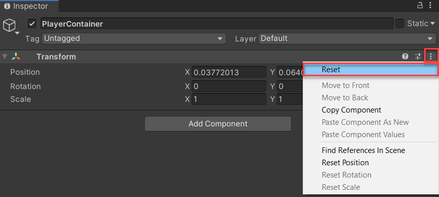

Now that you have an area for all of your players to go, you need to create buttons for each of them. Unity provides primitives that you can use in your projects as placeholders and prototypes for testing purposes. For this project, you'll use a cube primitive and then add MRTK scripts to make the cube primitives clickable.

## Create the cube primitive

The cube primitive will be a 3D object that we will put a character's image, name, and PER score onto. Then we will make that cube interactable.

To create the cube primitive, follow these steps:

1. In the **Hierarchy** window, right click the **PlayerContainer** object and select **3D Object** > **Cube**. Ensure that the cube is created as a child of the **PlayerContainer** object.

    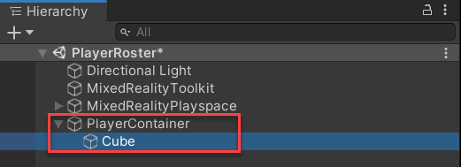

    You'll notice that the cube is only visible in the **Scene** window and not the **Game** window. The **Game** window is a representation of what you would see if wearing/using a device. Currently, the cube's position is at origin which is why it's not visible in the **Game** window. Furthermore, the cube is 1 meter on all sides -- which is a relatively large size for the **Game** window. You'll later change the cube's distance and size.

1. Select the **Cube** in the **Hierarchy** window. The **Cube** properties will display in the **Inspector** window. In the **Inspector** window, rename the cube **PlayerButton**.

1. In the **Inspector** window, change the **PlayerButton** **Position** to **0, 0, 0.9**. The Z axis value controls the distance (or depth) of the object from your view. This setting positions the cube to a distance of 0.9 meter in front of you.

    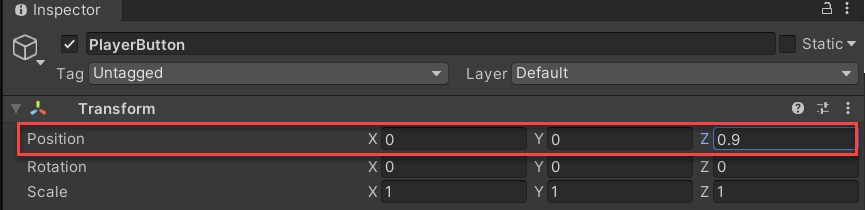

1. In the **Inspector** window, change the **Scale** to **.25, .25, .25**. This changes the scale of the cube to .5 meter on each axis.

    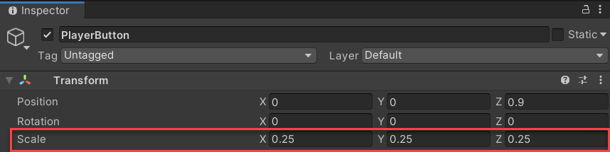

1. By default, the cube is a solid gray color. MRTK has shaders that you can use to change the cube's color (or material). In the **Project** window, enter **MRTK_Standard_Charcoal** into the search bar. Below the search bar, next to **Search**, select **In Packages**. This enables you to search in the **Packages** folder which is where the MRTK shaders are located.

    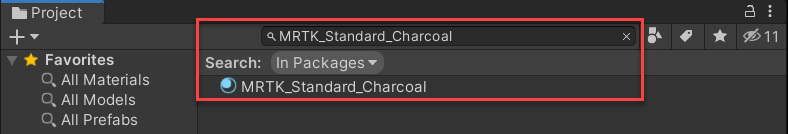

    Select the **MRTK_Standard_Charcoal** shader and drag the shader into the **Inspector** window for the **PlayerButton** object. The color of the cube will change to charcoal.

    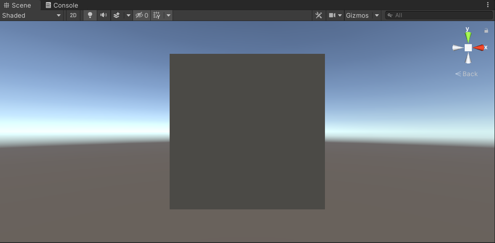

## Add MRTK scripts to create buttons

MRTK has two scripts that are used to turn an object into a button:

- **PressableButton.cs**
- **NearInteractionTouchable.cs**

The **PressableButton** script contains properties for managing the button press such as the press distance, return speed, press events, etc. The **NearInteractionTouchable** script contains properties for managing the touch interaction of the object.

Each script must be added as components to the cube for the button to function.

1. Select the **PlayerButton** object in the **Hierarchy** window. In the **Inspector** window, click **Add Component**.

    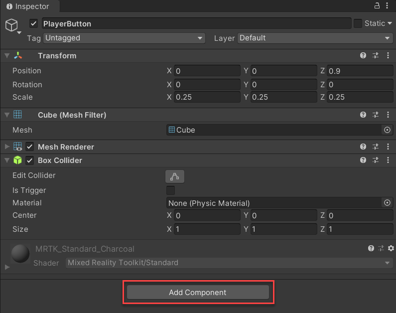

1. In the **Search** window that appears, enter **PressableButton** and select the **PressableButton** script.

    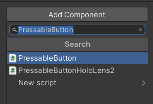

1. Click **Add Component** once more and search for **NearInteractionTouchable**. Select the **NearInteractionTouchable** script to add as a component.

1. It's likely that the **Touchable Collider** bounds and center parameters for the **NearInteractionTouchable** script don't match the **PlayerButton** object's collider size and center. Colliders define the shape of the object for the purpose of physical collisions. In this case, a button press is a collision given that your hand presses (or collides) with the cube.

    To adjust the bounds and center, in the **Touchable Collider** properties, click both **Fix Bounds** and **Fix Center**.

    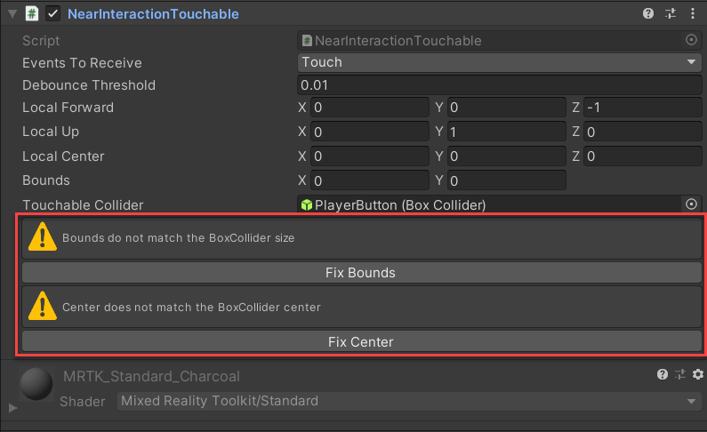

1. The **PlayerButton** object must be assigned in the **PressableButton** script for the object to be a button. Within the **PressableButton** component, drag the **PlayerButton** object to the **Moving Button Visuals** property.

    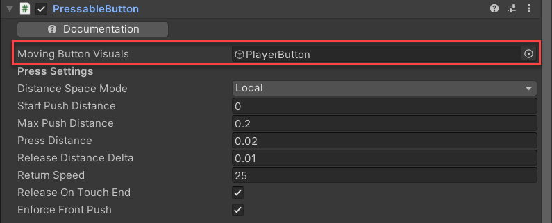

© 2021 Warner Bros. Ent. All Rights Reserved.
