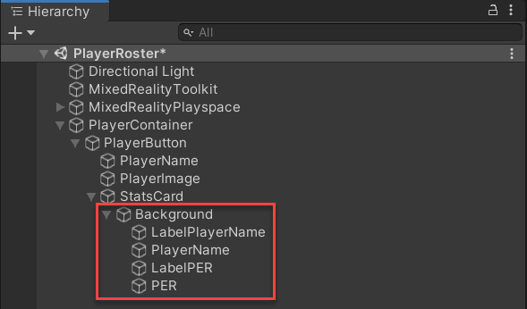
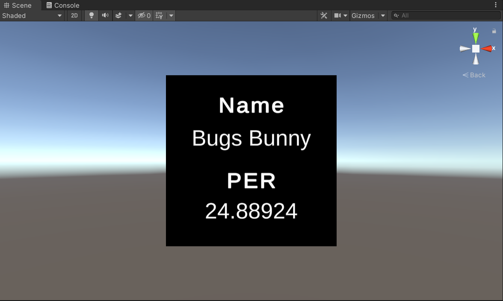
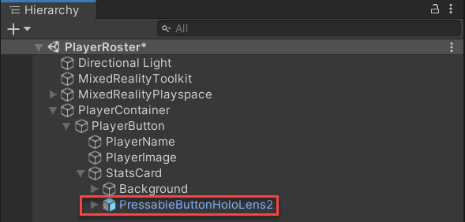
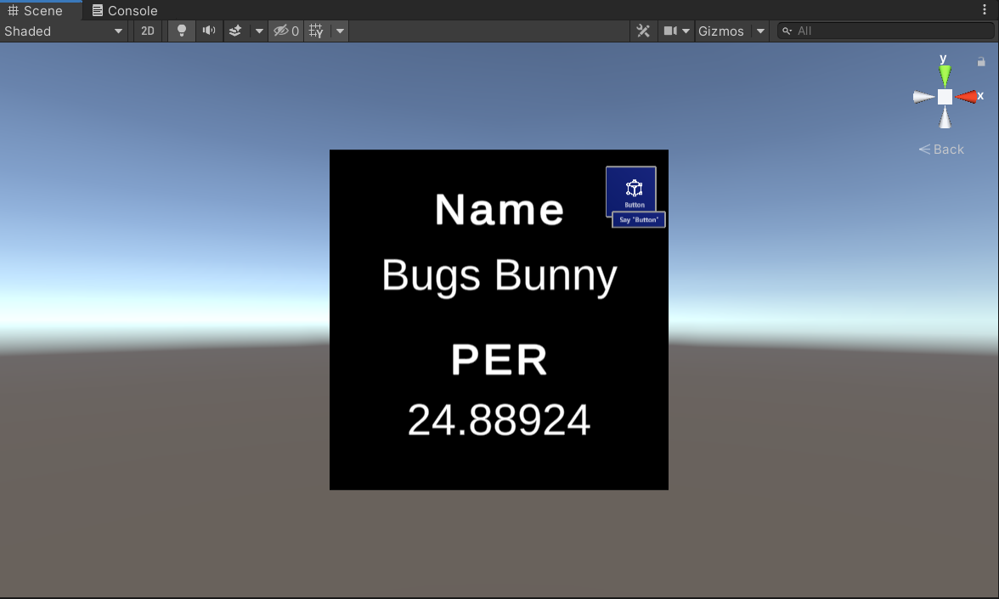
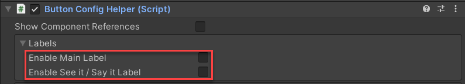
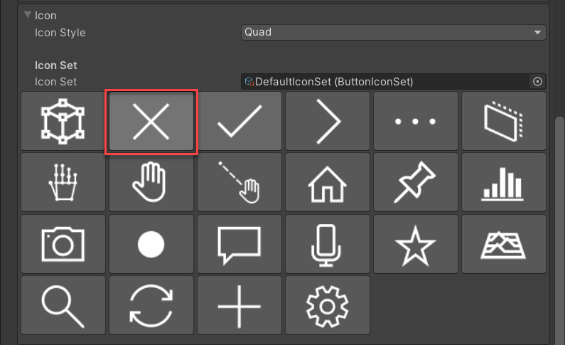
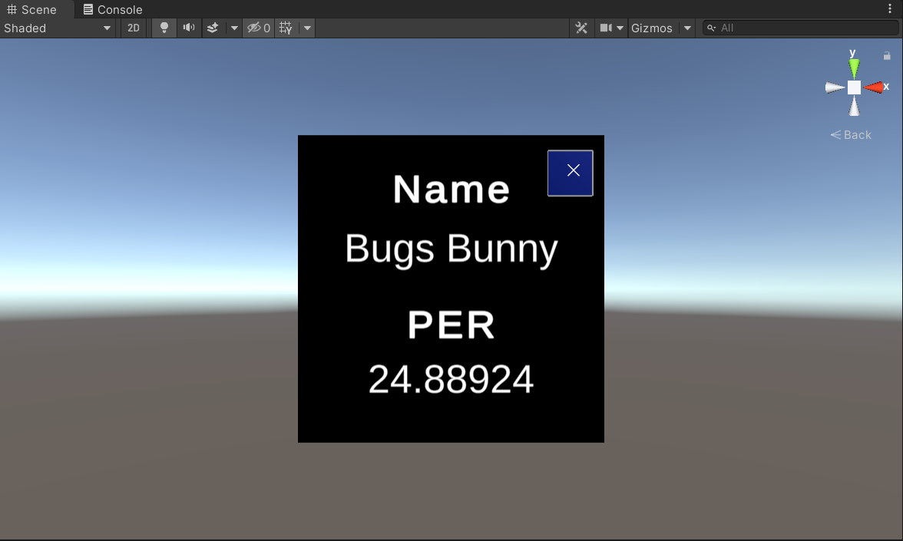

The stats card contains the player's name and PER. You'll need a text object for each label, and a text object for the respective values. The configuration for each text object is the same, except where the text objects are positioned. Therefore, you can create one text object, configure, and then duplicate for the remaining text objects. After all the necessary text objects are created, you can reposition each one.

1. In the **Hierarchy** window, right-click the **Background** object and select **3D Object** > **Text - TextMeshPro**. Ensure that the **Text (TMP)** object is created as a child of the **Background** object.

1. Select the **Text (TMP)** object in the **Hierarchy** window. In the **Inspector** window, rename the object **LabelPlayerName**.

1. You'll now modify parameters for the **TextMeshPro - Text** properties. In the **TextMeshPro - Text** properties, enter **Name**.

1. In the **Main Settings** properties, modify the following to adjust the size and position of the text:

    - **Font Size**: 1.3
    - **Alignment**: Center
    - **Alignment**: Middle

1. In the **Rect Transform** properties, modify the following to adjust the text box size and position of the text:

    - **Pos Z**: 0
    - **Width**: 1
    - **Height**: 0.2

1. Using the **Move Tool**, select the up and down arrows to drag the text onto the top-middle area of the quad.

1. Now that a text object is configured, duplicate (Ctrl+D) the object three times, and rename each object to the following:

    - PlayerName
    - LabelPER
    - PER

    

1. For each of the newly created text objects, change the **Text Input** property to the following:

    - **PlayerName**: Bugs Bunny
    - **LabelPER**: PER
    - **PER**: 24.88924

    Although the data for the **PlayerName** and **PER** text objects will pull from the JSON file, it's helpful to have sample text for placement purposes.

    Because the text objects are duplicated, they'll display on top of one another. You'll reposition each object for the next step.

1. Using the **Move Tool**, select the up and down arrows to reposition each text object so that there is space between each object.

1. For the **LabelPlayerName** and **LabelPER** objects, change the **Font Style** to **B**. This makes the font bold and provides visual differentiation between the label and the value.

    

## Create button to close stats card

You can use a Mixed Reality Toolkit (MRTK) button prefab to create a button that closes the card when pressed. In the last unit, you created a button from scratch by using MRTK scripts. For this unit, you'll use the `PressableButtonHoloLens2` prefab. This prefab contains a `ButtonConfigHelper` script that enables you to change the button's icon, text, and label.

1. In the **Project** window, enter **PressableButtonHoloLens2** into the search bar. Below the search bar, next to **Search**, select **In Packages**. This enables you to search in the **Packages** folder, which is where the MRTK button prefabs are located.

    Select the **PressableButtonHoloLens2** button, and drag the button into the **Inspector** window as a child of the **StatsCard** object.

    

1. Select the **PressableButtonHoloLens2** object in the **Hierarchy** window. In the **Inspector** window, rename the object **CloseCardButton**.

1. In the **Inspector** window, select the triple dots to the right of the **Transform** component, and select **Reset**. This resets the position of the button to 0, 0, 0.

1. The **CloseCardButton** object is relatively small in relation to the other objects. Although the button should be small, it should also be fully visible. To make the button larger, change the **Scale** to **4.5, 4.5, 4.5**.

1. Right now, the **CloseCardButton** and **PlayerButton** objects have the same position (0, 0, 0). Therefore, the **CloseCardButton** object appears in the middle of the **PlayerButton** object. Instead, the **CloseCardButton** object should appear in front of the **Background** object.

    To position the **CloseCardButton** object to display in front of the **PlayerButton** and **Background** objects, change the **CloseCardButton** object **Position** to **0, 0, -0.8**.

1. Using the **Move Tool**, reposition the **CloseCardButton** object to display at the top-right of the **Background** object.

    

1. For this project, you'll only need the button icon with no text or labels. Therefore, you can disable the **Main Label** and **See it/Say it Label** properties. In the **Labels** property for the **ButtonConfigHelper** components, disable each label.

    

    The button should now only display an icon.

    

1. The **CloseCardButton** object should reflect that the button can be pressed to close the card. Within the **ButtonConfigHelper** component are icons provided with the MRTK. When a user is selecting a button icon, the icon should ideally reflect the button's function. In this case, use the **X** button icon.

    In the **Icon Set** property of the **ButtonConfigHelper** component, select the **X** icon.

    

You should now have a completed `StatsCardButton` object that includes the player's name and their PER. There should also be a button to close the card.

© 2021 Warner Bros. Ent. All Rights Reserved.
