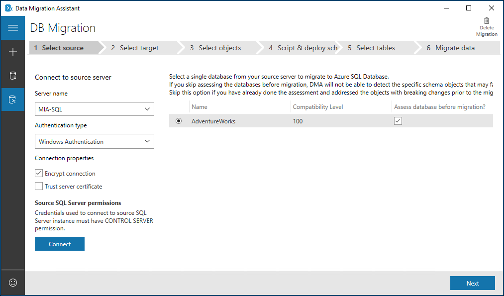

Suppose you are a database administrator for a law firm, and having used the **Microsoft Data Migration Assistant (DMA)** to identify compatibility issues between your source databases and target instances, you now want to migrate the databases to SQL Server 2017. Most of the databases will be migrated to on-premise instances of SQL Server, but some will be migrated to Azure SQL Database. You also need to keep track of the databases that you have migrated and report your progress to your business managers. The databases need to be upgraded outside of office hours and, because some of the office locations are in different time zones, you have limited time to perform the upgrades.

You have considered taking backups and restoring them on the target instances. Although this is a perfectly adequate choice, you realize that because you need to migrate a large number of databases, the migrations are likely to be a very lengthy task. Manually migrating databases, using backup and restore, also requires that logins and users be migrated separately, and as database administrator, you would also need to find the time to copy and fix any broken user accounts.  

You've, therefore, chosen to use the Data Migration Assistant, as this tool can migrate multiple databases in parallel, migrates logins, and enable you to export the results, and create a custom report. You'll now work through the required steps to use DMA to upgrade your databases.

## Upgrading a database using DMA

The Data Migration Assistant automates the process of upgrading your databases, by migrating the database schema, data, qualified Windows and SQL logins, and database users, to the target server. By choosing to use DMA over another method of performing the upgrade, you ensure that all requisite database users are included, enabling you to switch over appropriate applications as soon as possible after the migration. Alternatively, you can select only the logins you wish to migrate. If you are migrating to Azure SQL Database, the Data Migration Assistant enables you to choose between migrating the schema and data, the schema, or the data.


DMA also enables you to select one or more databases on a single instance to migrate to the target server. When you start the migration, the databases are copied in parallel, speeding up the time needed to perform the migration, particularly useful if you have a large number of databases on a single instance, or a very small window of opportunity, when users are offline, when you can migrate.



After migration, your source database may continue to change if users remain connected, or development on the database continues. You will need to capture these changes and apply them to the migrated database before the final switch over. If you are able to perform the upgrade when users are not connected, then you just need to switch over the instance name in any application connection strings.  

## Exporting migration results

The Data Migration Assistant saves the results of the database migration, enabling you to export the results to a CSV or JSON file. If you need to create reports, or want to audit the databases you have migrated, along with any that failed, you can managed these in Excel or import the results into your own database or reporting system. The report also alerts you to any databases on the source instance that you chose not to migrate.

## Changing database compatibility level

After your database has been successfully migrated to the target SQL Server, its compatibility level remains the same as it was on the source instance. On the target server, you can make any necessary changes to alter any deprecated features or broken code. Having made these changes, you can then change the compatibility level if you want to take advantage of new features in the target version.

## Steps to upgrade a database using DMA

The main steps to upgrade a database are:

1. In DMA, start by selecting **Migration**, and provide a name for the project.
1. Choose **SQL Server** as the **Source server type** and **Target server type**.
1. Enter the server names and credentials for the source and target servers.
1. Enter a shared backup location that is accessible by both the source and target SQL Servers.
1. Set the restore options, including the **Data** path and the **Log** path.
1. Set whether to migrate logins, and which particular logins to migrate, and then select **Start Migration**.
1. When the migration has completed, from the **View results** tab, you can choose to export a migration report.

To change the compatibility level of the database, after the migration, you can use the properties window in **SQL Server Management Studio (SSMS)**, selecting the **Options** tab and changing the selected compatibility level. You can also use Transact SQL; for example, to change the compatibility of the **WorldLaw** database to SQL Server 2017, you would execute the following code:

```sql
ALTER DATABASE WorldLaw
SET COMPATIBILITY_LEVEL = 140  
GO
```

## Summary

The Data Migration Assistant enables you to migrate one or more databases from an instance of SQL Server to a target instance for upgrading your databases. If you have multiple databases, DMA can migrate these in parallel, greatly reducing the time needed to migrate. After migration, you can then alter the compatibility level of the databases to make use of new features in the target instance.

DMA also provides you with a report listing all databases on the source server, and indicates the migration status, so you have an audit of those that migrated successfully, failed, or were not migrated.