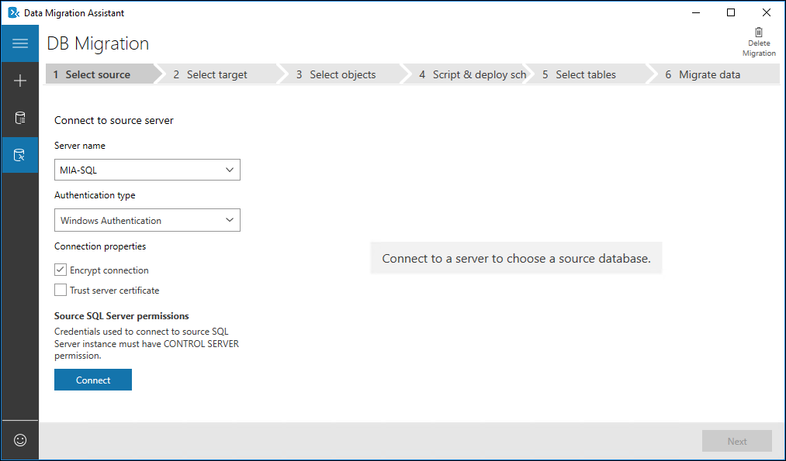

Suppose you're a database administrator for a law firm. Having used the **Microsoft Data Migration Assistant (DMA)** to identify compatibility issues between your source databases and target instances, you now want to migrate the databases to SQL Server 2019. 

Most databases will be migrated to on-premises instances of SQL Server, but some will be migrated to Azure SQL Database. You also need to keep track of the databases you've migrated and report progress to your business managers. You've limited time to do the upgrades because some of the office locations are in different time zones. Upgrading the databases needs to be outside of office hours.

You've considered taking backups and restoring them on the target instances. This approach is perfectly adequate but you realize that, because you need to migrate a large number of databases, this might take a long time. Manually migrating databases, using backup and restore, also requires that logins and users are migrated separately. As the database administrator, you'd also need to find the time to copy and fix any broken user accounts.  

You'll use the DMA, as this tool can migrate multiple databases in parallel, migrate logins, enable you to export the results, and create a custom report. Now you'll work through the required steps to use DMA to upgrade your databases.

## Upgrading a database using DMA

The DMA automates the process of upgrading your databases, by migrating the database schema, data, qualified Windows logins, SQL logins, and database users, to the target server. By choosing to use the DMA over another method of upgrading, you ensure all requisite database users are included. You can then switch over appropriate applications after the migration. If you need to, you can select only the logins you wish to migrate. If you're migrating to Azure SQL Database, the DMA enables you to choose between migrating the schema and data together, just the schema, or just the data.



DMA also enables you to select one or more databases on a single instance to migrate to the target server. When you start the migration, the databases are copied in parallel, speeding up the time needed to finish the migration. This approach is useful if you've a large number of databases on a single instance, or a small window of opportunity, if users are offline, when you can do the migration.


After migration, your source database might continue to change if users remain connected, or development on the database continues. You'll need to capture these changes and apply them to the migrated database before the final switch over. If you can do the upgrade when users aren't connected, you just need to switch over the instance name in application connection strings.  

## Exporting migration results

The DMA saves the results of the database migration, so you can export them to a CSV or JSON file. If you need to create reports, or want to audit the databases you've migrated, along with any that failed, you can manage these files in Excel or import the results into your own database or reporting system. The report also alerts you to any databases on the source instance that you chose not to migrate.

## Changing database compatibility level

After your database has been successfully migrated to the target SQL Server, its compatibility level remains the same as it was on the source instance. On the target server, you can make any necessary changes to alter any deprecated features or broken code. Having made these changes, you can then alter the compatibility level if you want to use the new features in the target version.

## Steps to upgrade a database using DMA

The main steps to upgrade a database are:

1. In DMA, start by selecting **Migration**, and provide a name for the project.
1. Choose **SQL Server** as the **Source server type** and **Target server type**.
1. Enter the server names and credentials for the source and target servers.
1. Enter a shared backup location that's accessible by both the source and target SQL Servers.
1. Set the restore options, including the **Data** path and the **Log** path.
1. Set whether to migrate logins, and which particular logins to migrate, then select **Start Migration**.
1. When the migration is complete, from the **View results** tab, you can choose to export a migration report.

To change the compatibility level of the database after the migration, you use the properties window in **SQL Server Management Studio (SSMS)**, selecting the **Options** tab and changing the selected compatibility level. You can also use Transact SQL to change the compatibility of the **WorldLaw** database to SQL Server 2019 by executing the following code:

```sql
ALTER DATABASE WorldLaw
SET COMPATIBILITY_LEVEL = 150  
GO
```

You use the DMA to migrate one or more databases from an instance of SQL Server to a target instance for upgrading your databases. With multiple databases, DMA can migrate them in parallel, greatly reducing the time needed. After migration, you can then alter the compatibility level of the databases to use the new features in the target instance.

DMA also produces a report listing all the databases on the source server. The report indicates the migration status, so you've an audit of databases that migrated successfully, failed, or weren't migrated.