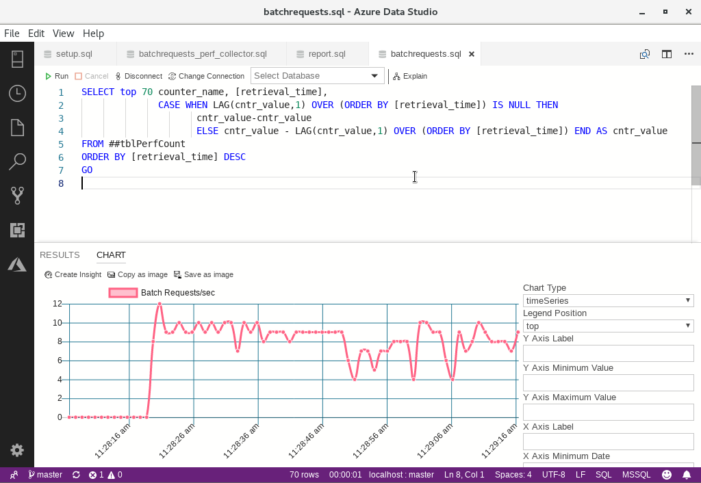

You can use time series charts in Azure Data Studio to plot how a performance counter varies over time.

Suppose you're a database administrator for a global novelty goods importer called Wide World Importers. You've migrated your customer-facing product database to a Linux server. Recently, some users have complained of slow performance.

You want to use Azure Data Studio to display SQL Server performance counters and how they vary over time.

## Create a database virtual machine

Start by creating a virtual machine, and use an image that includes SQL Server 2019:

1. Use the cloud shell on the right, and Azure CLI commands to create an Ubuntu LTS SQL server.

    ```azurecli
    export PASSWORD=$(openssl rand -base64 32)
    az vm create \
        --name UbuntuSQLServer \
        --image "MicrosoftSQLServer:sql2019-ubuntu1804:sqldev:latest" \
        --size Standard_D2s_v3 \
        --admin-username ubuntuadmin \
        --admin-password $PASSWORD \
        --nsg-rule SSH \
        --resource-group <rgn>[sandbox resource group name]</rgn>
    ```

1. Store the public IP address of your server and make a note of the administrator's password.

    ```bash
    export IPADDRESS=$(az vm show -d \
        --name UbuntuSQLServer \
        --query publicIps --output tsv \
        --resource-group <rgn>[sandbox resource group name]</rgn>)
    echo $PASSWORD
    ```

## Connect to the Ubuntu VM

Now you have an Ubuntu VM, ready to install SQL Server on, you connect to it by using Secure Shell (SSH):

1. In the Cloud Shell on the right, enter this command.

    ```bash
    ssh ubuntuadmin@$IPADDRESS
    ```

1. When asked if you're sure, type **yes**, and then press Enter.
1. For the password, use the password from above, and then press Enter. SSH connects to the VM and shows a bash shell.

## Configure SQL Server

Before you use SQL Server, you must change the system administrator password:

1. To configure SQL Server, in the Terminal window, type the following command, and then press Enter:

    ```bash
    sudo systemctl stop mssql-server
    sudo /opt/mssql/bin/mssql-conf set-sa-password
    ```

1. For the system administrator password, type **Pa$$w0rd**, and then press Enter.
1. Confirm the password then press Enter.
1. To restart SQL Server 2019, type this command:

    ```bash
    sudo systemctl start mssql-server
    ```

1. Run the following commands to modify the PATH for both login sessions and interactive/non-login sessions:

    ```bash
    echo 'export PATH="$PATH:/opt/mssql-tools/bin"' >> ~/.bash_profile
    echo 'export PATH="$PATH:/opt/mssql-tools/bin"' >> ~/.bashrc
    source ~/.bashrc
    ```

## Download the Wide World Importers database

You need a functioning database before you can optimize performance. You'll use the Wide World Importers database.

1. In the SSH session on the Ubuntu server, to download the Wide World Importers database, run this command:

    ```bash
    wget https://github.com/Microsoft/sql-server-samples/releases/download/wide-world-importers-v1.0/WideWorldImporters-Full.bak
    ```

    You'll use Azure Data Studio to restore this database later.

## Install Azure Data Studio

Although you need a GUI to run Azure Data Studio, you can install and configure it in SSH.

1. In the SSH session on the Ubuntu server, to download Azure Data Studio, run this command:

    ```bash
    curl -O https://azuredatastudiobuilds.blob.core.windows.net/releases/1.15.1/azuredatastudio-linux-1.15.1.deb
    ```

1. To install Azure Data Studio, run this command:

    ```bash
    sudo apt-get install -y ./azuredatastudio-linux-1.15.1.deb
    ```

1. To configure Azure Data Studio, run this command:

    ```bash
    sudo sed -i 's/BIG-REQUESTS/_IG-REQUESTS/' /usr/lib/x86_64-linux-gnu/libxcb.so.1
    ```

## Obtain the demonstration scripts

Later in the exercise, you'll use Transact-SQL scripts to simulate load on the server and optimize performance.

1. To download the sample scripts from GitHub, run this command:

    ```bash
    git clone https://github.com/MicrosoftDocs/mslearn-automatically-tune-sql-server-linux
    ```

## Configure Remote Desktop Protocol (RDP) access to the virtual machine

Azure Data Studio will run on the Ubuntu virtual machine that you created. However, it needs a graphical desktop environment. To provide this environment, you install an X Windows server and Remote Desktop Protocol (RDP) server.

1. In the SSH session on the Ubuntu server, to install `xfce`, run these commands:

    ```bash
    sudo apt-get update
    sudo apt-get install -y xfce4
    ```

1. Next, install and enable the `xrdp` package:

    ```bash
    sudo apt-get install -y xrdp
    sudo systemctl enable xrdp
    ```

1. To configure the default desktop environment, run this command:

    ```bash
    echo xfce4-session >~/.xsession
    ```

1. To apply your configuration, restart the `xrdp` service:

    ```bash 
    sudo service xrdp restart
    ```

1. To disconnect from the Ubuntu virtual machine and return to the Cloud Shell, run this command:

    ```bash
    exit
    ```

1. To open the correct port for RDP, run this command, replacing the name of the virtual machine you created:

    ```azurecli 
    az vm open-port \
        --resource-group <rgn>[sandbox resource group name]</rgn> \
        --name UbuntuSQLServer \
        --port 3389
    ```

## Connect to the virtual machine with RDP

Now that everything is installed, you'll connect to the virtual machine with RDP, so you can run Azure Data Studio.

1. In the [Azure portal](https://portal.azure.com/learn.docs.microsoft.com?azure-portal=true) left menu, select **Virtual machines**, and then click your virtual machine.
1. On the **Overview** page, click **Connect**, and then select **RDP**.
1. Click **Download RDP File**, and open the file with your RDP client.
1. If you're warned that the publisher can't be identified, click **Connect**. If you're warned that the identity of the remote computer can't be verified, click **Yes**.
1. Log in to the Ubuntu server with the username **ubuntuadmin** and the password that you recorded above.
1. In the **Panel** dialog, select **Use default config**.
1. In the top-left corner, select **Applications**, point to **Development**, and then select **Azure Data Studio**.

## Restore the Wide World Importers database

Let's create a database that's used to simulate load.

1. In Azure Data Studio, in the **Connection** dialog, use these values:

    | Property | Value |
    | --- | --- |
    | Connection type | Microsoft SQL Server |
    | Server | localhost |
    | Authentication type | SQL Login |
    | Username | sa |
    | Password | Pa$$w0rd |
    | | |

1. To enable preview features, which include the restore functionality, click **File**, point to **Preferences**, and then click **Settings**.
1. Select **Workbench**, and then under **Enable Preview Features**, select **Enable unreleased preview features**.
1. Switch to the **localhost** tab, and then in the **Tasks** pane, select **Restore**.
1. On the **General** tab, use these values, and then select **Restore**:

    | Property | Value |
    | --- | --- |
    | Restore from | Backup file |
    | Backup file path | /home/ubuntuadmin/WideWorldImporters-Full.bak |
    | Database | WideWorldImporters |
    | Target database | WideWorldImporters |
    | | |

## Create stored procedures

Four stored procedures are used in this module. In this section, you'll create those procedures.

1. In Azure Data Studio, on the **File** menu, click **Open File** and then browse to the **~/automatically-tune-sql-server-linux/** folder.
1. Select **setup.sql**, and then click **Open**. Examine the contents of the script, which creates four stored procedures.
1. In the top-left of the script window, click **Run**. Azure Data Studio runs the script.

## Create a global temporary table to store the counter

You'll create a global temporary table that stores the values of the **Batch Requests/sec** counter. Follow these steps:

1. In Azure Data Studio, on the **File** menu, click **Open File**.
1. Browse to the **~/mslearn-automatically-tune-sql-server-linux/** folder.
1. Click **batchrequests_perf_collector.sql**, and then click **Open**. Examine the contents of the script, which creates a global temporary table that stores the way a performance counter varies over time. The script continues to populate that table with measurements of the **Batch Requests/sec** counter.
1. In the top-left of the script window, click **Run**.

## Simulate load on the SQL Server

To store some meaningful measurements of the **Batch Requests/sec** counter, follow these steps:

1. On the **File** menu, click **Open File**.
1. Click **report.sql** and then click **Open**. Examine the contents of the script, which calls a stored procedure to simulate load on the SQL Server.
1. In the top-left of the script window, click **Run**. Wait for about 20 seconds to store some data before the next step.

## Query for and display the counter

The final step is to execute a query against the temporary table that returns relevant values. You'll use a timeSeries chart to display these values in a graph:

1. On the **File** menu, click **Open File**.
1. Click **batchrequests.sql**, and then click **Open**. Examine the contents of the script, which queries the global temporary table of performance data created by the **batchrequests_perf_collector.sql** script.
1. In the top-left of the script window, click **Run**.
1. On the right of the **RESULTS** window, click the lower icon, which displays the **CHART** window.
1. In the **Chart Type** drop-down list, select **timeSeries**. Azure Data Studio displays a graph that shows how the **Batch Requests/Sec** counter has varied over time.

    

1. Close **Azure Data Studio**.