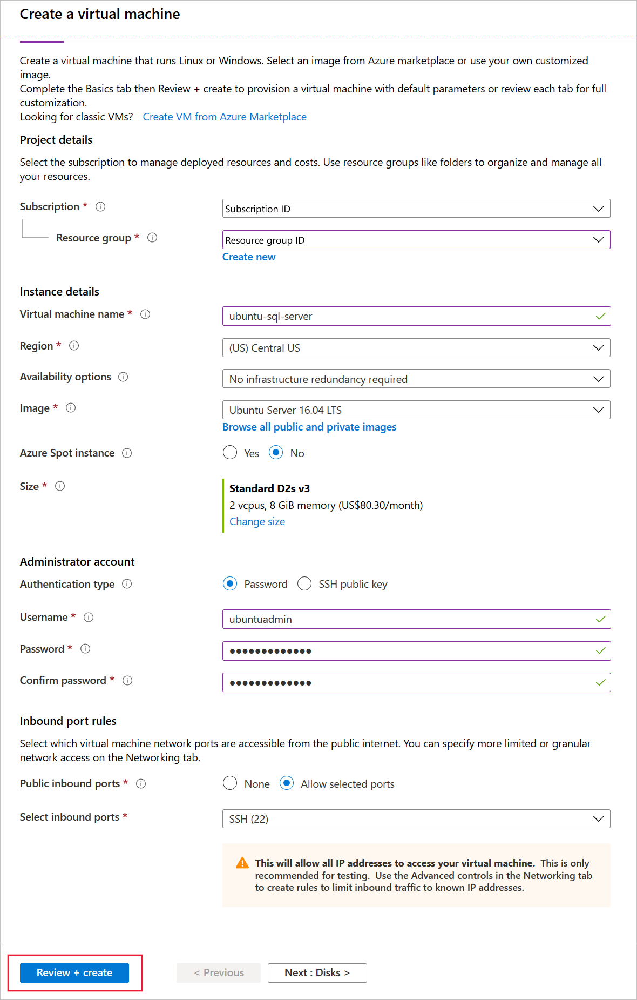
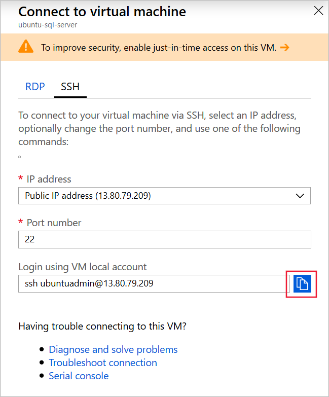

To install SQL Server on Ubuntu, you use the `apt-get` tool.

You are a database administrator at the wholesale company Wide World Importers. You want to benefit from SQL Server without having to change the server operating systems. You have decided to deploy SQL Server on an Ubuntu server and will configure the SQL Server package and install command-line tools so that SQL Server is ready to be used by your developers.

Here, you will see how to  deploy SQL Server on Ubuntu, install command-line tools and Azure Data Studio, and create a database on SQL Server.

[!include[](../../../includes/azure-sandbox-activate.md)]

[!include[](../../../includes/azure-sandbox-regions-first-mention-note-friendly.md)]

## Create an Ubuntu Virtual Machine 

Let's start by creating an Ubuntu Virtual Machine (VM) in Azure. Later, we can install SQL Server 2017 on that VM:

1. In the [Azure portal](https://portal.azure.com/learn.docs.microsoft.com?azure-portal=true), click **+ Create a resource**.
1. In the **Search the Marketplace** textbox, type **Ubuntu**, and then press Enter.
1. Click the **Ubuntu Server** image, in the **Select a software plan** drop-down list, select **Ubuntu Server 16.04 LTS**, and then click **Create**.
1. In the **Create a virtual machine** dialog, on the **Basics** page, enter these values, and then click **Review + create**:

    | Field | Value |
    | --- | --- |
    | Subscription | Concierge Subscription |
    | Resource group | <rgn>[sandbox resource group name]</rgn> |
    | Virtual machine name | Enter a unique name and make a note of it. |
    | Region | Select a region near you from the above list. |
    | Availability options | No infrastructure redundancy required |
    | Image | Ubuntu Server 16.04 LTS |
    | Size | Standard |
    | Authentication type | Password |
    | Username | ubuntuadmin |
    | Password | Pa$$w0rdLinux |
    | Public inbound ports | Allow selected ports |
    | Select inbound ports | SSH |
    | | |

    

1. On the **Review + create** page, click **Create**.

## Connect to the Ubuntu VM

Now that we have an Ubuntu VM, ready to install SQL Server on, let's connect to it by using Secure Shell (SSH):

1. In the [Azure portal](https://portal.azure.com/learn.docs.microsoft.com?azure-portal=true), when the VM deployment is complete, click **All resources** and then click the VM you created.
1. In the top left of the **Overview** page, click **Connect**.
1. On the **SSH** tab, to the right of the **Login using VM local account** textbox, click the **Copy** button.

    

1. In the Cloud Shell on the right, right-click, click **Paste**, and then press Enter.
1. When asked if you're sure, type **yes** and then press Enter.
1. For the password, type **Pa$$w0rdLinux** and then press Enter. SSH connects to the VM and shows a bash shell.

## Install the SQL Server package

Now, let's install and configure SQL Server:

1. To install the Microsoft repository GPG key, type the following command, and then press Enter:

    ```bash
    wget -qO- https://packages.microsoft.com/keys/microsoft.asc | sudo apt-key add -
    ```

1. To register the Microsoft SQL Server Ubuntu repository, type the following command, and then press Enter:

    ```bash
    sudo add-apt-repository "$(wget -qO- https://packages.microsoft.com/config/ubuntu/16.04/mssql-server-2017.list)"
    ```

1. To get an updated package list, type the following command, and then press Enter:

    ```bash
    sudo apt-get update
    ```

1. To install the **libcurl3** URL transfer library, type the following, and then press Enter:

    ```bash
    sudo apt-get install -y libcurl3
    ```

1. To install SQL Server, type the following command, and then press Enter:

    ```bash
    sudo apt-get install -y mssql-server
    ```

## Configure SQL Server

Before you use SQL Server, you must specify the edition that you want and the system administrator password:

1. To configure SQL Server, in the Terminal window, type the following command, and then press Enter:

    ```bash
    sudo /opt/mssql/bin/mssql-conf setup
    ```

1. To select the **Evaluation edition**, press 1, and then press Enter.
1. Type **Yes** and press Enter to accept the license terms.
1. For the system administrator password, type **Pa$$w0rd** and then press Enter.
1. Confirm the password and then press Enter.

## Install SQL Server tools

SQL Server is now installed. Next, install tools to work with SQL Server.

1. To register the repository for the Microsoft SQL Server tools package, type the following command, and then press Enter:

    ```bash
    sudo add-apt-repository "$(curl https://packages.microsoft.com/config/ubuntu/16.04/prod.list)"
    ```

1. To get an updated package list, type the following command, and then press Enter:

    ```bash
    sudo apt-get update
    ```

1. To install SQL Server command-line tools, type the following command, and then press Enter:

   ```bash
   sudo apt-get install -y mssql-tools unixodbc-dev
   ```

1. Press Tab and Enter to accept the license terms.
1. Press Tab and Enter to accept the ODBC license terms.
1. To add the tools to the **PATH** environment variable, type the following command, and then press Enter:

    ```bash
    echo 'export PATH="$PATH:/opt/mssql-tools/bin"' >> ~/.bash_profile
    echo 'export PATH="$PATH:/opt/mssql-tools/bin"' >> ~/.bashrc
    source ~/.bashrc
    ```

## Create a database

Finally, let's create a database in SQL Server.

1. To check whether SQL Server is running, run this command:

    ```bash
    systemctl status mssql-server
    ```

1. If SQL Server is not active, run this command to start the server:

    ```bash
    sudo systemctl start mssql-server
    ```

1. To start the `sqlcmd` tool, enter this command:

    ```bash
    sqlcmd -S localhost -U sa -P 'Pa$$w0rd'
    ```

1. To create a database, run these commands:

    ```sql
    CREATE DATABASE WideWorld1
    GO
    ```

1. To verify that the database was created, run these commands:

    ```sql
    SELECT name, database_id, create_date FROM sys.databases WHERE name = 'WideWorld1'
    GO
    ```

1. To exit the `sqlcmd` tool and SSH run the command `exit` twice.
