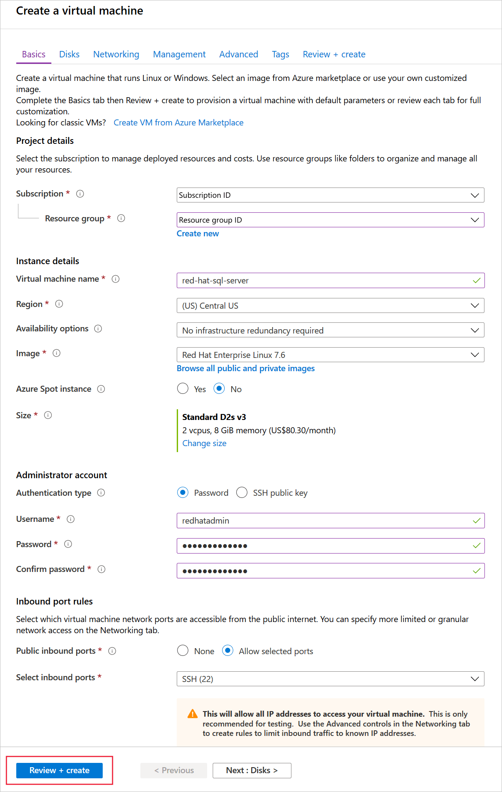
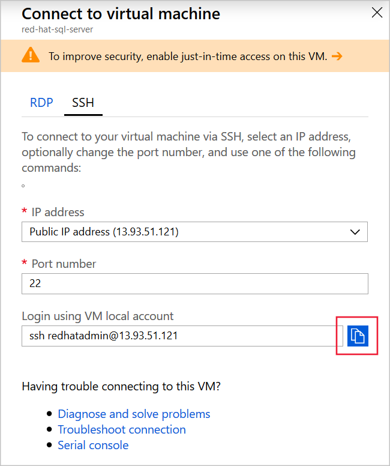

On Red Hat Enterprise Linux (RHEL) servers, use the `yum` tool to install SQL Server. 

You are a database administrator at the wholesale company Wide World Importers and want to benefit from SQL Server without having to change the server operating systems. You have decided to deploy SQL Server on a Red Hat server and will configure the SQL Server package and install command-line tools so that SQL Server is ready to be used by your developers.

In this exercise, you will deploy SQL Server on RHEL, install command-line tools, and create a database on SQL Server. 

[!include[](../../../includes/azure-sandbox-activate.md)]

[!include[](../../../includes/azure-sandbox-regions-first-mention-note-friendly.md)]

## Create a Red Hat Virtual Machine 

Let's start by creating a Red Hat Virtual Machine (VM) in Azure:

1. In the [Azure portal](https://portal.azure.com/learn.docs.microsoft.com?azure-portal=true), click **+ Create a resource**.
1. In the **Search the Marketplace** textbox, type **Red Hat**, and then press Enter.
1. Click the **Red Hat Enterprise Linux 7.6** image, and then click **Create**.
1. In the **Create a virtual machine** dialog, on the **Basics** page, enter these values, and then click **Review + create**:

    | Field | Value |
    | --- | --- |
    | Subscription | Concierge Subscription |
    | Resource group | <rgn>[sandbox resource group name]</rgn> |
    | Virtual machine name | Enter a unique name and make a note of it. |
    | Region | Select a region near you from the above list. |
    | Availability options | No infrastructure redundancy required |
    | Image | Red Hat Enterprise Linux 7.6 |
    | Size | Ensure you select **Standard D2s v3**. |
    | Authentication type | Password |
    | Username | redhatadmin |
    | Password | Pa$$w0rdLinux |
    | Public inbound ports | Allow selected ports |
    | Select inbound ports | SSH |
    | | |

    

1. On the **Review + create** page, click **Create**.

## Connect to the Red Hat VM

Now that we have a Red Hat VM, ready to install SQL Server on, let's connect to it by using Secure Shell (SSH):

1. In the [Azure portal](https://portal.azure.com/learn.docs.microsoft.com?azure-portal=true), when the VM deployment is complete, click **All resources** and then click the VM you created.
1. In the top left of the **Overview** page, click **Connect**.
1. On the **SSH** tab, to the right of the **Login using VM local account** textbox, click the **Copy** button.

    

1. In the Cloud Shell on the right, right-click, click **Paste**, and then press Enter.
1. When asked if you're sure, type **yes** and then press Enter.
1. For the password, type **Pa$$w0rdLinux** and then press Enter. SSH connects to the VM and shows a bash shell.

## Install the SQL Server package

Let's install SQL Server. Before using `yum` to install, you must add a configuration file:

1. To download the Microsoft SQL Server Red Hat repository configuration file, run this command:

    ```bash
    sudo curl -o /etc/yum.repos.d/mssql-server.repo https://packages.microsoft.com/config/rhel/7/mssql-server-2017.repo
    ```

1. If you are asked for a password, type **Pa$$w0rdLinux**, and then press Enter.
1. To install SQL Server, run this command:

    ```bash
    sudo yum install -y mssql-server
    ```

## Configure SQL Server

Before you use SQL Server, use the `mssql-conf` script to specify the edition that you want and the system administrator password:

1. Run this command:

    ```bash
    sudo /opt/mssql/bin/mssql-conf setup
    ```

1. If prompted for your password, type **Pa$$w0rdLinux** and press Enter.
1. To select the Evaluation edition, type **1**, and then press Enter:
1. Type **Yes**, and then press Enter to accept the license terms.
1. Type **Pa$$w0rd**, and then press Enter to set the system administrator password.
1. Type **Pa$$w0rd**, and then press Enter to confirm the password.

## Install SQL Server tools

SQL Server is now installed. Now you can install command-line tools to work with SQL Server:

1. To download the Microsoft SQL Server tools repository configuration file, run this command:

    ```bash
    sudo curl -o /etc/yum.repos.d/msprod.repo https://packages.microsoft.com/config/rhel/7/prod.repo
    ```

1. To install SQL Server command-line tools, run this command:

    ```bash
    sudo yum install -y mssql-tools unixODBC-devel
    ```

1. Type **YES**, and then press Enter to accept the ODBC license terms.
1. Type **YES**, and then and press Enter to accept the license terms.
1. To add the tools to the **PATH** environment variable, run these commands:

    ```bash
    echo 'export PATH="$PATH:/opt/mssql-tools/bin"' >> ~/.bash_profile
    echo 'export PATH="$PATH:/opt/mssql-tools/bin"' >> ~/.bashrc
    source ~/.bashrc
    ```

## Create a database

You can now use the **sqlcmd** tool to create a database:

1. Run this command to connect to SQL Server:

    ```bash
    sqlcmd -S localhost -U sa -P 'Pa$$w0rd'
    ```

1. To create a database called **WideWorld1**, run these SQL commands:

    ```bash
    CREATE DATABASE WideWorld1
    GO
    ```

1. To verify that the database was created, run this SQL query:

    ```bash
    SELECT name, database_id, create_date FROM sys.databases WHERE name = 'WideWorld1'
    GO
    ```

1. To exit the `sqlcmd` tool and SSH run the command `exit` twice.