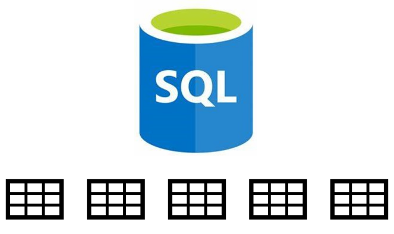
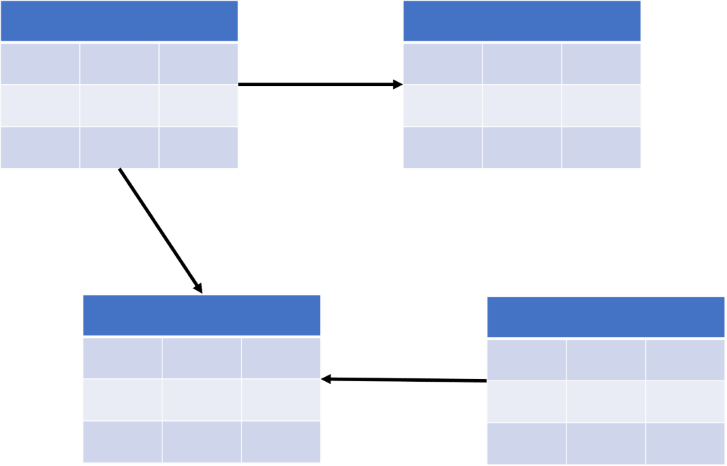
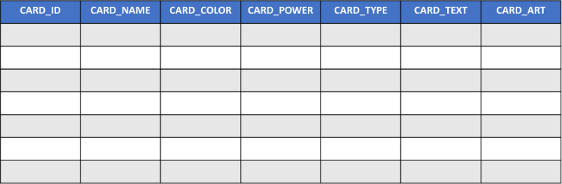
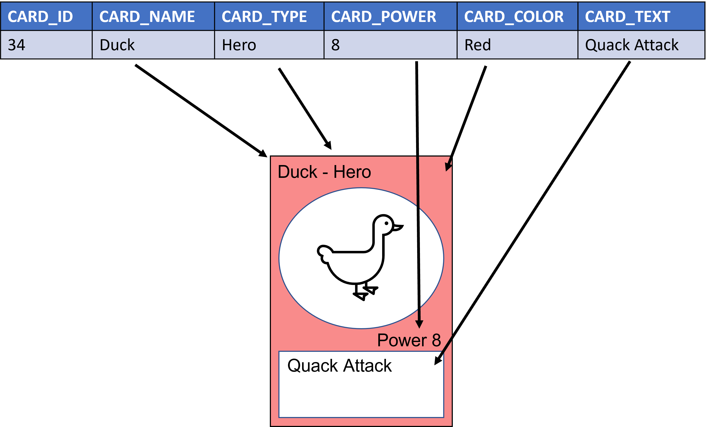
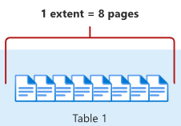

Understanding how tables are structured and what you can use them for in Azure SQL is key to developing a good application data model.

In the card game online reference application, many different types of data need to be stored in the database so that it can represent the physical cards as accurately as possible in this digital medium.

In this unit, you'll learn the basics of database tables in Azure SQL, how they're stored, and the types of data they can hold.

## Relational databases and data models

A relational database is a type of database that stores data in rows and columns that combine to create structures called tables, similar to entering data into an Excel spreadsheet. You can relate tables in a database by unique key values; for example, a product ID in a products table being referenced in an order table. You can also have key values related in a hierarchy with a one-to-many or a parent-child relationship. A data model is a representation of the tables in a relational database and how they connect to or reference each other.

## What is a database table?

Tables are one of many objects in a relational database, but are by far the most important. Without tables, how and where would we store the data? Tables are similar to spreadsheets, made up of columns and rows. Why have a database at all when you can just use spreadsheets? Imagine having thousands upon thousands of spreadsheets on your computer with some containing millions or billions of rows. How can you search these files? How are they logically and physically stored and ordered? Databases allow us to store these "spreadsheets" in a structured and ordered methodology, providing instant access to any record in any table with subsecond speeds.

Similar to spreadsheets, tables are made up of rows (the horizontal element) and columns (the vertical element). You can think of a column as an attribute of what our table is storing or describing. You can think of a row in a table as a record that's made up of data in these columns. When rows and columns intersect, it's called a *field*, like a cell in a spreadsheet. While the number of records, or rows, you can store in a table is limited by the amount of computer storage or disk space to which your database has access, the number of columns is limited to 1,024. Having tables with hundreds of columns is difficult to maintain, like looking for a paperclip in the bottom of your junk drawer. Tables are permanent structures in a database, but you can use a temporary table in certain scenarios, which we'll cover later in this module.

Within these tables that are structured in a row and column format is data, which can be stored as numbers, dates, text, binary objects, or even as JSON documents. Along with relationships between tables, you can apply rule sets to limit or enhance what data can be stored in the table.

Some of the rules you can apply are:

* The ability to restrict if a field in a row can be null or require a value
* Assign a default value if no values are given
* Define and restrict what are acceptable values
* Automatically insert data that is derived from a computed value based on other columns within the table

The card game information application will have fields such as card name, card ID, and card color, with each card being a record in the table. Using this scenario, you can see how the rows and columns in a table hold the information specific to one of the game cards in the following image.

### Memory-optimized tables

Azure SQL also has Memory-optimized tables, tables that are stored in the database server's main memory, where rows are read and written directly to memory. However, there's also a physical copy of the table on disk for durability if there's a restart or disaster-recovery scenario. For your purposes in this module, you won't be working with Memory-optimized tables, but it's important to know that they exist.

As you can see, making intelligent decisions about table structure before implementing any code can ensure a robust and extensible data model that can grow and evolve with your application.

## Compare Azure SQL data types

When you define the columns within a table, not only do you need to identify it with a name unique to the table, you also must assign it a data type. Data types are attributes of columns that specify the type of data that it can hold such as numbers, text, and dates.

### Decide when to use which data type

Storing data in a database requires you to take a close look at what type of data you want to hold. Is it money? How large are my numbers going to be? Do you need to store decimals? Does the application require the database to store images? How much text will a column need to hold? Depending on these answers, you have specific data types that can be used for each scenario.

Some of the common data types used in Azure SQL are:

* **Character**: When you want to store character or text in the database, Azure SQL provides the `nchar` and `nvarchar` data types. Use `nchar` for fixed-size text data and `nvarchar` for variable-size text data. Using `max` as the length of `nvarchar` allows for text storage up to 2 GB in length per field in a row. `Nchar` and `nvarchar` also allow for multibyte characters that you see in languages such as Japanese and Chinese.
* **Decimal**: Numbers with specific precision use the `decimal` data type. This data type must be defined by two variables. First, the precision (p), or maximum total number of decimal digits to be stored. Second, the scale(s), the number of decimal digits that are stored to the right of the decimal point.
* **Integers**: When storing exact numbers that don't need to carry decimal values, you can use `integer` types. Most use cases fall into using the `int` data type, but there are other integer types for special cases. For small values, you can use `tinyint` and `smallint`; for large numbers, `bigint` is best. The money data type can be used to store currency.
* **Bit**: The `bit` data type can only contain a 0 or a 1, making it perfect for boolean or true/false data.
* **Date and Time**: Similar to the number data types, you can store dates and time in the database with various levels of precision. The `date` data type stores the data in the database in the YYYY-MM-DD format. If you need more accuracy, you can use the `datatime2` data type, which stores the date in the YYYY-MM-DD hh:mm:ss[.nnnnnnn] format. If you just need the time, then you can use the `time` data type, which uses the hh:mm:ss[.nnnnnnn] format. If you're creating an application with globalization in mind, you can use the `datetimeoffset` data type, which contains time zone information.
* **Binary**: If you need to store data such as images or files, you can use the `binary` and `varbinary` data types. The `binary` data type is for fixed-length binary data, while `varbinary` is for variable-length binary data.
* **Spatial**: Azure SQL has two spatial data types; `geometry` and `geography`. The `geometry` type represents data in a Euclidean (flat) coordinate system, while the `geography` type represents data in a round-earth coordinate system. Once the data is stored in the database using these types, you can perform spatial operations with SQL, such as Nearest Neighbor queries (where is the closest pizza restaurant to my location) or locations of points in a geometrical space (where x, y, and z intersect on a graph).

With your new knowledge of database data types, refer back to the card-game application's data model. You can see that columns such as `card_id` and `card_power` will be number types, where `card_name`, `card_type`, and `card_color` will be text data types. Card art needs to be stored, so using `varbinary` to its max size will allow you to store images in the table.

## How are tables stored?

On the file system where the database lives, tables are stored in pages. These pages are 8K files that come either as data, text/image, or index pages. Like the index of a book or article, each page starts with a header section that describes what's in the page. This header information includes the page number, page type, the amount of free space on the page, and the allocation unit ID of the object that owns the page. Extents hold eight physically contiguous pages, thus Azure SQL databases have 16 extents per megabyte. (64K per extent * 16 extents = 1,024K or 1 MB) You can read more about this topic in the [Pages and extents architecture guide](/sql/relational-databases/pages-and-extents-architecture-guide).

Why is how tables are stored important? When designing the data model and deciding what data types and sizes of data types to use, you need to keep in mind that data from one page can't flow over and continue into another page. Creating columns with data types that always use the max size can lead to performance issues because pages potentially could be created for each row.
