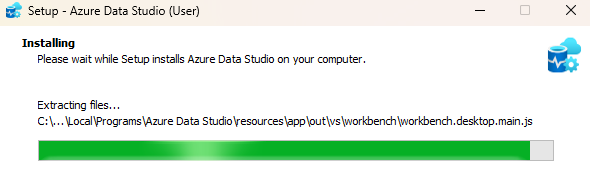
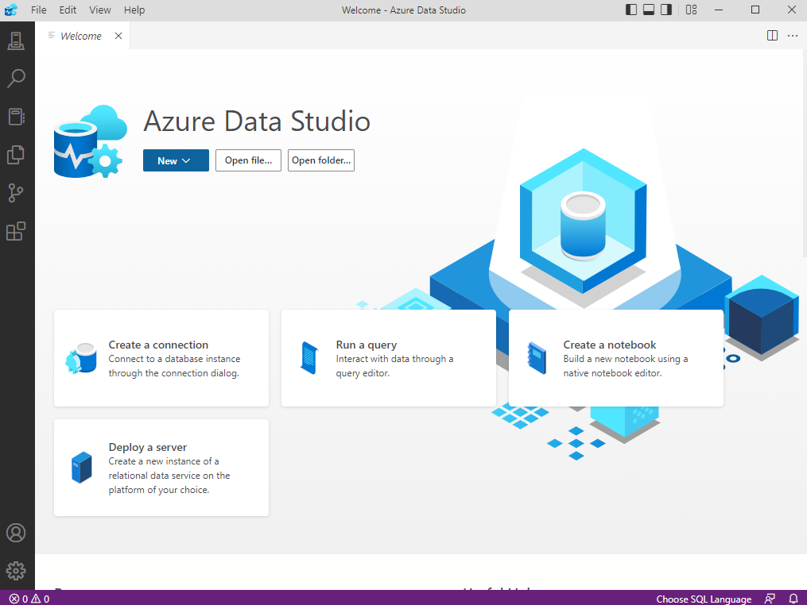
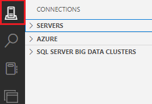
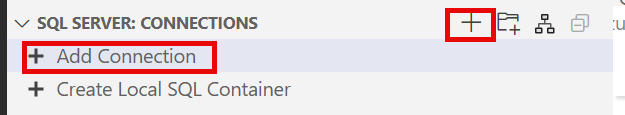
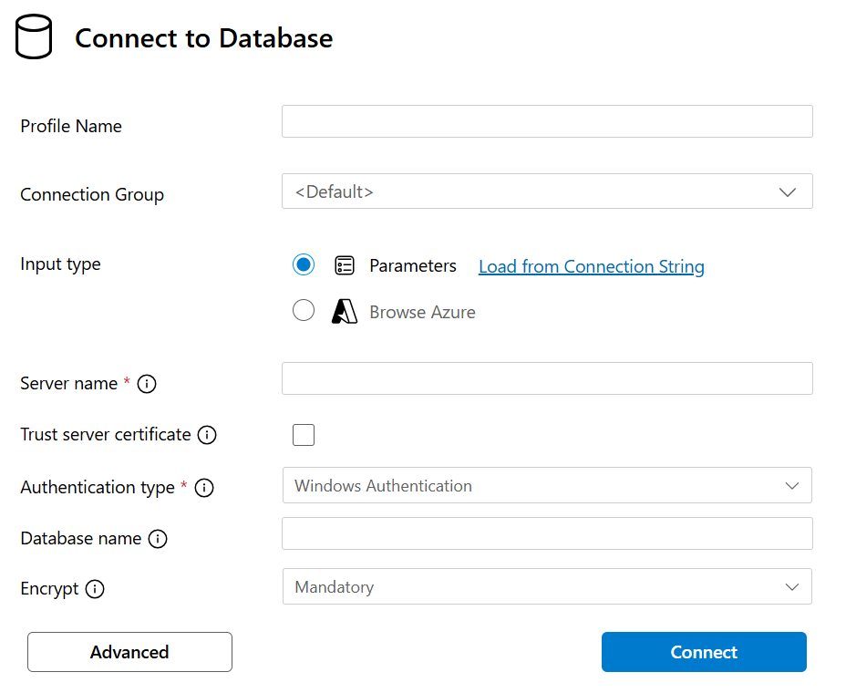
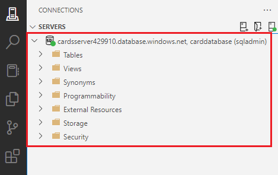

In the online card-reference application scenario, you'll be building a data model in an Azure SQL Database using the table designer in Azure Data Studio.

In this exercise, you'll deploy an Azure SQL Database using scripts via the Azure CLI right in the browser. Next, you'll install Azure Data Studio and create a connection from Azure Data Studio to the Azure SQL Database.

## Deploy Azure SQL Database using PowerShell

Before you start creating the data model, you'll first need to create a database. You can create the database via Azure Cloud Shell, which is on the right side of this page. Azure Cloud Shell is a browser-based shell experience that’s hosted in the cloud and accessible from virtually anywhere. It comes preinstalled with various tools such as Azure CLI, Azure PowerShell, and sqlcmd.

These scripts should take three to five minutes to complete. Be sure to note your password, unique ID, and region, because they won't be shown again unless you access the Azure portal.

1. Start by obtaining your local public IP address. Ensure that you're disconnected from any VPN service and open a local PowerShell terminal on your device. Run the following command and note the resulting IP address:

    ```powershell
    (Invoke-WebRequest -Uri "https://ipinfo.io/ip").Content
    ```

    > [!TIP]
    > If you're **not** on a Windows device, you need to locate your IP address with another method. In your terminal, you can run `curl ifconfig.co`.

    Why do you need your IP address? You'll be opening up access to this database, but restricting it to **only** your IP address in a later step.

1. Run the following commands in the Cloud Shell. Enter a **complex password** and enter your local public IP address at the prompt, which you obtained in the preceding step.

    > [!NOTE]
    > A **complex password** must consist of:
    >
    > * Eight characters minimum and 16 characters maximum
    > * Requires three out of four of the following:
    >   * Lowercase characters
    >   * Uppercase characters
    >   * Numbers ( 0-9 )
    >   * Symbols ( @ # $ % ^ & * - _  + = [ ] { } | \ : ‘ , . ? / ` ~ “ ( ) ; )

    ```powershell
    # Collect password 
    $adminSqlLogin = "sqladmin"
    $password = Read-Host "Your username is 'sqladmin'. Please enter a password for your Azure SQL Database server that meets the password requirements"
    # Prompt for local ip address
    $ipAddress = Read-Host "Disconnect your VPN, open PowerShell on your machine and run '(Invoke-WebRequest -Uri "https://ipinfo.io/ip").Content'. Please enter the value (include periods) next to 'Address': "
    Write-Host "Password and IP Address stored"
    ```

1. Output and store in a text file the information you'll need throughout the module by running the following code in Cloud Shell. You'll likely need to press **Enter** after you paste the code, because the last line won't be run by default.

    ```powershell
    # Get resource group and location and random string
    $resourceGroupName = "<rgn>[sandbox resource group name]</rgn>"
    $resourceGroup = Get-AzResourceGroup | Where ResourceGroupName -like $resourceGroupName
    $uniqueID = Get-Random -Minimum 100000 -Maximum 1000000
    $location = $resourceGroup.Location
    # The logical server name has to be unique in the system
    $serverName = "cardsserver$($uniqueID)"
    # The sample database name
    $databaseName = "carddatabase"    
    Write-Host "Please note your unique ID for future exercises in this module:"  
    Write-Host $uniqueID
    Write-Host "Your resource group name is:"
    Write-Host $resourceGroupName
    Write-Host "Your resources were deployed in the following region:"
    Write-Host $location
    Write-Host "Your server name is:"
    Write-Host $serverName
    ```

    Remember to note your password, unique ID, and region and server name. You'll use them throughout the module.

1. Run the following script to deploy an empty Azure SQL Database instance and logical server. The script also adds your IP address as a firewall rule so you can access the database via Azure Data Studio.

    ```powershell
    # Create a new server with a system wide unique server name
    $server = New-AzSqlServer -ResourceGroupName $resourceGroupName `
        -ServerName $serverName `
        -Location $location `
        -SqlAdministratorCredentials $(New-Object -TypeName System.Management.Automation.PSCredential -ArgumentList $adminSqlLogin, $(ConvertTo-SecureString -String $password -AsPlainText -Force))
    # Create a server firewall rule that allows access from the specified IP range and all Azure services
    $serverFirewallRule = New-AzSqlServerFirewallRule `
        -ResourceGroupName $resourceGroupName `
        -ServerName $serverName `
        -FirewallRuleName "AllowedIPs" `
        -StartIpAddress $ipAddress -EndIpAddress $ipAddress 
    $allowAzureIpsRule = New-AzSqlServerFirewallRule `
        -ResourceGroupName $resourceGroupName `
        -ServerName $serverName `
        -AllowAllAzureIPs
    # Create a database
    $database = New-AzSqlDatabase  -ResourceGroupName $resourceGroupName `
        -ServerName $serverName `
        -DatabaseName $databaseName `
        -Edition "Hyperscale" -Vcore 4 -ComputeGeneration "Gen5" `
        -HighAvailabilityReplicaCount 0
    Write-Host "Database deployed."
    Write-Host "------------------------------------------------------"
    Write-Host "Your database connect details for Azure Data Studio are:"
    Write-Host "Server: "$serverName".database.windows.net"
    Write-Host "User Name: "$adminSqlLogin
    Write-Host "Password: "$password
    Write-Host "Database: "$databaseName
    ```

    The script takes a few minutes to complete. There are four main commands in the preceding code block; let's break them down. The first command creates an Azure SQL Database logical server, which serves as the instance to connect to and as a way for grouping metadata and policy settings for all databases assigned to that server. The next two commands create two firewall rules: one to allow your IP address to connect and one to allow other Azure services to connect. The final command deploys a database into that logical server.

    From the commands, you can tell the Azure SQL database is a Hyperscale database with four virtual cores. The Hyperscale service tier in Azure SQL Database is a cost-effective database for development and production workloads that provides the following additional capabilities:

    * Support for up to 100 TB of database size
    * Fast database backups (based on file snapshots stored in Azure Blob storage) regardless of size with no IO impact on compute resources
    * Fast database restores (based on file snapshots) in minutes rather than hours or days (not a size of data operation)
    * Higher overall performance due to higher transaction-log throughput and faster transaction commit times regardless of data volumes
    * Rapid scale out; you can provision one or more read-only replicas for offloading your read workload and for use as hot-standbys
    * Rapid Scale up; you can, in constant time, scale up your compute resources to accommodate heavy workloads when needed, and then scale the compute resources back down when not needed

    If you have any issues or want to confirm the resources were deployed, you can review your deployment in the Azure portal.

    > [!div class="nextstepaction"]
    > [The Azure portal](https://portal.azure.com/learn.docs.microsoft.com/?azure-portal=true)

## Configure your local machine for development with Azure SQL Database

In this section, you'll install Azure Data Studio so that you can use the table designer when creating your data model.

### Download and install Azure Data Studio

Azure Data Studio is an open-source application for managing Azure SQL Databases on any platform (Windows, Mac, or Linux). In this module, you'll use Azure Data Studio to connect to an Azure SQL Database and use the Table Designer.

1. Go to the [Azure Data Studio Download](/sql/azure-data-studio/download-azure-data-studio) page and download and install the application applicable to your operating system.

    

1. Once Azure Data Studio is installed, start the application.

    

## Connect to Azure SQL Database with Azure Data Studio

Once your database is deployed, there are many ways that you can connect and interact with it: sqlcmd, Azure Data Studio, SQL Server Management Studio, the query editor in the portal, and so on. Here, you'll learn how to connect to the database using Azure Data Studio.

1. Open Azure Data Studio.

1. Select **Connections** from the left-hand taskbar. You can create and store all your database connections here.

    

1. Next to **SERVERS**, select the **New Connection** button (it looks like a server with a plus sign).

    

1. In the **Connection Details** pane that opens, fill in the following information:

    > [!TIP]
    > You can find the values for **Server**, **User Name**, **Password** and **Database** at the end of the PowerShell database creation script you just ran with Azure Cloud Shell.

    *Connection type*: **Microsoft SQL Server**  
    *Server*: **cardsserver[uniqueID].database.windows.net**  
    *Authentication type*: **SQL Login**  
    *User name*: **sqladmin**  
    *Password*: **your-password**  
    *Remember password*: **Check the box**  
    *Database*: **carddatabase**  
    *Encrypt*: **Mandatory (True)**  
    *Trust Server Certificate*: **True**  
    *Server group*: **Default**  
    *Name (optional)*: **leave-blank**  

    
1. Select **Connect**.
1. Once you make a successful connection, you should be able to navigate the database's contents in the **Connections pane** in Azure Data Studio.

    
