It's time to create the tables that will hold the data for your online card reference application. Use the following image to visualize what the data model could look like.

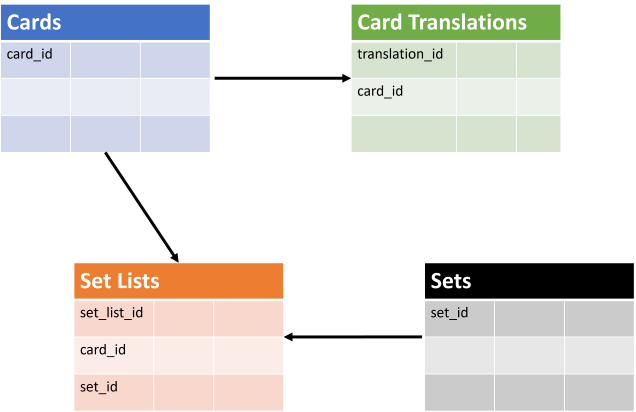

In this exercise, you'll create the data model for your online card reference application.

## What tables are needed?

The online card reference application isn't only going to have to hold information about individual cards, but translations in different languages for each card and what set or release each card is in. Because of these requirements, you'll be creating a data model with four tables. A cards table to hold information about each card, a card translations table, a sets table to hold set name and release date and a table that matches cards to a set. Each set can contain cards from older sets and new cards so you need to have a table that can match up a card to a set.

## Create the cards table

First, create the cards table. There are some rules the card game has to adhere to and they need to be reflected in your table design:

- Only one row for each card in the cards table
- A card can have multiple language translations of the original text and card name
- The cards attributes are
  - card ID (a number)
  - name (no more than 100 characters)
  - color (no more than 10 characters)
  - power (no card can have a power greater than 20)
  - type (no more than 10 characters)
  - text (Text area is 500 characters large)
  - status
  - art
- A card can only be one of the following colors: **black, blue, green, red, white, orange**
- A card can only be one of the following types: **hero, monster, spell, weapon**

With these rules, you can draft up a table to hold the card information. Lets start with the initial eight fields and assign data types based on what needs to be stored.

Starting with card ID, the rules dictate that it will be a number so an integer data type is appropriate here. Name, type, and color are all text based so nvarchar can be used as the data type; then provide a length from the guidance in the above card rules. Card power can have a value between 0 and 20 so it can use a tinyint data type. Card text is a text area no larger than 500 characters so as was done with name, type and color, you can use nvarchar. Card status tells us if the card is still being used or has been retired; a yes or no answer. Using a bit data type for a true/false answer (boolean) using a 1 or 0 will provide the application what it needs and take up as little space in storage as possible.  Lastly, images will be stored for the card art so varbinary is the data type needed.

The following table outline is a summary of what was discussed in the previous paragraph:

### Cards

| Column name | Data type |
|---|---|
| card_id | int  |
| card_name | nvarchar(100) |
| card_type | nvarchar(10) |
| card_color | nvarchar(10) |
| card_power | tinyint |
| card_text | nvarchar(500) |
| card_status | bit |
| card_art | varbinary(max) |

#### Create the cards table in Azure Data Studio

1. Open Azure Data Studio and navigate to the **connections tab**.

    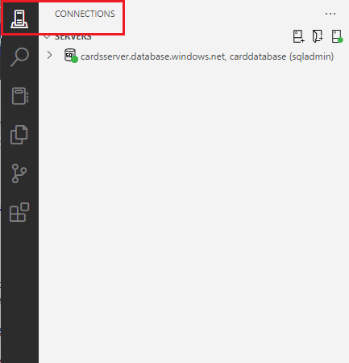

1. **Expand** the database server directory to find the **tables folder**.

    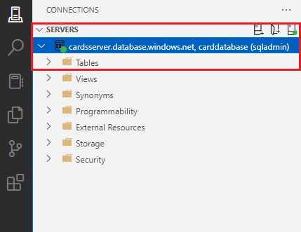

1. Right-click on the **Tables** folder and select **New Table** which will open up a new Table Designer view.

    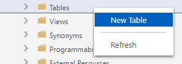

1. Change the **Table name field** from its provided default of **NewTable** to **cards**.

    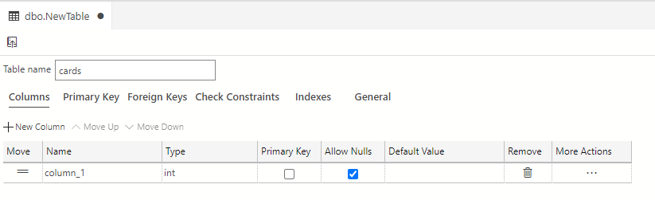

1. Next, select the **publish icon** which is located in the upper left hand corner of the Table Designer to save and publish this table to your database.

    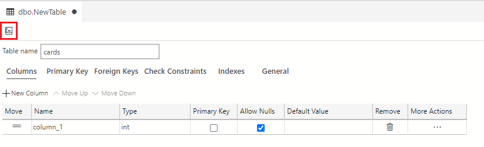

    You'll see the **Preview Database Updates** dialog box appears to confirm the updates to your database. Select **Update Database** to confirm and publish these updates.

    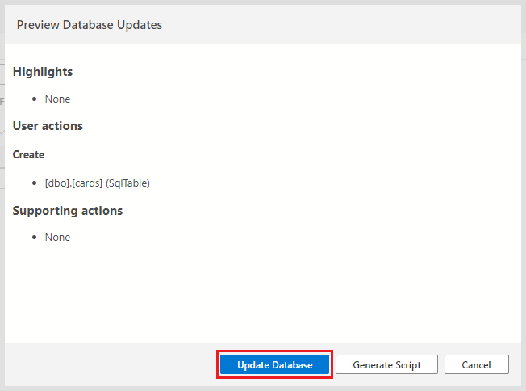

    > [!NOTE]
    > Be sure to confirm that this table can be located in the **Tables** folder. This is done by right-clicking tables folder in your database drop-down in your server connection, and selecting **Refresh**. You should now see your table populated in the drop-down.

    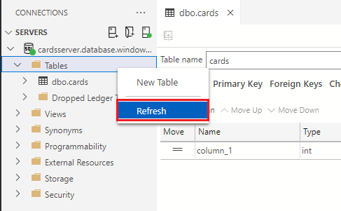

1. Now, you need to add columns and data types to the **cards** table. The first column you're going to add is **card_id** which has a data type of **int**. Use the default column that was added when you created the table and change the name from **column_1** to **card_id**.

    Your card_id column structure should look like the following image with name set to card_id:

    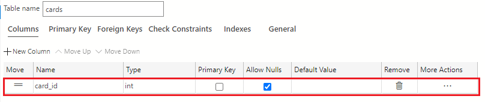

1. Add a new column to this table by selecting the **+New Column** button.

    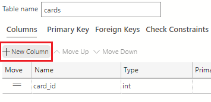

1. In the **Name Column** grid of the Table Designer, change the provided default value from **column_1** to **card_name**. In the **Type** field, select the drop-down arrow and select the **nvarchar(50)** data type.

    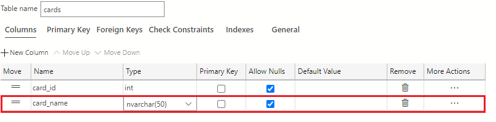

    Using the **Column Properties** area, change the **Length** from 50 to 100.

    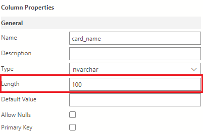

1. Using the **+New Column** button, add another new column named **card_type** and give it a data type value of nvarchar(50).

    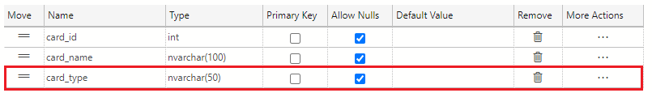

    Using the **Column Properties** area, change the **Length** from 50 to 10.

    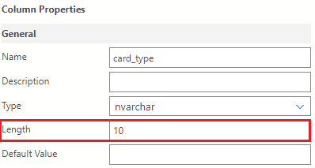

1. Again, using the **+New Column** button, add another new column named **card_color** and give it a data type value of **nvarchar(50)**. As you did with the card_name and card_type columns, use the **Column Properties** area to change the **Length** from 50 to 10.

    

1. Click the **+New Column** button to add another new column named **card_power** to the table. In the **Type** dropdown, select the **tinyinit** data type.

    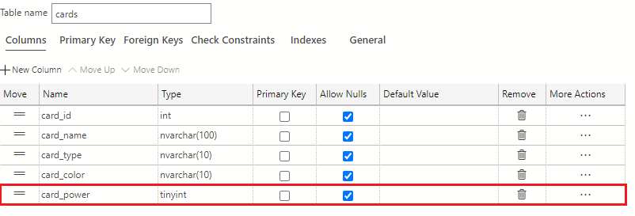

1. Using the **+New Column** button, add another new column named **card_text** to the table. In the **Type** dropdown, select the **nvarchar(50)** data type. Again, use the **Column Properties** area to change the **Length** from 50 to 500.

    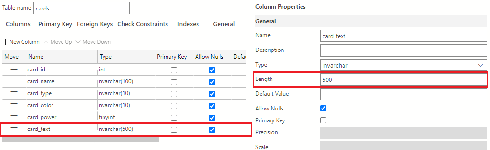

1. Add another column named **card_status** to the table using the **+New Column** button. In the **Type** dropdown, select the **bit** data type.

    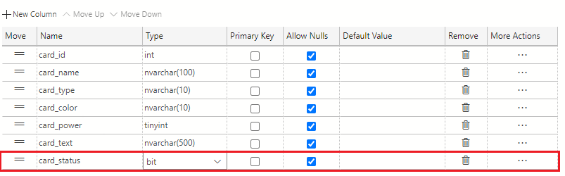

1. Add the final column using the **+New Column** button named **card_art** to the table. In the **Type** dropdown, select the **varbinary(max)** data type.

    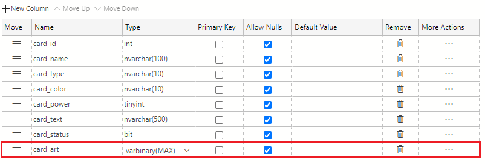

    The **cards** table is now complete and should look like the following:

    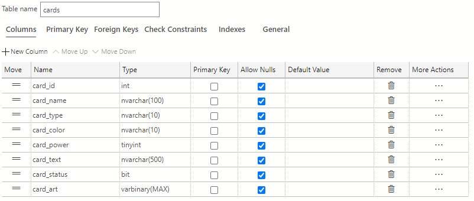

1. Click the **Publish Changes** button on the top left of the table designer window to save these table changes to the database.

    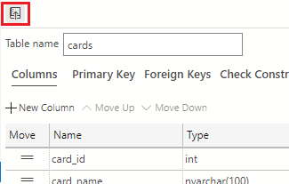

    If prompted to review the changes, click the **Update Database** button.

    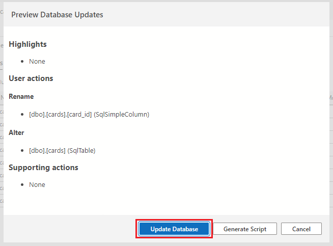

1. Click the **X** on the **table designer tab** in Azure Data Studio when done to close the window.

    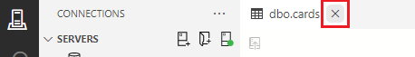

## Create the translations table

The next table you have to create is the card translations table. This table will contain the card ID and card text translations in multiple languages.

The first column will be the translations_id column and will be an **init** data type. Following that is the card_id column. If you can remember back to the previous table, card_id was an init and will be the same here. The next column will track what language the translation is in. Call it card_language and set it to a **nvarchar** of length 50. The final two columns are the translated name and translated text columns. You'll be **increasing** the lengths from the card table because languages like Japanese or Chinese have more complex characters, thus needing more space in the database. For example, in English, an O will take up 1 byte. In Japanese, う, which is pronounced as 'oo' like in pool, will take up to 4 bytes.  

With the translation rules in mind, here's how you can create the translations table:

### Card_translations

| Column name | Data type |
|---|---|
| translation_id | int |
| card_id | int |
| translation_card_language | nvarchar(50) |
| translation_card_name | nvarchar(500) |
| translation_card_text | nvarchar(2000) |

#### Create the translations table in Azure Data Studio

1. Right-click on the **Tables** folder and select **New Table** which will open up a new Table Designer view.

    

1. Change the **Table name field** from its provided default of **NewTable** to **card_translations**.

    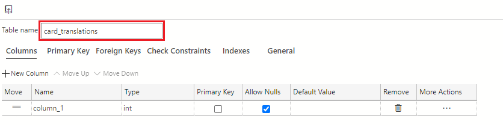

1. Next, select the **publish icon** which is located in the upper left hand corner of the Table Designer to save and publish this table to your database.

    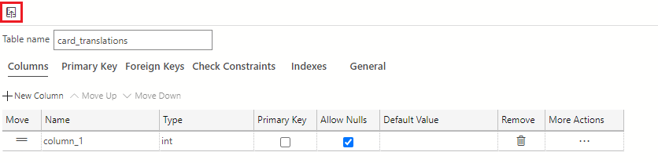

    You'll see the **Preview Database Updates** dialog box appears to confirm the updates to your database. Select **Update Database** to confirm and publish the updates.

1. Out first column will be named **translation_id** with a data type of **int**. Use the default column that was added when you created the table and change the name from **column_1** to **card_id** and ensure that the data type is **int**.

    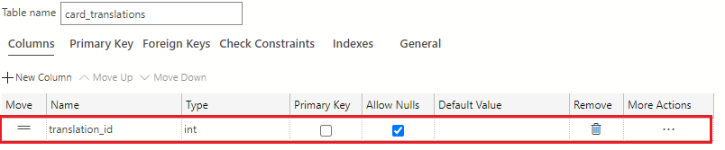

1. Add a new column using the **+New Column** button and name the column **card_id** with a data type of **int**.

    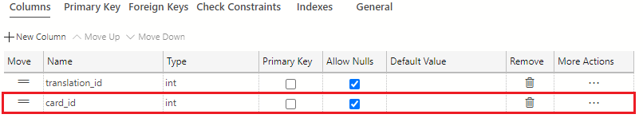

1. Again, add a new column using the **+New Column** button. Name the column **translation_card_language** of type **nvarchar(50)**.

    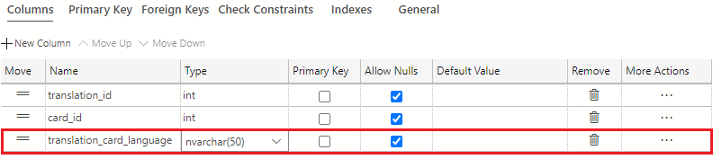

1. Add a new column with the **+New Column** button and then name it **translation_card_name** of type **nvarchar(50)** data type. Using the **Column Properties** area, change the **Length** from 50 to 500.

    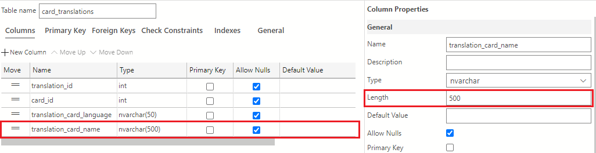

1. Add the last column with the **+New Column** button. Name this column **translation_card_text** of type **nvarchar(50)**. Again, use the **Column Properties** area to change the **Length** from 50 to 2000.

    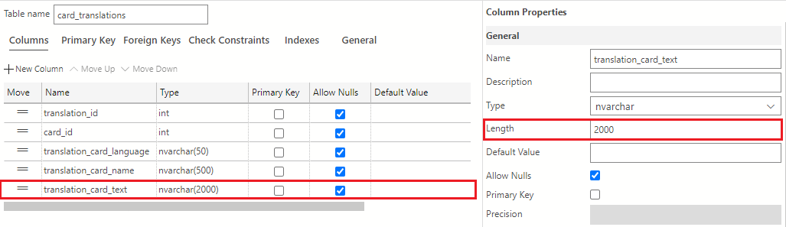

    Once this column is added, the card_translations table should look like the following image:

    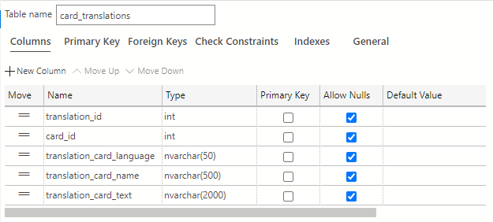

1. Click the **Publish Changes** button on the top left of the table designer window to save these table changes to the database.

    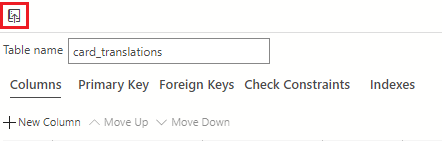

    If prompted to review the changes, click the **Update Database** button.

1. Click the **X** on the **table designer tab** in Azure Data Studio when done to close the window.

    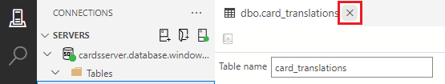

## Create the sets table

The card game will have sets released five times a year so you need to track the set name and the release date. The sets table is a simple table but will be important when you need to add cards to each individual set. The first column will be named set_id and be an **int** data type. Next, a name is needed for each set so set_name will be the next column being a **nvarchar** of length 50. The last column in this small, but important table, is the set date. It only needs to track day/month/year so a **date** data type will work here.

Here's what the sets table looks like:

### Sets

| Column name | Data type |
|---|---|
| set_id | int |
| set_name | nvarchar(50) |
| set_date | date |

#### Create the sets table in Azure Data Studio

1. Right-click on the **Tables** folder and select **New Table** which will open up a new Table Designer view.

    

1. Change the **Table name field** from its provided default of **NewTable** to **sets**.

    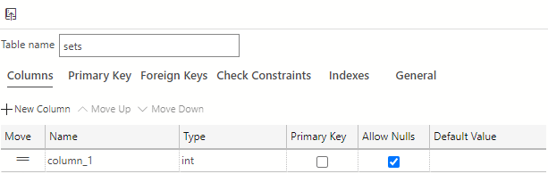

1. Next, select the **publish icon** which is located in the upper left hand corner of the Table Designer to save and publish this table to your database.

    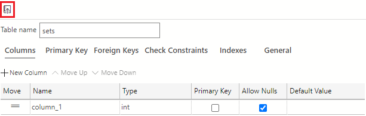

    You'll see the **Preview Database Updates** dialog box appears to confirm the updates to your database. Select **Update Database** to confirm and publish these updates.

1. Out first column will be named **set_id** with a data type of **int**. Use the default column that was added when you created the table and change the name from **column_1** to **set_id** and ensure that the data type is **int**.

    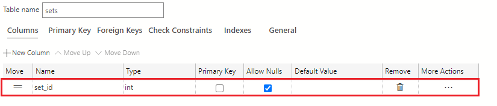

1. Add a new column using the **+New Column** button and name the column **set_name** with a data type of **nvarchar(50)**.

    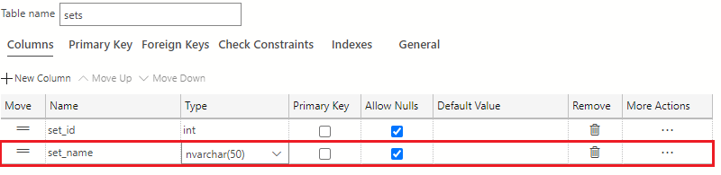

1. Add the last new column using the **+New Column** button. Name the column **set_date** of type **date**.

    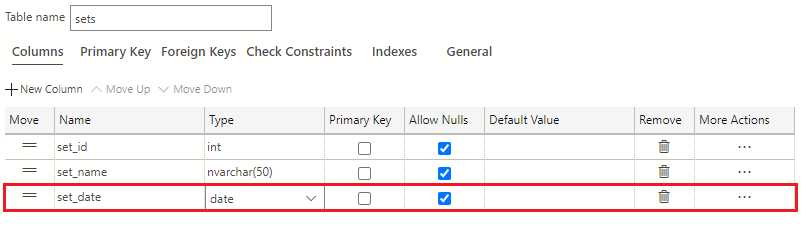

    The final **sets** table should look like the following image:

    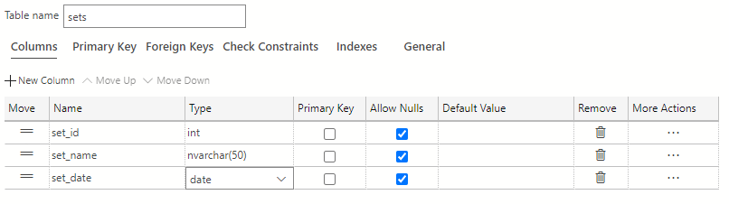

1. Click the **Publish Changes** button on the top left of the table designer window to save these table changes to the database.

    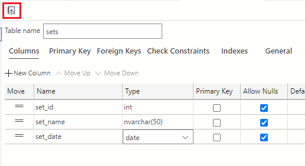

    If prompted to review the changes, click the **Update Database** button.

1. Click the **X** on the **table designer tab** in Azure Data Studio when done to close the window.

    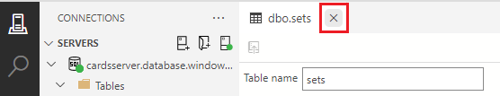

## Create the set_lists table

The last table will tie the cards table and the set table together. When a set releases, it contains a subset of cards from the cards table. For example, if you have cards 1 through 20, a set may contain cards 1 through 10. Another set might contain cards 5 through 8 and then 10 through 20.

The columns you'll need start with a set_list_id column of data type **int**. Next, a card_id column of data type **int** as seen in the cards and card_translations table. Finally, you need a set_id column of data type **int** as in the sets table.

The set_lists table will look like the following table outline:

### Set_lists

| Column name | Data type |
|---|---|
| set_list_id | int |
| card_id | int |
| set_id | int |

#### Create the set_lists table in Azure Data Studio

1. Right-click on the **Tables** folder and select **New Table** which will open up a new Table Designer view.

    

1. Change the **Table name field** from its provided default of **NewTable** to **set_lists**.

    

1. Next, select the **publish icon** which is located in the upper left hand corner of the Table Designer to save and publish this table to your database.

    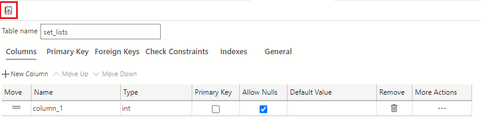

    You'll see the **Preview Database Updates** dialog box appears to confirm the updates to your database. Select **Update Database** to confirm and publish these updates.

1. Out first column will be named **set_list_id** with a data type of **int**. Use the default column that was added when you created the table and change the name from **column_1** to **set_list_id** and ensure that the data type is **int**.

    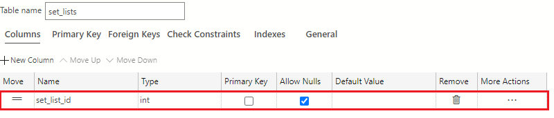

1. Add a new column using the **+New Column** button and name the column **card_id** with a data type of **int**.

    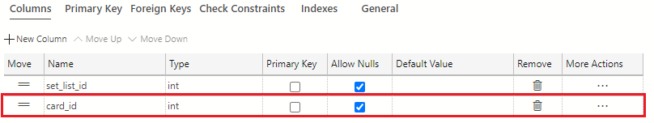

1. Add the last new column using the **+New Column** button. Name the column **set_id** of type **int**.

    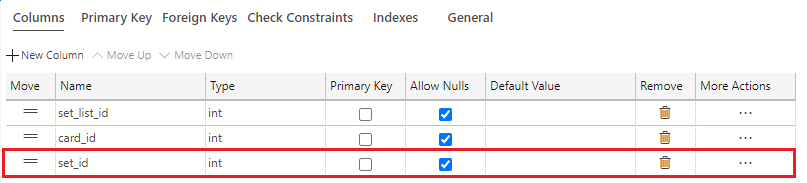

    The final **sets** table should look like the following:

    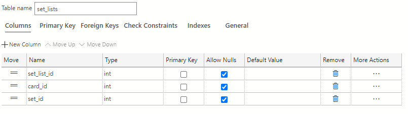

1. Click the **Publish Changes** button on the top left of the table designer window to save these table changes to the database.

    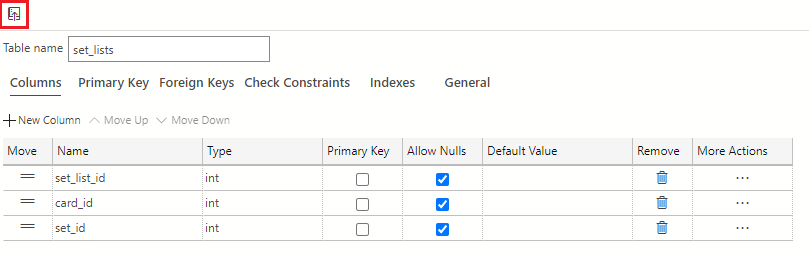

    If prompted to review the changes, click the **Update Database** button.

1. Click the **X** on the **table designer tab** in Azure Data Studio when done to close the window.

    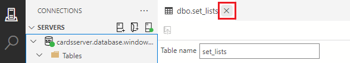

## View the tables in the database

1. Right click the tables folder and select **Refresh**.

    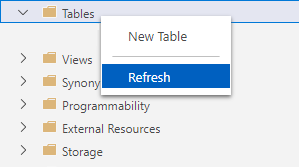

1. You should see the four created tables in the tables folder.

    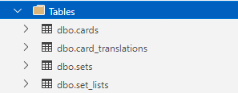
