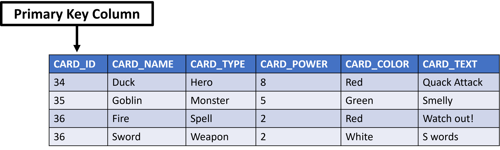
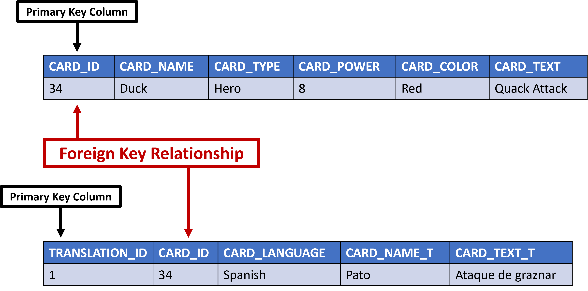
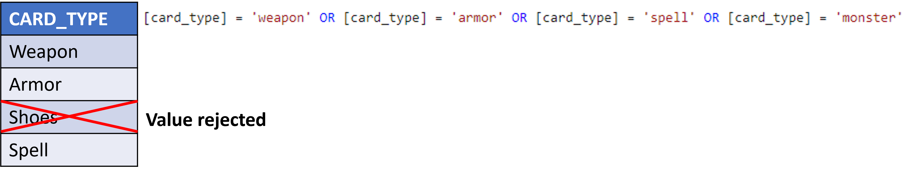

Database table constraints not only let you control what and how you store data, but define relationships between tables as well.

Using constraints and table relationships, you can satisfy the card game's specific rules for data quality with no duplicate rows. It's important to eliminate duplicate rows because they not only cause performance issues, they also remove the ability to have complete, consistent, and accurate data (also called data integrity).

By learning how to use constraints and table relationships, you can ensure data integrity across the application.

## Assign unique values with primary keys

Classification helps when looking for a specific item by limiting your choices and presenting a smaller set of results. A relational database contains primary keys, which are a column or combination of columns that contain values that uniquely identify each row in a table. With the card game, you can limit a search result by card type or color but, by assigning a primary key as well, the database can instantly recall all information about that card with a single, unique value.

When you define and create tables, you can combine a primary key column with an identity column. Combining the two columns not only ensure a unique value, but will also have Azure SQL take care of enforcing and generating these unique values automatically. Just note, a table can contain only one primary key and this column or set of columns can never contain empty or null values. In the scenario, the cards table will have a primary key on the card_id column providing a direct lookup pointer to a specific card a user is searching for.

## Define table relationships with foreign keys

A requirement for the online card reference application is to support cards having translations for multiple languages. You could just add columns for each language on the main card table but eventually that would become difficult to manage. It would also require you to add a new column to the table each time a new translation is required. The better solution is to have a separate translations table that you can link back to the cards table card_id column. This is where foreign keys come into play.

A foreign key is a column or combination of columns that can be used to enforce a link, or relationship, between two tables. Foreign keys help to control the data that can be stored using this relationship ensuring that only data from the primary key column in the related table can be stored in the foreign key column. In the card game scenario, you would use a foreign key relationship in the translations table to the primary key of the main cards table. This relationship would then only allow values from the primary key column in the cards table to be entered into the foreign key column in the translations table to ensure there's always a relationship between the two preventing orphaned rows or inaccurate data. For example, you couldn't have a row in the translations table for card_id 52 if card_id 52 didn't exist in the cards table.

## Enforce data integrity with constraints

### Null values, default values and check constraints

Controlling what data gets stored in the card game tables could help in keeping out unwanted values and enforcing data integrity (complete, consistent, and accurate data sets). At the simplest level, there are columns where you need to always have a value entered such as card name; preventing the omission of key pieces of data. When creating the tables, you can set columns to allow or disallow empty or null values. The Azure SQL database will see when someone isn't providing all the required data elements that are needed by passing in null values. When this situation occurs, the database will prevent the record from being entered.

Azure SQL can also help us control what values are acceptable in a column by assigning one or multiple default values. The database can even limit the data allowed to a set list of values. Default values with a column will let the database know what value to use if no value is defined. Once such example that can be used with the card reference application is with the status column. Here, you can assign a default value to be used on card entry helping with quick data entry and default user interface elements.

Check constraints can limit what values a column can accept. With the card reference application scenario, card color and card type need to be of a certain set of values; a perfect condition for a check constraint so that values not meeting this criteria will be rejected.

There may be situations where defining a set of default values is unrealistic. Imagine a column that only allows numbers between 1 and 10000. Creating a list of values for 10000 individual numbers would be unnecessary and labor intensive. You can create a check constraint with any logical (Boolean) expression that returns TRUE or FALSE based on the logical operators; such as a range of values using greater than and less than operators. You can have multiple check constraints on a single column and you can have a single check constraint apply to multiple columns.

### Unique constraints

Just like a primary key will enforce uniqueness, there are situations where you want a column to have unique values but not be the primary key (remember there's only one primary key per table). By creating a column with a unique constraint, Azure SQL can allow entry of unique values, allow null values if appropriate unlike a primary key, and use as a foreign key if needed. A unique constraint could be used in the card application on the set_lists table. Here, you can put a unique constraint on the card_id and set_id columns to ensure that a card isn't added to a set more than once.
