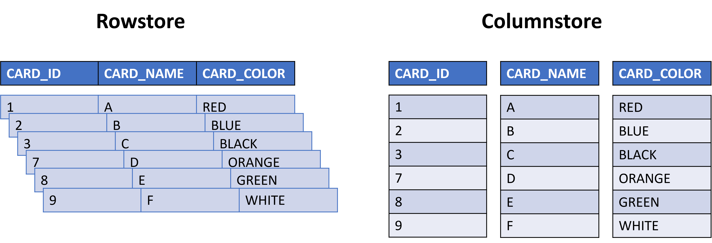
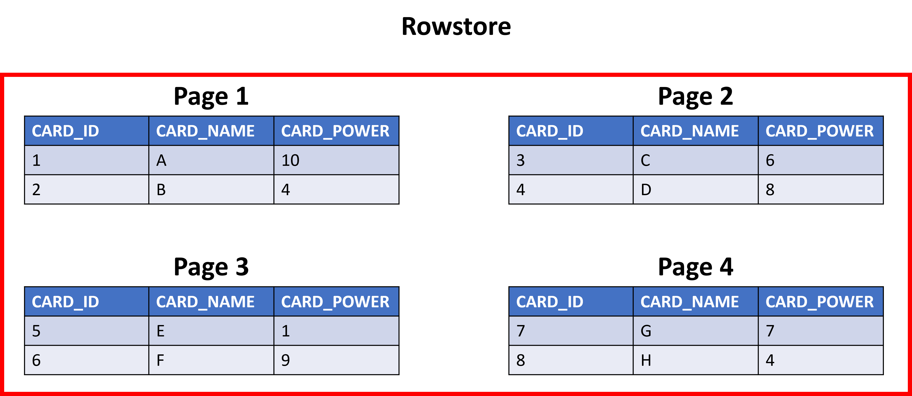
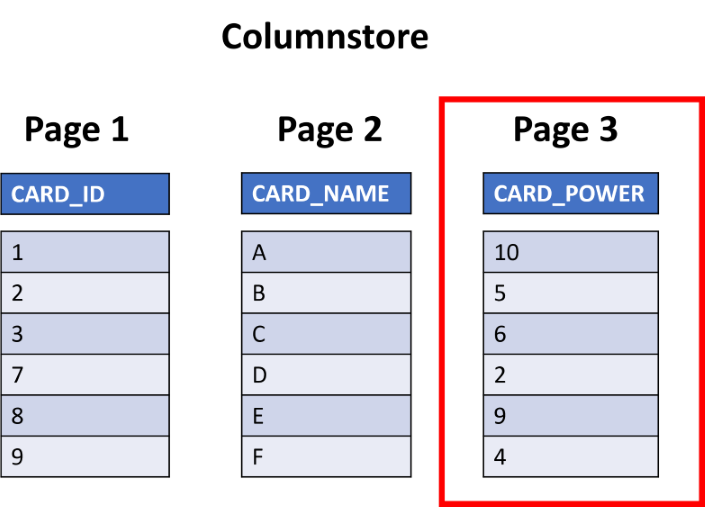

Performance bottlenecks can appear as more users access the application and the data in the database. To keep user satisfaction high and encourage repeat visits, database optimization must start with the initial table design.

Thousands of people worldwide will use the online card-reference application in our scenario. Because of this demand, you need to ensure that queries against the database return data as quickly as possible. To aid in preventing application-performance bottlenecks, you can place indexes on columns or sets on columns on a table.

This unit will give you an overview of table indexes to help you decide which ones to use and when to use them on your tables and in your applications.

## Designing table indexes

When one thinks of the word index, usually the index in the back of a book springs to mind; a complete overview of the text in the book and where to find key words and topics. An index on a table in Azure SQL is similar to an index in the back of a book. The index helps you get to the row you're looking for quickly by providing the database a map of where it's located. If you recall, tables are stored on pages in the Azure SQL Database, and indexes help the database find the data you want within these pages quickly. Indexes themselves are also stored on pages, aptly called Index Pages.

Depending on your application's use case or workload, there are some choices to make on index type. If you need to find information about a specific row or information inside a specific row (think card name in the scenario), then a rowstore index would fit best here. If the workload was based around large analytical queries on a data warehouse, we'd recommend a columnstore index.

Creating a table without an index causes the table to be stored as a heap structure; there's no sorting of the data. Imagine a scenario with a deck of unsorted cards. Not having an index works great for a table that's used primarily for data/row inserts, because there's no overhead with searching through the rows at this point. With the imaginary deck of cards, it would be like just adding cards on the top of the pile; quick and easy, if that's what you set out to do. But imagine trying to look for a single row in a table of a million records, or an individual card in the imaginary pile of cards. As the data (or pile of cards) grows, you're going to need some way to retrieve information and deliver it back to the user as quickly as possible.

### Understanding rowstore indexes

There are two types of disk-based rowstore indexes that are used with the Azure SQL Database: clustered and nonclustered. Clustered indexes sort and store the data rows in the table based on their key value, usually the primary key. When a row is written to a table with a clustered index, the row is sorted and placed in storage in the correct order. Think of a dictionary or encyclopedia and when a new entry is added. A clustered index will sort and store the full row data on the correct page on disk (remember how tables are stored in pages on disk). Because a clustered index dictates how the data will be stored on disk in the page, there can only be one clustered index on a table. It would be impossible to sort and store multiple columns in a single page. Try to sort your address book by last name of people and state at the same time; it's one or the other. In fact, when you create a primary key on a table, the Azure SQL Database automatically creates a clustered index on the table for you.

Nonclustered indexes create separate structures to sort the data in tables, then use row locators to point back to the row containing the information you're looking for. You can think of the differences between clustered and nonclustered indexes with this example: a clustered index is similar to how a dictionary has words sorted alphabetically on pages with the definitions and pronunciation all in the same place; a nonclustered index is like a dictionary's index, showing a pointer (the page number) to where you can find that word and definition.

### Understanding columnstore indexes

Columnstore indexes provide huge performance benefits for analytical queries and storage savings from the compression it uses. Columnstore indexes work by storing the data in columns instead of rows and putting each column in a separate page on the database server. In the card scenario, imagine putting a columnstore index on the main cards table. It would then split each column into a page and have a page for card name, card color, card type, and so on.

Columnstore indexes, like rowstore indexes, come as clustered and nonclustered. Just like the rowstore indexes, a clustered columnstore index will sort the data when it's stored on the page. A nonclustered columnstore index is a pointer to where the row is stored on a page. Think back to the dictionary example comparing a word's entry on a page and the index in the back of the book. A clustered columnstore index would have the words sorted alphabetically on pages with the definitions and pronunciation. The nonclustered columnstore index is like a dictionary's index; showing a pointer (the page number) to where you can find that word and definition.

> [!NOTE]
> Remember, a table can only have one clustered index, whether it's a columnstore or rowstore, but you *can* have nonclustered columnstore indexes on a table with a clustered rowstore index if you have a table used for both data inserts and analytic queries.

### When to use columnstore indexes

You'll find columnstore indexes in data warehouse and analytic scenarios. Here, in the data warehouse/analytical space, the data people are generally looking for isn't a single row, but rather trends, ranges, and aggregations across specific columns. By having the data stored as a column, the database can see ranges more easily (such as min/max values) and only retrieve the pages of data for the columns in the query.

The performance gain for the analytical queries comes from how the data is retrieved from the database. With a rowstore, if someone was looking for trends or min/max values in a specific column, the database would retrieve all the pages in storage for the rows needed for the query. Looking at the cards table, say you wanted to find the average card power across a set. A rowstore index would bring back all four pages with all the columns, even though you just wanted the card power.

Now, if you used a columnstore index, you'd only retrieve the page that stores card power and ignore the rest of the data, speeding up query time.

In the online-reference application, you'll be returning all the data in the row, so a columnstore index wouldn't be appropriate for that use case.

## Full text indexes

Wouldn't it be a good feature in the card-reference application if a user could enter some text and then return all the results that match? Maybe the feature could account for misspellings and ignore case sensitivity, as well? The Azure SQL Database has a full-text search index that lets users and applications run full-text queries against character-based columns, which is useful for the **card_name** and **card_text** columns. We can apply the full-text index to columns that have any of the following data types: `char`, `varchar`, `nchar`, `nvarchar`, `text`, `ntext`, `image`, `xml`, or `varbinary(max)` and `FILESTREAM`.
